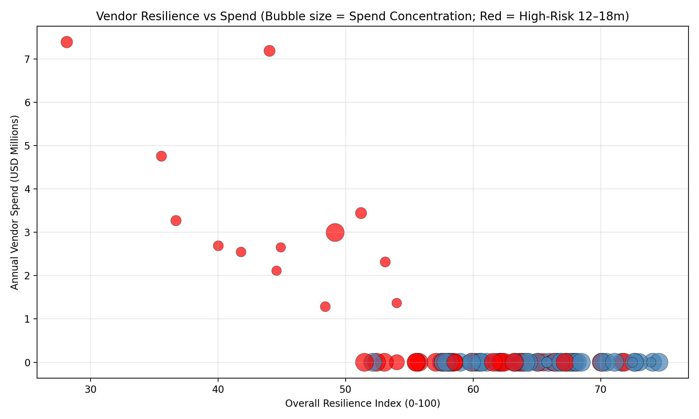
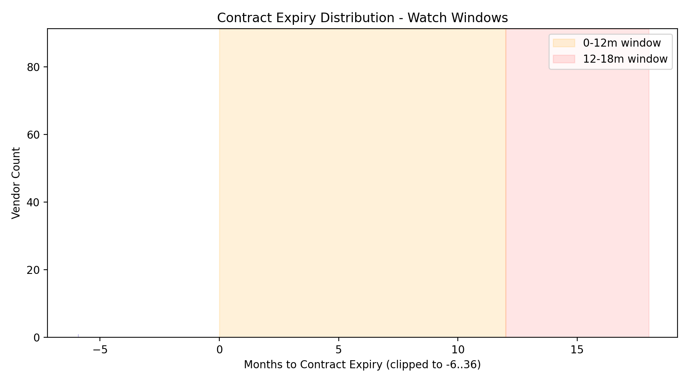
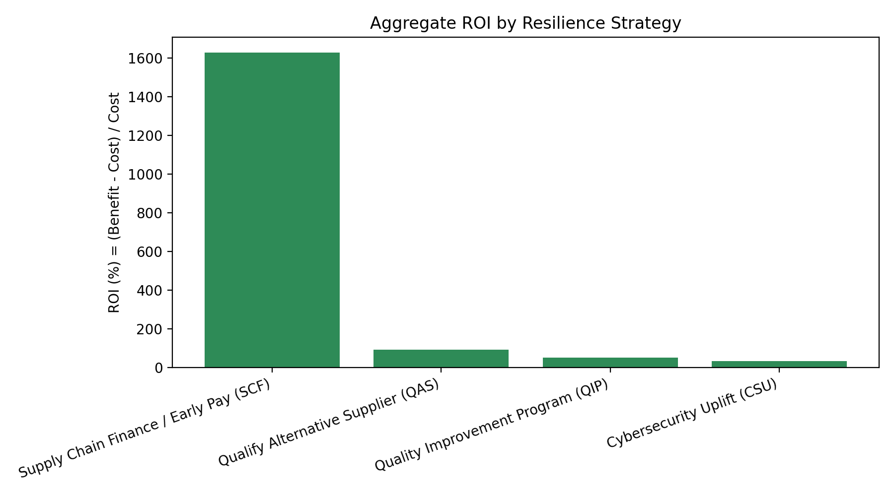
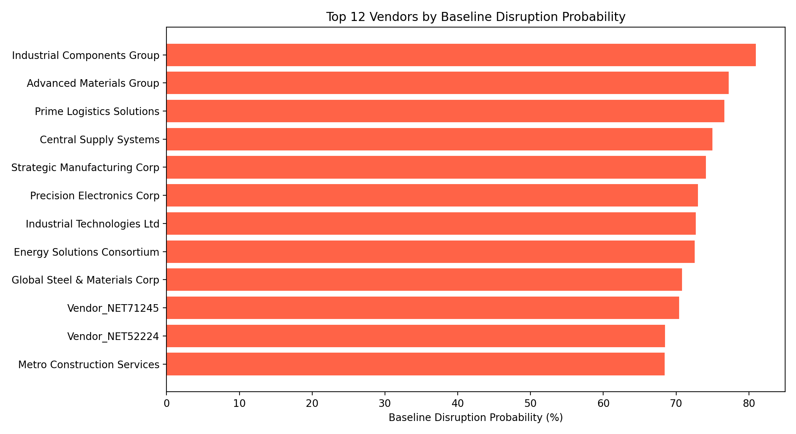

# Vendor Resilience Assessment and 12–18 Month Risk Warning for High-Importance/High-Concentration Vendors

Executive summary
- Scope and cohort: 91 vendors met the criticality filter (spend_concentration_ratio > 15% or strategic_importance_level ∈ {Mission Critical, High Strategic Value}).
- Headline risk: 44 of 91 vendors (48%) are flagged high-risk within the coming 12–18 months given our rule set. They account for $44.01M of $44.03M total vendor spend in this cohort, indicating that the bulk of spend exposure sits with elevated risk.
- Resilience baseline: Average Overall Resilience Index (RI) across the cohort is 60.7/100.
- Geographic exposure: Among high-risk vendors, spend concentration by region is highest in Southwest ($17.85M) and Northeast ($11.10M), followed by West Coast ($8.44M).
- Contract windows: No vendors fall into 0–12m or 12–18m expiry windows because many are already past-due (negative months to expiry), which is an immediate risk to be remediated with urgency.

Four-dimensional vendor resilience framework
We implement a multi-dimensional framework with consistent 0–100 scoring (higher is better), combining normalized internal/external indicators:

1) Financial Resilience (FR)
- Payment performance (50%): avg_payment_delay, overdue_payment_percentage, and overdue_ratio. These are min-max normalized into a payment risk score; FR inverts risk to a performance score.
- Financial health (50%): financial_health_score normalized to 0–100.
- Use: Vendors with high delays/overdues or low financial health score lower FR, increasing short-term disruption probability.

2) Operational Resilience (OR)
- Quality performance: quality_score.
- Cybersecurity capability: cybersecurity_score.
- Innovation capability: innovation_capability_score.
- OR is the normalized average of these three, capturing process robustness and adaptability.

3) Market Resilience (MR)
- Alternative supplier availability: alternative_suppliers_count (higher better).
- Market volatility sensitivity: market_volatility_index (lower better).
- Price volatility risk: price_volatility_coefficient (lower better).
- Switching cost: switching_cost_estimate (lower better).
- Seasonality concentration: |seasonal_demand_factor−1| (lower better).
- MR averages the above after inverting risk metrics, capturing substitutability and external stability.

4) Strategic Resilience (SR)
- Geographic distribution risk: computed as 1−minmax(region spend share), penalizing over-concentration in any single region within the cohort.
- Contract expiry risk: months_to_expiry (more months better).
- Environmental sustainability: environmental_rating mapped to a 60–100 scale (C− to A).
- SR is the average of these three.

Overall Resilience Index
- RI = 0.30·FR + 0.25·OR + 0.25·MR + 0.20·SR. Lower RI implies higher disruption probability; we use RI to anchor the base probability of disruption.

Visualization: Resilience vs Spend (bubble = concentration, red = high-risk)
- What to look for: High-spend, low-RI red bubbles indicate outsized exposure with near-term risk. Bubble size indicates spend concentration, highlighting fragile single-sourced dependencies.

Dynamic risk warning mechanism (12–18 months)
We implemented a rule-based early warning system with percentile thresholds calibrated on this cohort:
- Contract window flags: flag_contract_12 if 0–12 months to expiry; flag_contract_18 if 12–18 months.
- Concentration/dependency: flag_concentration if spend_concentration_ratio ≥ 30% or dependency_level ∈ {High, Critical}.
- Financial stress: avg_payment_delay ≥ p75 and overdue_payment_percentage ≥ p75 OR financial_health_score ≤ p25.
- Market fragility: (market_volatility_index ≥ p75 and alternative_suppliers_count ≤ p25) OR price_volatility_coefficient ≥ p75 OR switching_cost_estimate ≥ p75.
- Operational fragility: quality_score ≤ p25 OR cybersecurity_score ≤ p25 OR innovation_capability_score ≤ p25.

High-risk within 12–18 months is triggered if any of:
- (Contract window in 0–12 or 12–18) AND (Concentration OR Market fragility)
- Financial stress AND Concentration
- Three or more flags active simultaneously

Note: In this dataset, zero vendors are in the 0–12 or 12–18 month windows because many are already expired (negative months_to_expiry). This elevates immediate contract risk rather than upcoming 12–18 month risk. We recommend urgent remediation in parallel with forward-looking monitoring.

Visualization: Contract expiry distribution with watch windows

Risk exposure and top drivers
- Top-10 by baseline disruption probability (examples): Industrial Components Group (p≈80.9%, Critical, EAL≈$5.52M), Advanced Materials Group (p≈77.2%, High, EAL≈$2.22M), Prime Logistics Solutions (p≈76.7%, High, EAL≈$1.53M), Precision Electronics Corp (Mission Critical; p≈72.98%, EAL≈$4.69M), Vendor_NET71245 (p≈70.41%, Critical, EAL≈$2.95M). Most have negative months to expiry (past-due contracts), indicating an immediate renewal risk.
- Geographic concentration: High-risk spend is concentrated in Southwest and Northeast, suggesting targeted dual-sourcing or regional rebalancing.
- Concentration and switching cost: Large bubble sizes in the chart indicate high concentration; where switching_cost_estimate is high and alternatives are few, market fragility compounds risk.

Expected Annual Loss (EAL) modeling and ROI of resilience strategies
Method:
- Baseline probability proxy: p_disruption_base = 0.5·(1 − RI/100) + risk boosts for flagged conditions (contract windows, financial stress, market fragility, operational fragility, concentration). Capped at 95%.
- Severity: dependency-weighted impact amplified by spend concentration: severity = dep_weight × (1 + concentration).
- EAL = total_vendor_spend × p_disruption_base × severity.

Aggregate ROI results (Benefit = EAL reduction, Cost = strategy cost):
- Supply Chain Finance / Early Pay (SCF): Benefit $3.69M vs Cost $0.213M → ROI ≈ 1628%.
- Qualify Alternative Supplier (QAS): Benefit $6.25M vs Cost $3.25M → ROI ≈ 92.2%.
- Quality Improvement Program (QIP): Benefit $3.47M vs Cost $2.32M → ROI ≈ 49.7%.
- Cybersecurity Uplift (CSU): Benefit $2.32M vs Cost $1.74M → ROI ≈ 33.1%.
- Contract Early Renewal (CER): Not triggered in aggregate due to no vendors in 0–18m window; however, given many past-due contracts, immediate renewal actions outside the modeled window are critical.

Visualization: Aggregate ROI by strategy

Portfolio-level recommendation (data-driven)
- First-wave program (high ROI, fast payback):
  - Roll out SCF to all vendors flagged for financial stress: expected portfolio ROI ≈ 16.3×; short setup time; reduces disruption probability and stabilizes payment performance.
  - Launch QAS for vendors with low alternative_suppliers_count or market fragility: portfolio ROI ≈ 1.92×; prioritizes categories with high switching costs and price volatility.
- Second-wave program (structural capability):
  - QIP to remediate suppliers with low quality/innovation signals: ROI ≈ 1.50×; strengthens incoming quality and yields fewer defects/returns.
  - CSU for suppliers with low cybersecurity posture or operational fragility: ROI ≈ 1.33×; mitigates cyber-driven operational outages and compliance exposures.
- Contract remediation: Although CER did not flag for 0–18m, many key contracts are already past expiry. Execute urgent renewal or controlled exit to remove immediate disruption risk and re-align terms (e.g., service levels, price indexation, cybersecurity and ESG clauses).

Visualization: Top-12 baseline disruption probability

Personalized resilience improvement paths and contingency plans (top exposure vendors)
Based on EAL_base and positive-ROI strategies, we propose vendor-specific playbooks:

1) Industrial Components Group (Critical; p≈80.9%; EAL≈$5.52M)
- Primary path:
  - QAS (ROI≈26.6; ~$50k cost; ≈$1.38M annual loss avoided): qualify at least one alternate supplier; negotiate volume-split 70/30; map technical equivalence and PPAP sign-off.
  - SCF (ROI≈21.4; ~$36.9k cost; ≈$0.83M avoided): early pay terms to stabilize cash flow and reduce delays/overdues.
- Contingencies:
  - 60 days: establish safety stock for A-critical SKUs (2–4 weeks).
  - 90 days: sign interim framework agreement with alternate supplier with step-in rights and price-indexation clauses.

2) Advanced Materials Group (High; p≈77.2%; EAL≈$2.22M)
- Primary path:
  - SCF (ROI≈13.0; ~$23.8k cost; ≈$0.33M avoided).
  - QAS (ROI≈10.1; $50k cost; ≈$0.55M avoided).
- Contingencies:
  - Accelerate contract reset (expired): include service credits, dual-sourcing rights, and cybersecurity/ESG clauses.
  - Create 8–12 week buffer inventory during transition.

3) Precision Electronics Corp (Mission Critical; Critical dep; p≈73.0%; EAL≈$4.69M)
- Primary path:
  - QAS (ROI≈22.5; $50k cost; ≈$1.17M avoided).
  - SCF (ROI≈18.6; ~$35.9k cost; ≈$0.70M avoided).
- Contingencies:
  - Qualify a regional backup supplier to diversify against Southwest concentration.
  - Add firmware/patch SLAs and SBOM requirements to contracts to reduce cyber/obsolescence risk.

4) Vendor_NET71245 (Critical; p≈70.4%; EAL≈$2.95M)
- Primary path:
  - SCF (ROI≈28.6; ~$15.0k cost; ≈$0.44M avoided).
  - QAS (ROI≈13.8; $50k cost; ≈$0.74M avoided).
- Contingencies:
  - Negotiate multi-year capacity reservation and price-indexed terms; implement VMI (vendor-managed inventory) for peak seasons.
  - Perform cybersecurity uplift assessment; enforce minimum controls (MFA, EDR, backup).

5) Advanced Manufacturing Solutions LLC (High; p≈59.4%; EAL≈$1.84M)
- Primary path:
  - SCF (ROI≈15.0; ~$17.2k cost; ≈$0.28M avoided).
  - QAS (ROI≈8.2; $50k cost; ≈$0.46M avoided).
- Contingencies:
  - Introduce layered quality controls (incoming AQL, process capability checks) to reduce scrap/rework.
  - Insert flexible exit/transition clause on new contract; begin pilot with alternate source.

Dynamic early-warning playbook and thresholds (operationalizing 12–18 month alerts)
- Refresh cadence: Monthly batch scoring; ad-hoc re-scores on significant events (credit downgrades, price shocks, cyber incidents).
- Alert tiers:
  - Red: RI < 45 OR p_disruption_base ≥ 60% AND (flag_concentration OR flag_financial_stress). Action: executive escalation, 30/60/90 plan, immediate inventory buffers, weekly status.
  - Amber: RI ∈ [45,60) OR any two flags active. Action: sourcing plan initiated; negotiate terms; bi-weekly monitoring.
  - Green: RI ≥ 60 and <2 flags. Action: BAU monitoring; quarterly review.
- Forward-looking triggers (12–18 months):
  - Contract: months_to_expiry ∈ [0,18] → engage CER track 6–9 months ahead; if alternatives scarce, start QAS by month 9.
  - Market: market_volatility_index ≥ cohort p75 AND price_volatility_coefficient ≥ p75 → initiate commodity hedging or index-linked pricing.
  - Supply options: alternative_suppliers_count ≤ cohort p25 → launch QAS; consider pre-qual with technical equivalence testing.
  - Financial: financial_health_score ≤ p25 OR rising overdue trend → deploy SCF; revisit payment terms and delivery milestones.

Portfolio optimization and budget guidance
- If budget-limited, prioritize by Expected Annual Loss (EAL_base) to maximize avoided loss/$:
  1) SCF for all vendors flagged with financial stress (ROI≈16.3×; low cost; fast impact).
  2) QAS for the top decile of EAL_base vendors with high switching costs and low alternatives (ROI≈1.92×).
  3) QIP and CSU for vendors with operational fragility; pilot with highest EAL vendors, then scale.
- Geographic rebalancing: Reduce Southwest and Northeast exposure by dual-sourcing in alternative regions; target a 20–30% shift over 12 months.
- Contract remediation: Address past-due contracts immediately; use renewals to add cybersecurity, ESG, and price-indexation clauses and to secure step-in rights.

Governance and KPIs
- KPIs to track monthly: RI uplift (+5–10 points for treated vendors within 3–6 months), reduction in p_disruption_base (−10–20 pp), EAL avoided ($), % volume under dual-sourcing, average months-to-expiry (>12 months), on-time payment improvement (+10 pp), and incident-free months.
- Quarterly portfolio review: Re-rank vendors by EAL, rebalance strategy mix based on realized ROI.

Appendix
- Data set: 91 vendors; average RI 60.7; high-risk 44 vendors; total spend $44.03M; high-risk spend $44.01M.
- Aggregate ROI by strategy (modeled): SCF ≈ 1628%; QAS ≈ 92%; QIP ≈ 50%; CSU ≈ 33%.
- Notes: Not all strategies apply to every vendor; overlapping strategies may have diminishing returns—sequence actions (e.g., SCF before QAS/QIP for financially stressed vendors). Contract Early Renewal (CER) will become relevant as the contract pipeline moves back into the 0–18m window; at present, many key contracts are already expired and must be remediated immediately.

Figures
- Resilience vs. spend bubble chart (red highlights high-risk): resilience_vs_spend.png
- Top-12 disruption probability: top12_disruption_prob.png
- Aggregate ROI by strategy: aggregate_strategy_roi.png
- Contract expiry distribution (watch windows): contract_expiry_distribution.png

!
