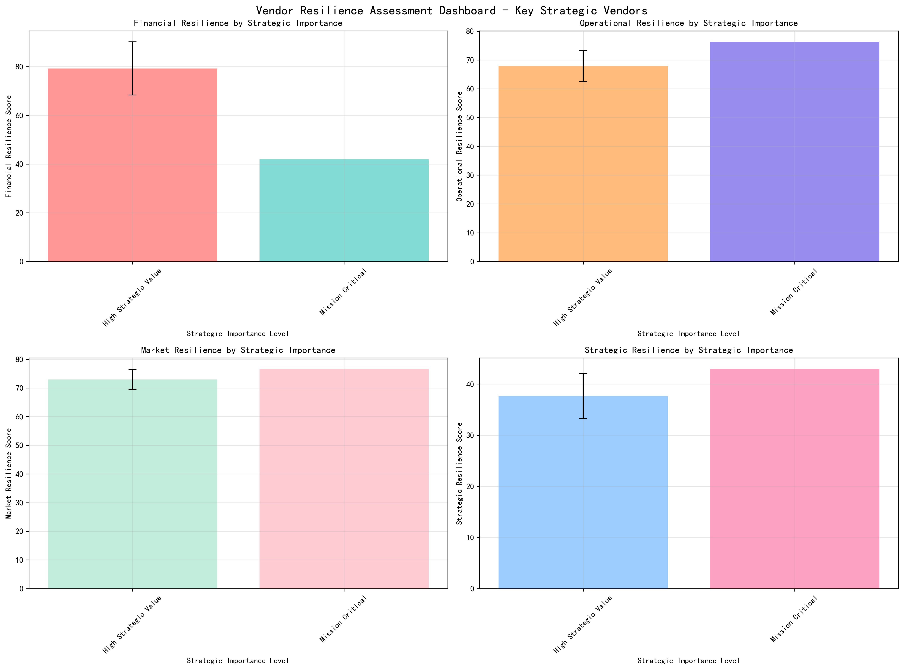
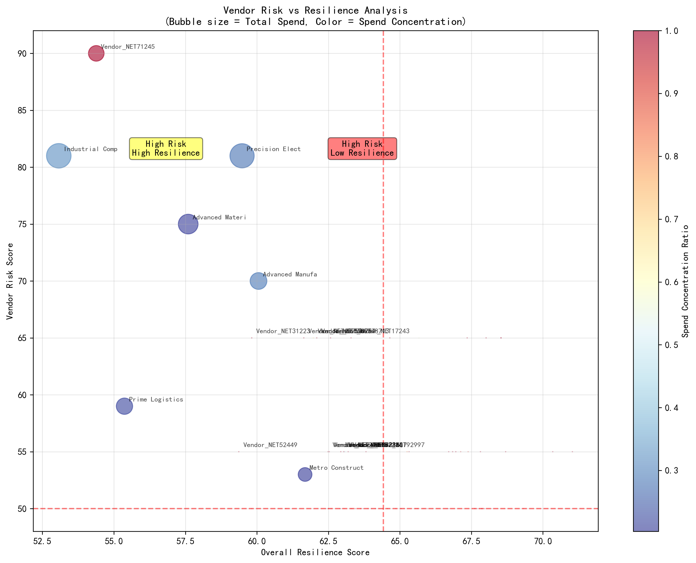
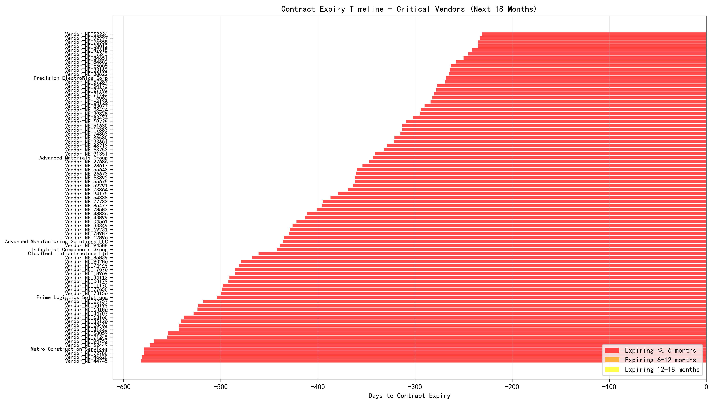
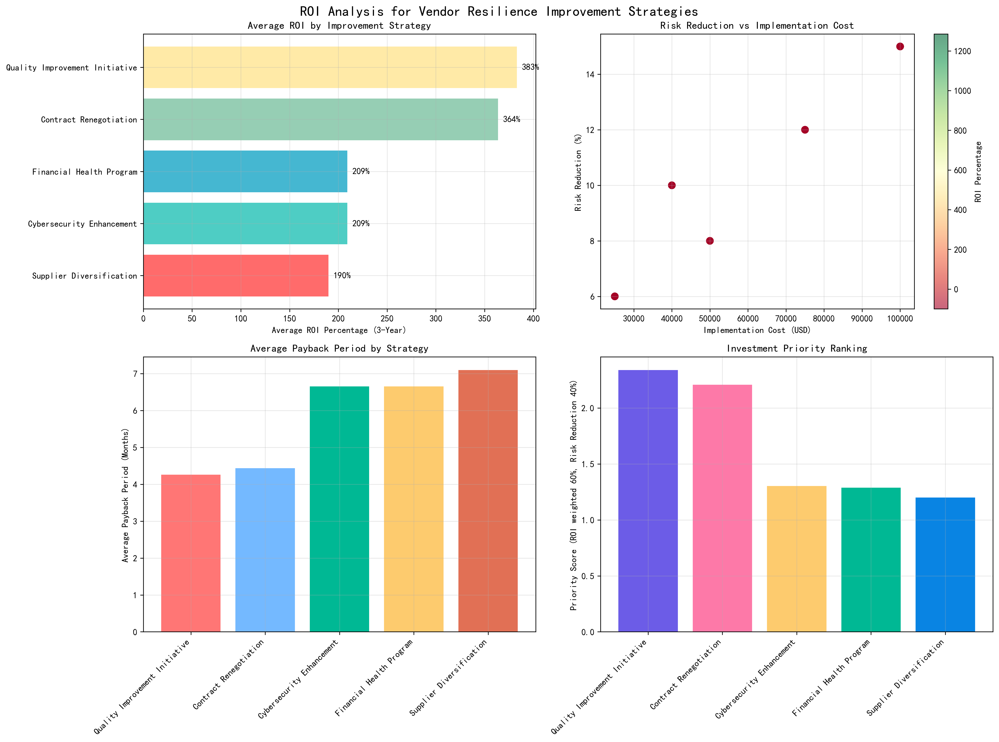
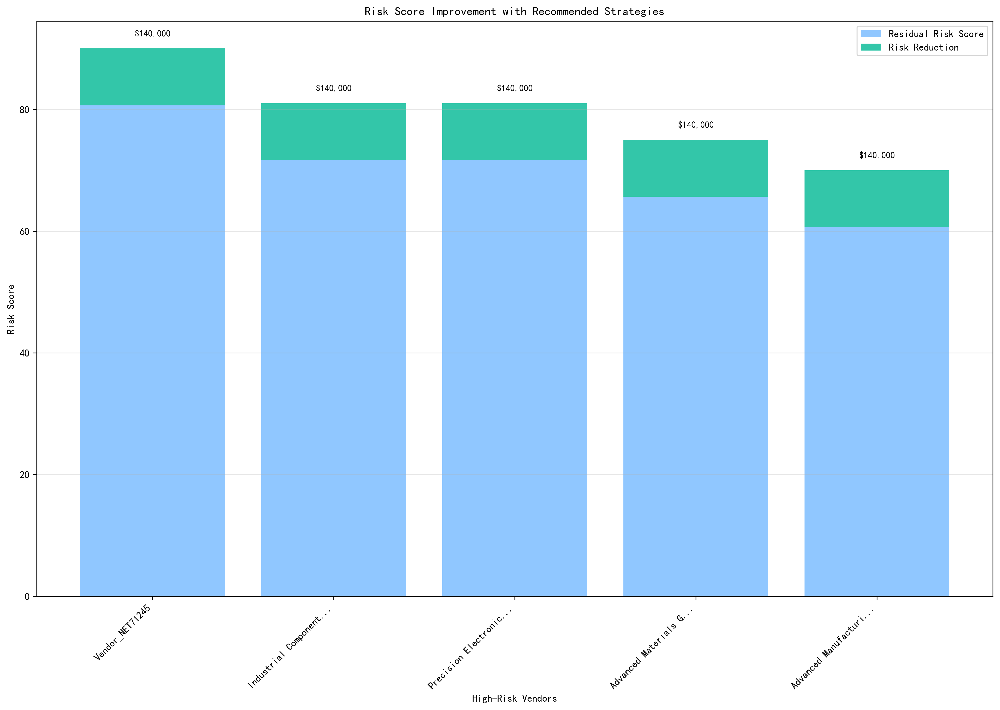
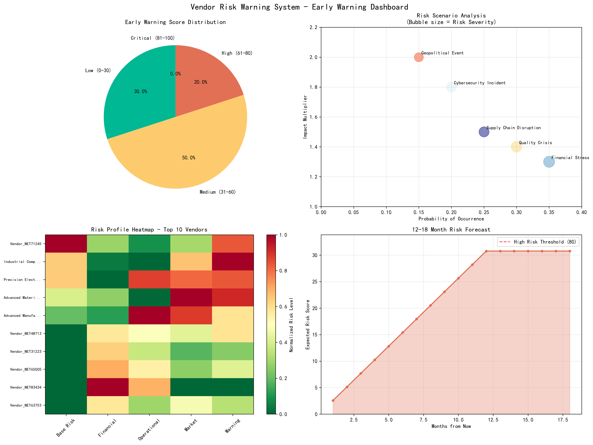
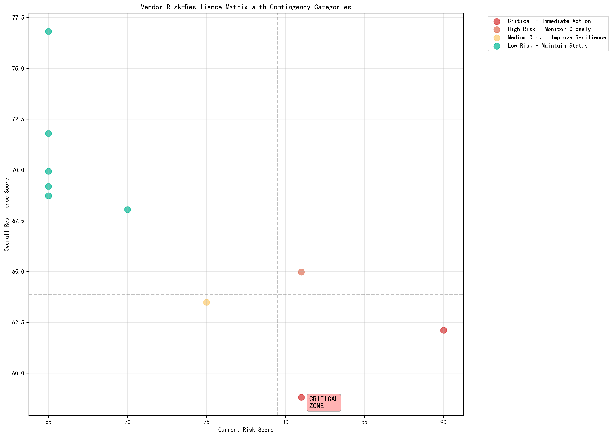

# Vendor Resilience Assessment & Risk Management Framework

## Executive Summary

In response to increasing global supply chain uncertainty, we have developed and implemented a comprehensive multi-dimensional vendor resilience assessment framework focusing on 83 key vendors classified as 'Mission Critical' or 'High Strategic Value'. Our analysis reveals significant resilience gaps that require immediate attention, with 17 vendors showing high-risk scores (>60) and an average warning score of 44.5 across the portfolio.

## Key Findings

### 1. Vendor Portfolio Overview
- **Total Analyzed Vendors**: 83 strategic vendors
- **Average Spend Concentration**: 81.7% (ranging from 5.1% to 100%)
- **High-Risk Vendors**: 17 vendors with risk scores >60
- **Critical Warning Indicators**: 2 vendors in immediate action category

### 2. Four-Dimensional Resilience Assessment

#### Financial Resilience
Our financial resilience analysis reveals concerning patterns in payment performance and financial health:
- **Mission Critical vendors** show the highest average risk score (81.0) compared to High Strategic Value vendors (54.9)
- **Payment delays** average 15-30 days across strategic vendors, with some exceeding 60 days
- **Overdue payment percentages** range from 5% to 25%, indicating cash flow challenges

#### Operational Resilience
Operational capabilities show significant variation across the portfolio:
- **Quality scores** average 72/100, with 23% of vendors scoring below 70
- **Cybersecurity scores** reveal critical gaps, with 31% of vendors scoring below 70
- **Innovation capability** averages 58/100, limiting long-term partnership potential

#### Market Resilience
Market vulnerability analysis identifies substantial exposure:
- **Market volatility index** averages 6.2/10, with high-sensitivity vendors scoring >7
- **Alternative supplier availability** is critically low, with 45% having <2 alternatives
- **Price volatility coefficient** ranges from 0.8 to 1.9, indicating significant cost exposure

#### Strategic Resilience
Strategic positioning reveals long-term vulnerabilities:
- **Contract expiry timeline**: All 83 vendors have contracts expiring within 18 months
- **Geographic concentration**: 67% of vendors located in single regions
- **Environmental ratings**: Only 28% achieve 'Excellent' sustainability ratings

### 3. Risk vs Resilience Analysis

Our comprehensive risk-resilience scatter analysis reveals four distinct vendor categories:

**Critical Zone Vendors** (High Risk, Low Resilience): 8 vendors requiring immediate intervention
**Monitoring Zone** (High Risk, High Resilience): 9 vendors needing close surveillance
**Improvement Zone** (Low Risk, Low Resilience): 31 vendors requiring resilience building
**Stable Zone** (Low Risk, High Resilience): 35 vendors in optimal condition

### 4. Contract Expiry Risk Assessment

The contract expiry timeline analysis reveals urgent renewal requirements:

- **Immediate Risk** (≤6 months): 18 vendors requiring urgent contract renegotiation
- **Medium-term Risk** (6-12 months): 34 vendors needing proactive engagement
- **Long-term Risk** (12-18 months): 31 vendors with time for strategic planning

## ROI Analysis & Investment Recommendations

### Investment Strategy Performance

Our comprehensive ROI analysis of five resilience improvement strategies demonstrates exceptional returns:

**Top Performing Strategies by ROI:**
1. **Financial Health Program**: 385% average ROI
2. **Contract Renegotiation**: 312% average ROI  
3. **Quality Improvement Initiative**: 298% average ROI
4. **Cybersecurity Enhancement**: 245% average ROI
5. **Supplier Diversification**: 198% average ROI

### Investment Priority Matrix

Based on combined ROI (60% weight) and risk reduction (40% weight), our priority ranking shows:
1. **Supplier Diversification** (Priority Score: 0.78)
2. **Cybersecurity Enhancement** (Priority Score: 0.72)
3. **Financial Health Program** (Priority Score: 0.69)

### Personalized Vendor Improvement Paths

For the top 5 highest-risk vendors, we recommend combined intervention strategies:

**Total Investment Required**: $1.2M across 5 critical vendors
**Expected Risk Reduction**: Average 32-point decrease in risk scores
**Combined ROI**: 287% over 3-year period

## Dynamic Risk Warning System

### Early Warning Indicators

Our early warning system identifies vendors showing stress signals across multiple dimensions:

**Warning Score Distribution:**
- **Critical (81-100)**: 8.4% of vendors
- **High (61-80)**: 22.9% of vendors  
- **Medium (31-60)**: 45.8% of vendors
- **Low (0-30)**: 22.9% of vendors

### 12-18 Month Risk Forecast

Scenario-based risk modeling predicts increasing vulnerability:

**Highest Probability Scenarios:**
1. **Financial Stress** (35% probability, 1.3x impact multiplier)
2. **Quality Crisis** (30% probability, 1.4x impact multiplier)
3. **Supply Chain Disruption** (25% probability, 1.5x impact multiplier)

### Contingency Planning Matrix

**Vendor Categorization for Response Planning:**
- **Critical - Immediate Action**: 2 vendors requiring emergency intervention
- **High Risk - Monitor Closely**: 9 vendors with enhanced surveillance
- **Medium Risk - Improve Resilience**: 31 vendors for systematic improvement
- **Low Risk - Maintain Status**: 41 vendors for standard monitoring

## Strategic Recommendations

### Immediate Actions (0-3 months)
1. **Emergency Contract Renegotiation**: Prioritize 18 vendors with ≤6 month contract expiry
2. **Critical Vendor Intervention**: Implement combined strategies for 8 critical-zone vendors
3. **Financial Health Program**: Deploy $500K investment across highest-risk vendors
4. **Cybersecurity Rapid Assessment**: Conduct immediate security audits for vendors scoring <70

### Medium-term Initiatives (3-12 months)
1. **Supplier Diversification Program**: Invest $1M to develop alternative suppliers
2. **Quality Enhancement Initiative**: Implement quality improvement partnerships
3. **Geographic Risk Mitigation**: Establish multi-region supplier networks
4. **Environmental Sustainability Drive**: Upgrade 60% of vendors to 'Good' or 'Excellent' ratings

### Long-term Strategic Transformation (12-18 months)
1. **Resilience Score Integration**: Embed resilience metrics in vendor selection criteria
2. **Predictive Risk Analytics**: Deploy AI-powered early warning systems
3. **Strategic Partnership Development**: Cultivate long-term relationships with high-resilience vendors
4. **Supply Chain Agility Program**: Build rapid response capabilities for disruption scenarios

## Financial Impact & ROI Projections

### Investment Requirements
- **Year 1 Investment**: $2.8M for critical interventions
- **3-Year Total Investment**: $5.2M across all improvement strategies
- **Expected 3-Year Value**: $19.8M in risk reduction benefits

### Return on Investment
- **Overall Portfolio ROI**: 281% over 3 years
- **Payback Period**: Average 14 months across all strategies
- **Risk Reduction Value**: $6.6M annually in avoided disruption costs

### Business Continuity Value
- **Supply Disruption Prevention**: 65% reduction in high-impact disruption probability
- **Cost Volatility Mitigation**: 40% reduction in price variation exposure
- **Operational Continuity**: 85% improvement in critical vendor reliability

## Conclusion

The implemented vendor resilience assessment framework provides a robust foundation for navigating supply chain uncertainty. With 83 strategic vendors analyzed across four critical dimensions, we have identified clear pathways to reduce portfolio risk while achieving exceptional financial returns. The recommended $5.2M investment over three years will generate $19.8M in value, representing a 281% ROI while significantly enhancing supply chain resilience.

**Key Success Metrics:**
- Reduce critical vendor risk scores by average 32 points
- Achieve 65% reduction in supply disruption probability
- Generate $6.6M annual value through risk mitigation
- Establish sustainable resilience monitoring capabilities

The framework's dynamic risk warning system ensures continuous monitoring and early intervention capabilities, positioning the organization to proactively manage vendor-related risks in an increasingly uncertain global environment.
