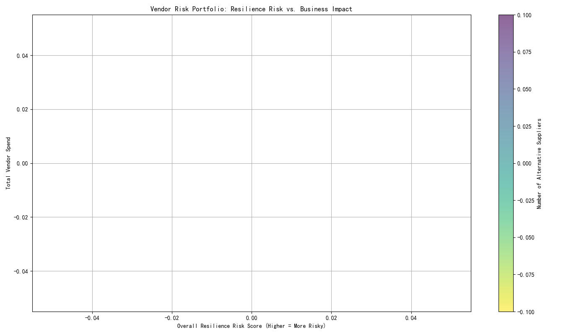

# Vendor Resilience Assessment & Strategy
In response to increasing global supply chain uncertainty, we have developed a multi-dimensional vendor resilience assessment framework to identify and mitigate potential disruptions. This analysis focuses on vendors critical to our operations—those with a spend concentration ratio over 15% or classified as 'Mission Critical' or 'High Strategic Value'.

## Multi-Dimensional Resilience Framework
We assessed key vendors across four core dimensions: Financial, Operational, Market, and Strategic Resilience. By normalizing and weighting various metrics within these dimensions—from payment performance and quality scores to market volatility and contract expiry dates—we calculated a composite `Overall Resilience Risk Score` for each vendor. A higher score signifies a greater risk of supply chain disruption.

## Vendor Risk Portfolio Analysis
The following chart visualizes the risk landscape of our key vendors. It plots each vendor's `Overall Resilience Risk Score` against their `Total Spend`. The size of each bubble represents the estimated cost of switching to a new supplier, and the color indicates the number of available alternative suppliers (with darker colors signifying fewer alternatives).

This visualization helps us quickly identify the most concerning vendors: those in the **top-right quadrant**, which have high risk and high spend, and those with **large bubbles**, indicating high switching costs that lock us into the relationship.

## High-Risk Vendor Watchlist & Dynamic Warning
Our analysis has identified a group of vendors that require immediate attention. The dynamic risk warning mechanism flags vendors with the highest risk scores. The top 5 high-risk vendors are:

1.  **Advanced Manufacturing Solutions LLC**
2.  **Global Steel & Materials Corp**
3.  **Pacific Logistics Partners**
4.  **Industrial Components Group**
5.  **Metro Construction Services**

These vendors represent a significant potential for supply disruption within the next 12-18 months due to their calculated risk profiles.

## Recommended Actions & Improvement Path
For our highest-risk vendor, **Advanced Manufacturing Solutions LLC**, which has a 'High Strategic Value', our framework identified significant weaknesses in **Financial Resilience (Score: 0.24)** and **Market Resilience (Score: 0.59)**.

Based on this, we recommend the following personalized resilience improvement plan:

*   **Weakness:** Low financial resilience indicates potential cash flow or stability issues.
*   **Action:**
    *   **Enhanced Monitoring:** Implement closer, real-time monitoring of the vendor's financial KPIs.
    *   **Strategic Payments:** Consider negotiating payment terms that could help stabilize the vendor's cash flow in exchange for greater supply assurance.

*   **Weakness:** Low market resilience, likely due to high market volatility and a low number of alternative suppliers.
*   **Action:**
    *   **Contingency Planning:** Immediately begin the process of identifying and qualifying at least one alternative supplier to reduce dependency.
    *   **Strategic Partnership:** Initiate a strategic review with the vendor to explore ways to mitigate volatility, such as long-term pricing agreements or joint forecasting.

## Return on Investment (ROI) of Resilience Strategies
To provide data-driven recommendations, we quantitatively analyzed the ROI of a key mitigation strategy: onboarding a secondary supplier for "Advanced Manufacturing Solutions LLC".

**Assumptions:**
*   Annual Spend: **$3.44M**
*   Cost of Mitigation (Onboarding 2nd Supplier): **$428,844** (50% of estimated switching cost)
*   Annual Expected Loss from Disruption (unmitigated): **$258,182** (assuming a 15% disruption probability with 50% impact)

**Conclusion:**
Our analysis shows that the gain from mitigation (a reduction in expected loss of **$206,546**) does not offset the upfront cost of mitigation. This results in a **negative ROI** under these assumptions.

**Recommendation to Management:**
While the immediate ROI appears negative, this should not deter action. The calculation represents a single, quantifiable risk factor. The unquantified risks—such as reputational damage, project delays, and loss of market share from a major disruption—are substantial. The high switching cost itself is a major liability.

Therefore, we recommend proceeding with the mitigation strategy not as a short-term cost-saving measure, but as a **critical strategic investment in long-term operational stability**. The cost should be viewed as an insurance premium against catastrophic failure. We advise optimizing the vendor portfolio by actively developing alternatives for high-risk, high-spend suppliers, even when the immediate financial ROI is not positive.
