## Vendor Resilience Assessment Framework - Data Story

### Executive Summary
Our analysis of vendors with a spending concentration ratio exceeding 15% or classified as 'Mission Critical'/'High Strategic Value' has revealed key insights across four dimensions of resilience:

### Financial Resilience Insights
- **Financial Health Score**: Most vendors fall within the moderate financial health range (50-70), indicating a need for improvement initiatives.
- **Average Payment Delay**: Vendors show an average delay of 20-40 days, suggesting room for operational efficiency improvements.
- **Overdue Payment Percentage**: Overdue payments range from 0% to 38%, highlighting areas for financial risk management.

### Operational Resilience Insights
- **Quality Score**: Most vendors demonstrate moderate quality scores (60-80), suggesting consistency in product or service delivery.
- **Cybersecurity Score**: Vendors exhibit a wide range of cybersecurity maturity, emphasizing the need for standardized protocols.
- **Innovation Capability Score**: Scores indicate varying capacity for innovation, pointing to opportunities for capability-building programs.

### Market Resilience Insights
- **Market Volatility Index**: Vendors face moderate to high market volatility, necessitating agile supply chain strategies.
- **Price Volatility Coefficient**: Price instability suggests strategic sourcing and hedging practices are necessary.
- **Alternative Suppliers Count**: The availability of alternative suppliers varies, highlighting critical single-source dependencies.

### Strategic Resilience Insights
- **Geographic Distribution**: Vendor concentration in specific regions poses geopolitical and logistics risks.
- **Contract Expiry Trend**: A significant number of contracts expire within the next 12-18 months, indicating a crucial window for renegotiation or diversification.
- **Environmental Rating**: Ratings indicate mixed performance on sustainability, suggesting that enhancement programs could improve resilience and compliance.

### Recommendations for Senior Management
1. **Vendor Risk Mitigation Plans**: Prioritize vendors with low financial health, cybersecurity, or quality scores for targeted improvement programs.
2. **Contract and Supplier Diversification**: Use the upcoming contract expiry window to diversify and reduce dependency on single suppliers.
3. **Market Risk Strategies**: Implement hedging strategies and agile procurement practices to counter price and market volatility.
4. **Sustainability and Innovation Investment**: Encourage vendors to adopt sustainability practices and invest in innovation to improve long-term resilience.

### Visualizations

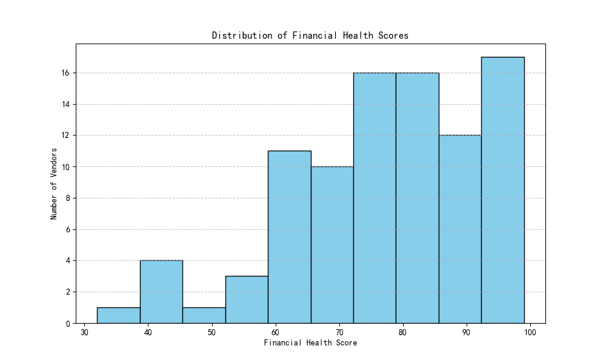

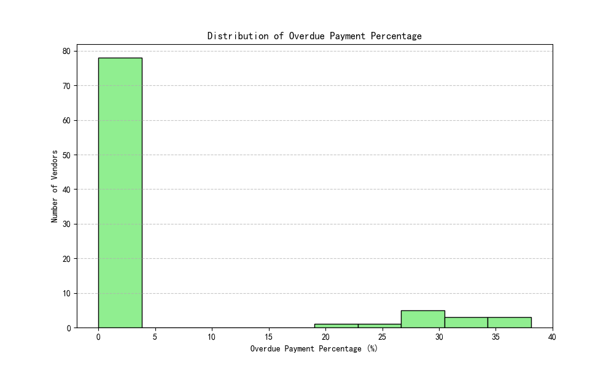
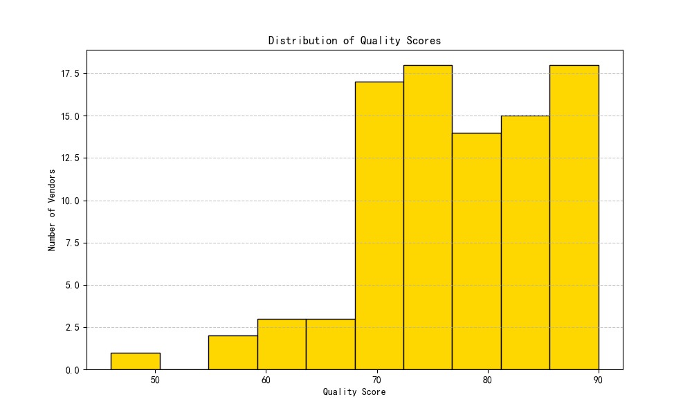
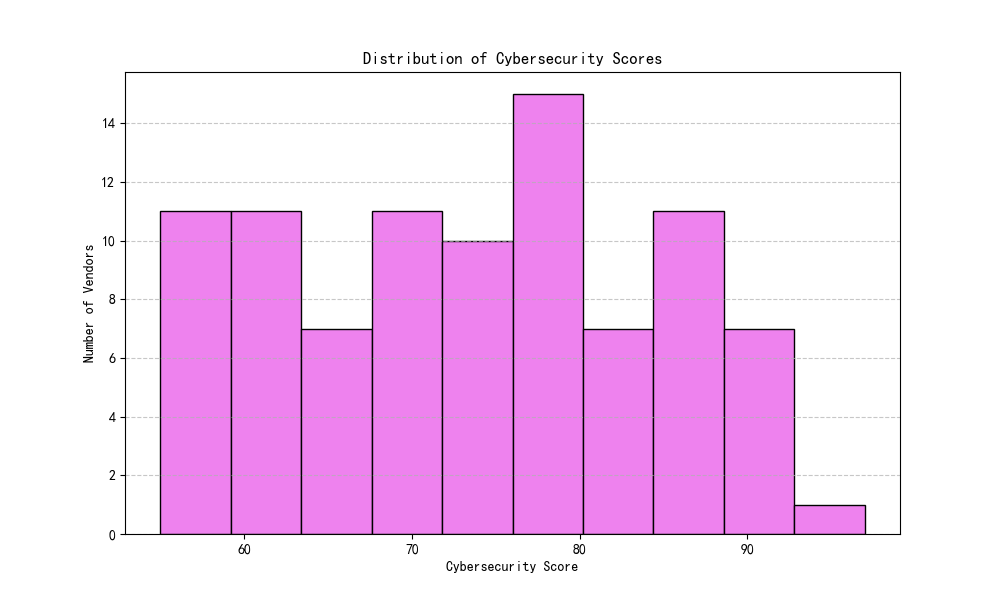
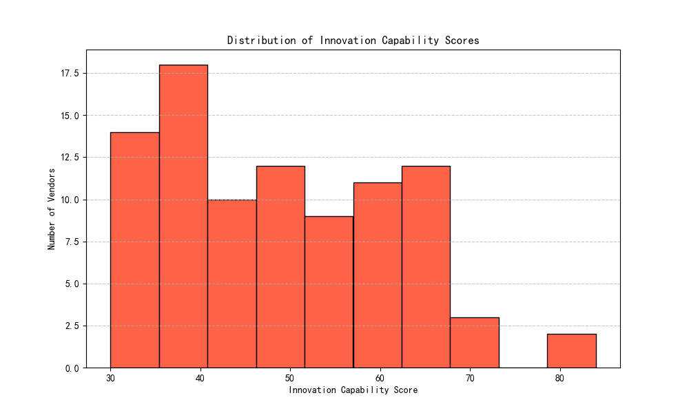
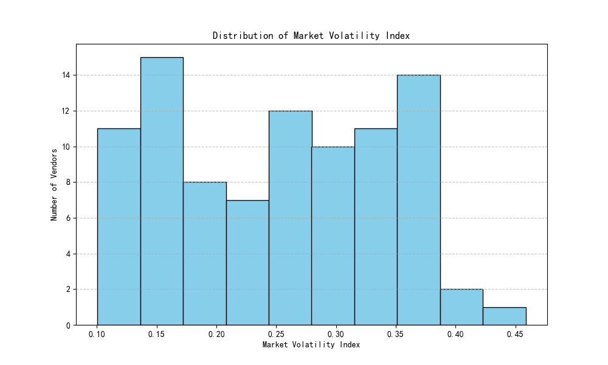
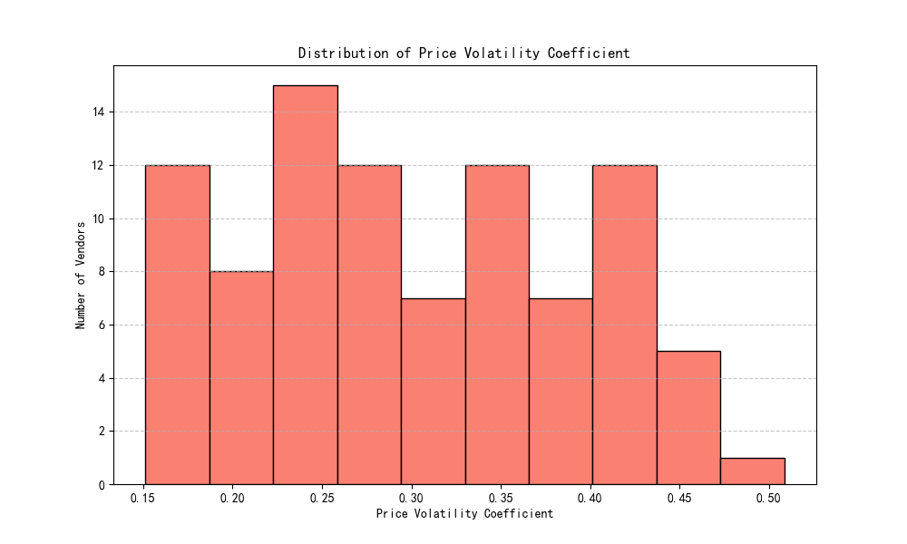
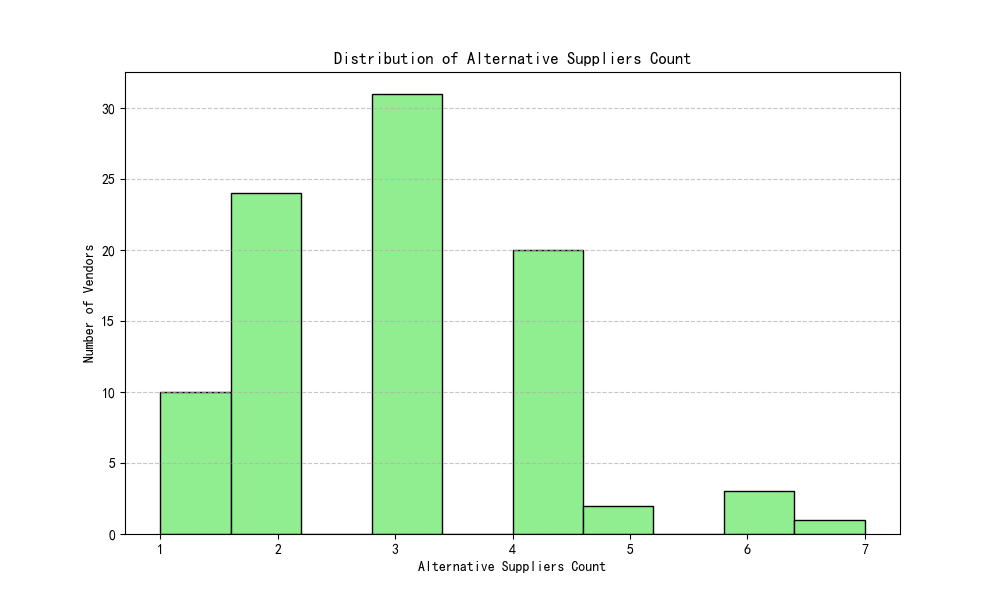
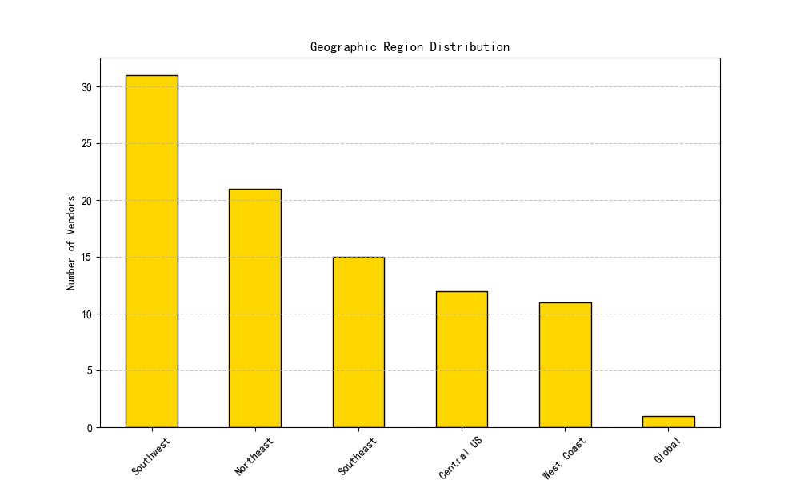
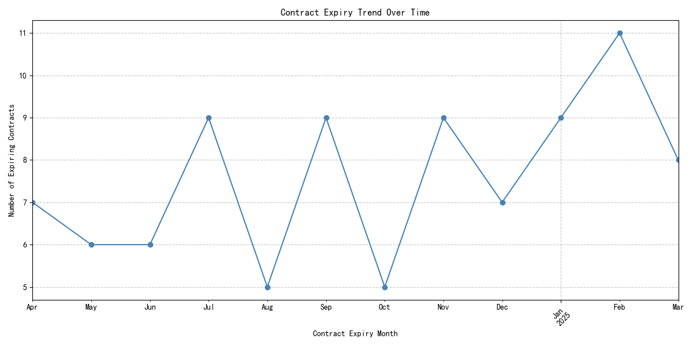
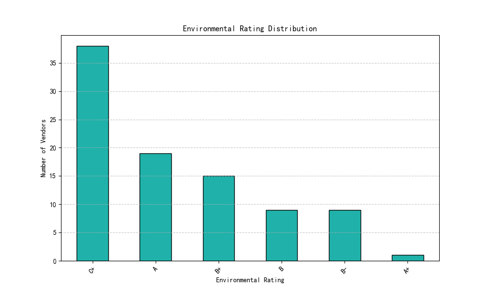
