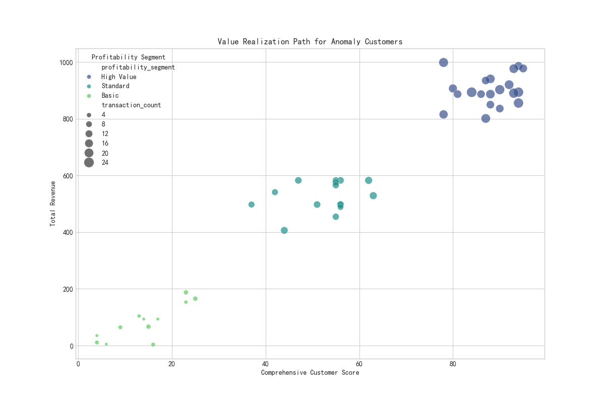
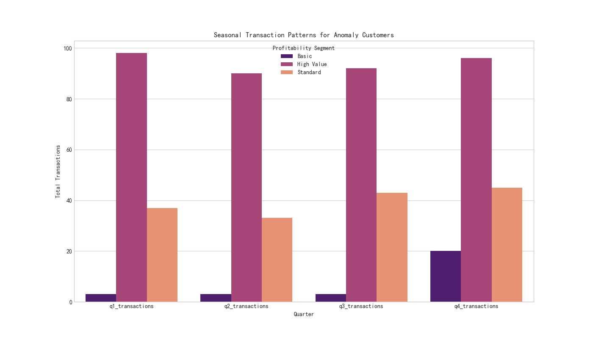
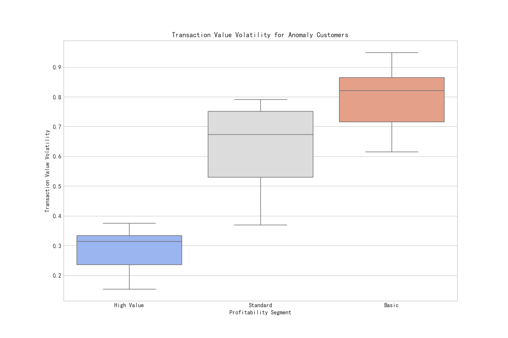

# Re-examining Customer Segmentation Effectiveness

## Introduction

This report analyzes the effectiveness of our current `profitability_segment` customer segmentation strategy. The analysis focuses on "classification anomaly" customers, defined as those whose `retention_probability` deviates by more than 15 percentage points from their segment's average. We explore the characteristics of these customers across transactional behavior, seasonal patterns, and value realization to determine if new dimensions should be introduced to the segmentation model.

## Analysis of "Classification Anomaly" Customers

We identified a subset of customers whose retention probability was significantly different from their assigned profitability segment's average. Our analysis of this group reveals several key insights:

### 1. Misaligned Value Realization

The relationship between `comprehensive_customer_score` and `total_revenue` for anomaly customers shows a significant misalignment. The scatter plot below illustrates that many customers with high comprehensive scores are not generating proportionally high revenue, and vice-versa. This suggests that our current scoring model may not be effectively capturing the true value of these customers.

**Insight:** The `comprehensive_customer_score` is not a reliable predictor of `total_revenue` for this anomaly group. The current segmentation oversimplifies the customer value, leading to misclassification.

### 2. Distinct Seasonal Transaction Patterns

The transaction data for anomaly customers reveals distinct seasonal preferences that are not uniform across all profitability segments. The bar chart below shows the distribution of transactions across the four quarters.

**Insight:** Certain segments exhibit strong seasonal peaks in their transaction activity. For example, some segments are more active in Q4, while others have a more even distribution throughout the year. The current model does not appear to account for these seasonal variations, which could impact retention probability.

### 3. High Transaction Value Volatility

Our analysis shows that `transaction_value_volatility` is a significant characteristic of the anomaly customers. The box plot below compares this volatility across the different profitability segments.

**Insight:** Anomaly customers, particularly in certain segments, exhibit higher transaction value volatility. This indicates unpredictable purchasing behavior, which makes it difficult to forecast their future value and retention. This volatility is a risk factor that the current segmentation model is not adequately addressing.

## Recommendations

Based on our findings, we recommend the following actions to improve the customer segmentation model:

1.  **Incorporate Transaction Stability and Seasonality:** The current segmentation model should be enhanced to include metrics for transaction stability (such as `transaction_value_volatility`) and seasonal preferences. This will provide a more dynamic and accurate view of customer behavior.

2.  **Refine the Customer Scoring Model:** The `comprehensive_customer_score` should be re-evaluated to better align with actual `total_revenue`. Consider incorporating a a ‘customer lifecycle stage’ dimension to better predict future value and to differentiate between newly acquired high-potential customers and established, high-value customers.

3.  **Develop Targeted Retention Strategies:** For customers identified as "classification anomalies," we should develop targeted retention strategies. For example, customers with high volatility could benefit from personalized offers that encourage more consistent purchasing. Customers with strong seasonal preferences could be targeted with marketing campaigns that align with their peak activity periods.

## Conclusion

The current customer segmentation model provides a useful baseline, but it has limitations in accurately classifying all customers, especially those with non-linear or volatile behavior. By incorporating new dimensions such as transaction stability, seasonal preference, and customer lifecycle stage, we can create a more robust and predictive segmentation model. This will enable us to develop more effective marketing and retention strategies, ultimately leading to improved customer lifetime value and business profitability.
