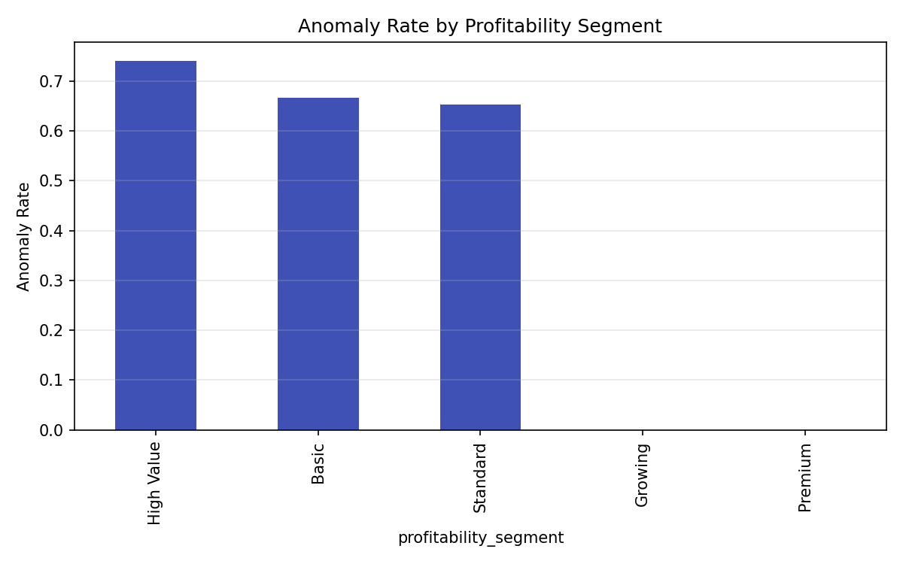
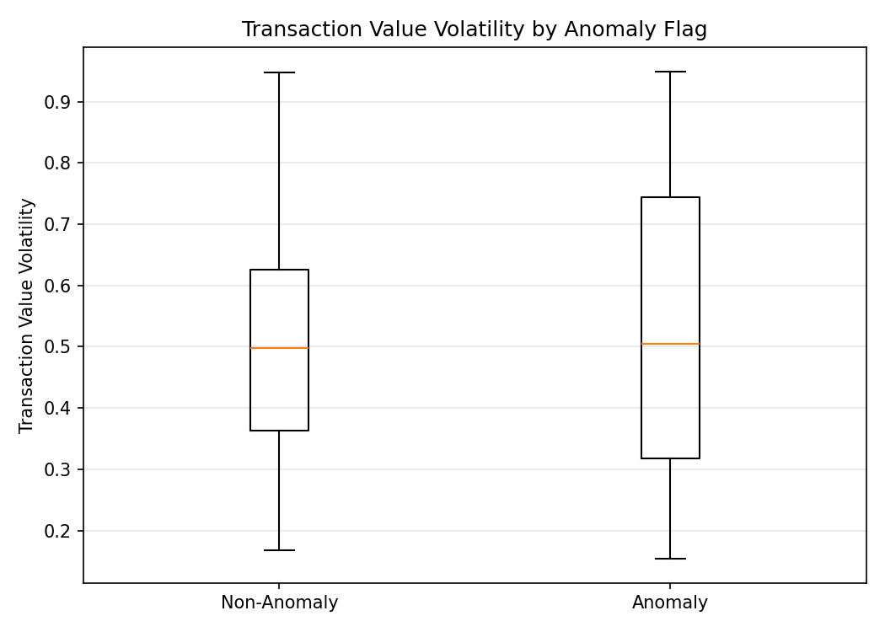
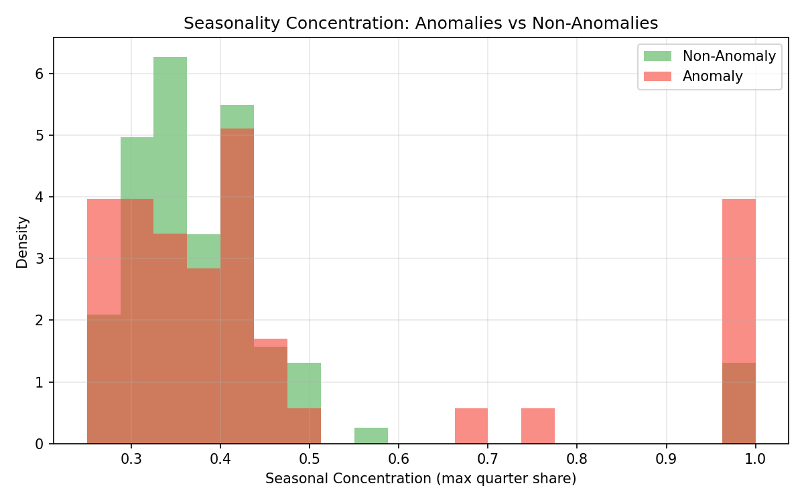
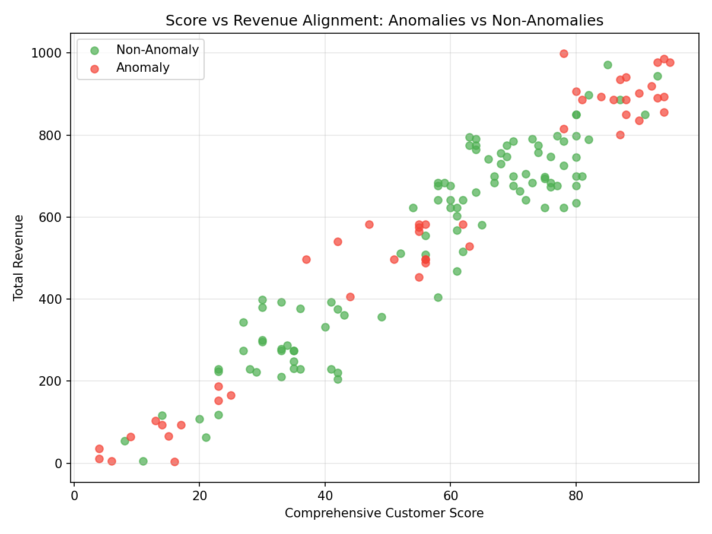

# Re-examining Segmentation: Do profitability_segment labels align with actual performance?

This analysis evaluates whether the current profitability_segment assignments align with actual customer performance, with a focus on “classification anomaly” customers whose retention_probability deviates by more than 0.15 from their segment’s average retention. We examine behavioral consistency, value volatility, seasonal balance, and the score-to-revenue alignment. We also use diagnostic decision-tree-like splits and cluster-style (quantile bin) groupings to assess whether new dimensions (transaction stability, seasonal preference, lifecycle stage) should be introduced into the segmentation model.

Data and table: netsuite2_customer_analytics (SQLite). All fields are curated; no cleaning was performed.

Key fields used:
- Segmentation and retention: profitability_segment, retention_probability
- Transactions and behavior: transaction_count, avg_transactions_per_month, transaction_value_volatility, q1_transactions..q4_transactions
- Customer value and stage: total_revenue, net_profit, comprehensive_customer_score, lifecycle_stage, customer_age_days

Method summary:
- For each segment, computed the segment average retention.
- Flagged anomalies where |retention_probability − segment_avg| > 0.15.
- Derived:
  - Transactional consistency: transaction_count vs expected = avg_transactions_per_month × months_active.
  - Seasonality: concentration in most-active quarter (seasonal_concentration) and imbalance.
  - Value realization: revenue_per_score and correlation between score and total_revenue.
- Diagnostics:
  - Decision-stump style thresholds to separate anomalies from non-anomalies.
  - Quantile-binned clusters across volatility, seasonality, and consistency.

Findings

1) Anomaly prevalence by profitability segment
- Anomaly rate by segment (retention deviation > 0.15):
  - High Value: 74.1%
  - Basic: 66.7%
  - Standard: 65.2%
  - Growing: 0.0%
  - Premium: 0.0%

Interpretation: Three segments (High Value, Basic, Standard) show substantial misalignment between individual retention probabilities and segment norms. By contrast, Premium and Growing are tight bands with negligible retention deviation.

Visual: anomaly rates by segment
- 

2) Transactional behavior consistency and volatility
- Consistency ratio (transaction_count / expected_transactions): anomalies and non-anomalies have similar central tendencies (mean ~0.52 vs ~0.516). Consistency alone is not separating anomalies.
- Transaction value volatility is higher among anomalies (mean 0.524 vs 0.506; medians 0.504 vs 0.498). This is a modest but systematic difference.
- avg_transactions_per_month appears as a strong separator in simple threshold testing (<= 0.6), associated with notably higher anomaly rates.

Visual: transaction value volatility by anomaly flag (boxplot)
- 

Implication: Introduce a transaction stability dimension that blends volatility and cadence (avg_tx_per_month). Low cadence and/or high volatility profiles are disproportionately anomalous, especially inside High Value/Basic/Standard segments.

3) Seasonality balance across Q1-Q4
- Anomalies are more seasonally concentrated: mean seasonal_concentration 0.462 vs 0.396 for non-anomalies.
- A simple split at seasonal_concentration ~0.514 divides groups with large anomaly-rate differences (delta ~0.316). This is on par with the best volatility-based splits.

Visual: distribution of seasonal concentration by anomaly flag
- 

Implication: A seasonal preference dimension (e.g., Peaked vs Balanced) is a strong candidate feature to refine segmentation. Customers who transact heavily in a single quarter are more likely to be retention anomalies within their segment.

4) Value realization path: score vs revenue alignment
- Overall correlation between comprehensive_customer_score and total_revenue is very strong (r ≈ 0.957). Within anomalies, it’s even higher (r ≈ 0.979), and for non-anomalies still very high (r ≈ 0.937).
- Revenue per score is slightly lower for anomalies (mean 9.01 vs 9.38), but the gap is small. This suggests that while score scales with revenue, retention deviations are more tied to behavioral seasonality and transaction cadence/volatility than to the score itself.

Visual: score vs revenue scatter by anomaly flag
- 

Implication: The comprehensive_customer_score is a strong value proxy but not sufficient for retention calibration. Behavioral and seasonal features should complement the score in segmentation.

5) Lifecycle stage is predictive for anomalies
- Anomaly rates by lifecycle_stage:
  - At Risk: 54.5% (n=22), with very high volatility (mean 0.744) and high seasonal concentration (mean 0.704).
  - Mature: 32.9% (n=73).
  - Growth: 20.4% (n=54).

Implication: Lifecycle_stage provides incremental predictive power. “At Risk” customers are disproportionately anomalous and also display pronounced seasonality and volatility. Lifecycle signals should be included in segmentation logic and retention targeting.

Decision-Tree-style (threshold) diagnostics
- The following single-feature thresholds produced the largest anomaly-rate separations:
  - avg_transactions_per_month <= ~0.60 → anomaly rate delta ~0.347
  - transaction_value_volatility >= ~0.277 → delta ~0.316
  - seasonal_concentration >= ~0.514 → delta ~0.316
  - consistency_ratio <= ~0.35 → delta ~0.242

Interpretation: Simple rules around cadence, volatility, and seasonality can create segments/micro-segments with sharply different anomaly propensities, suggesting these features are highly relevant for segmentation precision.

Cluster-style grouping (quantile bins)
- Constructed 3x3x3 bins across volatility (Low/Mid/High), seasonal_concentration (Balanced/Moderate/Peaked), and consistency (Low/Mid/High). Top anomaly-rate clusters include:
  - HighVol | Moderate | HighCons: 100% anomalies (n=3)
  - LowVol | Balanced | LowCons: 77.8% (n=9)
  - LowVol | Peaked | HighCons: 75.0% (n=4)
  - HighVol | Moderate | MidCons: 66.7% (n=6)

Interpretation: Both high and low consistency extremes can be associated with anomalies depending on seasonal and volatility context. The interaction of these behavioral traits is informative; segmentation should consider their combined effect rather than any metric in isolation.

Business implications and recommendations

A) Adjust segmentation with new behavioral/seasonal features
- Introduce a “Transaction Stability” dimension combining:
  - Cadence: avg_transactions_per_month (flag low cadence, e.g., ≤ 0.6)
  - Volatility: transaction_value_volatility (flag high volatility, e.g., ≥ 0.28)
  - Consistency: consistency_ratio (flag very low consistency, e.g., ≤ 0.35)
- Introduce a “Seasonal Preference” dimension using seasonal_concentration:
  - Peaked (≥ ~0.51) vs Balanced (< ~0.51)
- Leverage lifecycle_stage to calibrate risk within segments:
  - “At Risk” customers with high seasonality/volatility deserve a distinct sub-segment, regardless of profitability_segment.

B) Priority misalignment segments
- High Value, Basic, and Standard have high anomaly loads. For these segments:
  - Create micro-segments that explicitly account for seasonality and stability. For example, “High Value – Peaked Seasonality” vs “High Value – Balanced.”
  - For customers flagged by low cadence or high volatility, adjust retention expectations downward and proactively plan intervention timing (pre-peak quarter) to stabilize activity.

C) Retention strategy tuning
- For Peaked seasonality customers, align outreach with their dominant quarter and add cross-quarter activation tactics to reduce concentration.
- For high-volatility customers, test incentives that promote smaller, more regular orders to reduce variance and improve predictability.
- For “At Risk” lifecycle customers with high seasonality/volatility, trigger early-warning playbooks two months before expected activity windows.

D) Model calibration guidance (non-ML training in this work)
- Decision-rule candidates:
  - If seasonal_concentration ≥ 0.51 or volatility ≥ 0.28 or avg_tx_per_month ≤ 0.60, apply a retention calibration factor that shifts expected retention away from the segment baseline toward a behavior-adjusted expectation.
  - If lifecycle_stage == “At Risk” and (seasonal_concentration ≥ 0.51 or volatility ≥ 0.28), prioritize for retention outreach and reconsider the profitability_segment classification.
- Cluster-informed policies:
  - Maintain separate KPI targets and messaging for clusters with high anomaly rates (e.g., HighVol | Moderate | HighCons) versus more stable clusters.

E) Why this matters
- Premium and Growing segments show tight alignment (0% anomaly), implying current rules suffice.
- In High Value, Basic, and Standard, adding behavioral and seasonal features will likely reduce retention prediction error and produce more actionable segment assignments.

Limitations
- We used diagnostic thresholds and quantile-based groups (no ML training) to emulate decision-tree and cluster insights. Future work could validate these splits with out-of-sample tests or train proper models.

Appendix: Python plotting code executed

The following code was executed to compute metrics and generate the plots embedded above.

```
import pandas as pd
import numpy as np
import matplotlib.pyplot as plt

# Load data
df = pd.read_csv('anomaly_base.csv')

# Create anomaly flag: retention deviation > 0.15
df['anomaly_flag'] = (df['retention_dev'] > 0.15).astype(int)

# Derived metrics
months_active = np.maximum(df['customer_age_days'] / 30.0, 1.0)
expected_tx = df['avg_transactions_per_month'] * months_active
df['consistency_ratio'] = np.where(expected_tx > 0, df['transaction_count'] / expected_tx, np.nan)
df['consistency_gap'] = df['consistency_ratio'] - 1.0

quarters = ['q1_transactions','q2_transactions','q3_transactions','q4_transactions']
df['total_q'] = df[quarters].sum(axis=1)
df['max_q'] = df[quarters].max(axis=1)
df['min_q'] = df[quarters].min(axis=1)
df['seasonal_concentration'] = np.where(df['total_q']>0, df['max_q']/df['total_q'], np.nan)
df['seasonal_imbalance'] = np.where(df['total_q']>0, (df['max_q'] - df['min_q'])/df['total_q'], np.nan)

df['revenue_per_score'] = np.where(df['comprehensive_customer_score']>0, df['total_revenue']/df['comprehensive_customer_score'], np.nan)

# Segment-level summary
seg_summary = (
    df.groupby('profitability_segment')
      .agg(n=('customer_id','count'),
           anomaly_n=('anomaly_flag','sum'),
           anomaly_rate=('anomaly_flag','mean'),
           avg_retention=('retention_probability','mean'),
           seg_avg_retention=('avg_retention','mean'),
           avg_rev=('total_revenue','mean'),
           avg_profit=('net_profit','mean'))
      .sort_values('anomaly_rate', ascending=False)
)
print(\"\
Anomaly rate by profitability_segment:\")
print(seg_summary.to_string())

# Anomalies vs Non-Anomalies comparison
vol_col = 'transaction_value_volatility'
comp = df.groupby('anomaly_flag').agg(
    n=('customer_id','count'),
    mean_consistency_ratio=('consistency_ratio','mean'),
    median_consistency_ratio=('consistency_ratio','median'),
    mean_volatility=(vol_col,'mean'),
    median_volatility=(vol_col,'median'),
    mean_seasonal_conc=('seasonal_concentration','mean'),
    median_seasonal_conc=('seasonal_concentration','median'),
    mean_revenue=('total_revenue','mean'),
    median_revenue=('total_revenue','median'),
    mean_rev_per_score=('revenue_per_score','mean'),
    median_rev_per_score=('revenue_per_score','median'),
)
print(\"\
Anomalies vs Non-Anomalies comparison:\")
print(comp.to_string())

# Correlations
def safe_corr(x, y):
    x = pd.to_numeric(x, errors='coerce')
    y = pd.to_numeric(y, errors='coerce')
    m = x.notna() & y.notna()
    if m.sum() < 3:
        return np.nan
    return np.corrcoef(x[m], y[m])[0,1]

overall_corr = safe_corr(df['comprehensive_customer_score'], df['total_revenue'])
print(f\"\
Overall correlation (score vs revenue): {overall_corr:.4f}\")
for flag in [0,1]:
    sub = df[df['anomaly_flag']==flag]
    corr = safe_corr(sub['comprehensive_customer_score'], sub['total_revenue'])
    print(f\"Correlation (score vs revenue) for anomaly_flag={flag}: {corr:.4f} (n={len(sub)})\")

# Lifecycle stage summary
if 'lifecycle_stage' in df.columns:
    life_summary = df.groupby('lifecycle_stage').agg(
        n=('customer_id','count'),
        anomaly_n=('anomaly_flag','sum'),
        anomaly_rate=('anomaly_flag','mean'),
        mean_consistency_ratio=('consistency_ratio','mean'),
        mean_volatility=(vol_col,'mean'),
        mean_seasonal_conc=('seasonal_concentration','mean')
    ).sort_values('anomaly_rate', ascending=False)
    print(\"\
Lifecycle stage summary (sorted by anomaly_rate):\")
    print(life_summary.to_string())

# Save derived dataset
df.to_csv('anomaly_derived_metrics.csv', index=False)
print(\"\
Saved derived metrics to anomaly_derived_metrics.csv\")

# Decision-stump style split search
def best_binary_split(series, y, min_count=15):
    s = pd.to_numeric(series, errors='coerce')
    y = pd.to_numeric(y, errors='coerce')
    m = s.notna() & y.notna()
    s = s[m]; y = y[m]
    qs = np.unique(np.quantile(s, np.linspace(0.1, 0.9, 9)))
    best = None
    for thr in qs:
        left = y[s <= thr]
        right = y[s > thr]
        if len(left) < min_count or len(right) < min_count:
            continue
        lrate = left.mean()
        rrate = right.mean()
        delta = abs(lrate - rrate)
        score = delta
        if (best is None) or (score > best['score']):
            best = {'threshold': float(thr), 'left_rate': float(lrate), 'right_rate': float(rrate),
                    'delta': float(delta), 'left_n': int(len(left)), 'right_n': int(len(right)), 'score': float(score)}
    return best

y = df['anomaly_flag']
split_features = ['transaction_value_volatility', 'seasonal_concentration', 'consistency_ratio',
                  'revenue_per_score', 'customer_age_days', 'avg_transactions_per_month']
print(\"\
Best binary split diagnostics (maximize anomaly-rate separation):\")
for feat in split_features:
    res = best_binary_split(df[feat], y)
    print(f\"- {feat}: {res}\")

# Cluster-style grouping via quantile bins
def quantile_bins(s, q=3, labels=None):
    s_num = pd.to_numeric(s, errors='coerce')
    try:
        b = pd.qcut(s_num, q=q, labels=labels, duplicates='drop')
    except ValueError:
        b = pd.cut(s_num, bins=q, labels=labels, duplicates='drop')
    return b

df['vol_bin'] = quantile_bins(df['transaction_value_volatility'], q=3, labels=['LowVol','MidVol','HighVol'])
df['conc_bin'] = quantile_bins(df['seasonal_concentration'], q=3, labels=['Balanced','Moderate','Peaked'])
df['consist_bin'] = quantile_bins(df['consistency_ratio'], q=3, labels=['LowCons','MidCons','HighCons'])

df['cluster_3x3x3'] = df['vol_bin'].astype(str) + ' | ' + df['conc_bin'].astype(str) + ' | ' + df['consist_bin'].astype(str)
cluster_summary = (df.groupby('cluster_3x3x3')
                   .agg(n=('customer_id','count'),
                        anomaly_rate=('anomaly_flag','mean'),
                        avg_rev=('total_revenue','mean'))
                   .sort_values(['anomaly_rate','n'], ascending=[False, False]))
print(\"\
Top clusters by anomaly rate (3x3x3 bins):\")
print(cluster_summary.head(10).to_string())

# Plot 1: Score vs Revenue scatter, colored by anomaly flag
plt.figure(figsize=(8,6))
colors = {0: '#4CAF50', 1: '#F44336'}
labels = {0: 'Non-Anomaly', 1: 'Anomaly'}
for flag in [0,1]:
    sub = df[df['anomaly_flag']==flag]
    plt.scatter(sub['comprehensive_customer_score'], sub['total_revenue'],
                c=colors[flag], alpha=0.7, label=labels[flag])
plt.xlabel('Comprehensive Customer Score')
plt.ylabel('Total Revenue')
plt.title('Score vs Revenue Alignment: Anomalies vs Non-Anomalies')
plt.legend()
plt.grid(alpha=0.3)
plt.tight_layout()
plt.savefig('score_vs_revenue.png', dpi=150)
print(\"Saved plot: score_vs_revenue.png\")

# Plot 2: Volatility by anomaly flag (boxplot)
plt.figure(figsize=(7,5))
data = [df[df['anomaly_flag']==0][vol_col].dropna(), df[df['anomaly_flag']==1][vol_col].dropna()]
plt.boxplot(data, labels=['Non-Anomaly','Anomaly'])
plt.ylabel('Transaction Value Volatility')
plt.title('Transaction Value Volatility by Anomaly Flag')
plt.grid(axis='y', alpha=0.3)
plt.tight_layout()
plt.savefig('volatility_by_anomaly.png', dpi=150)
print(\"Saved plot: volatility_by_anomaly.png\")

# Plot 3: Seasonality concentration histograms
plt.figure(figsize=(8,5))
na_series = df[df['anomaly_flag']==0]['seasonal_concentration'].dropna()
an_series = df[df['anomaly_flag']==1]['seasonal_concentration'].dropna()
plt.hist(na_series, bins=20, alpha=0.6, label='Non-Anomaly', color='#4CAF50', density=True)
plt.hist(an_series, bins=20, alpha=0.6, label='Anomaly', color='#F44336', density=True)
plt.xlabel('Seasonal Concentration (max quarter share)')
plt.ylabel('Density')
plt.title('Seasonality Concentration: Anomalies vs Non-Anomalies')
plt.legend()
plt.grid(alpha=0.3)
plt.tight_layout()
plt.savefig('seasonality_concentration_hist.png', dpi=150)
print(\"Saved plot: seasonality_concentration_hist.png\")

# Plot 4: Anomaly rate by profitability segment
seg_plot = df.groupby('profitability_segment')['anomaly_flag'].mean().sort_values(ascending=False)
plt.figure(figsize=(8,5))
seg_plot.plot(kind='bar', color='#3F51B5')
plt.ylabel('Anomaly Rate')
plt.title('Anomaly Rate by Profitability Segment')
plt.grid(axis='y', alpha=0.3)
plt.tight_layout()
plt.savefig('anomaly_rate_by_segment.png', dpi=150)
print(\"Saved plot: anomaly_rate_by_segment.png\")
```

Summary
- The current profitability_segment labels align poorly with retention behavior in High Value, Basic, and Standard. Behavioral seasonality and transaction stability are key missing dimensions.
- Incorporating seasonal preference, transaction stability, and lifecycle signals promises meaningful gains in segmentation precision and retention prediction accuracy. Premium and Growing need little change; focus remediation on misaligned segments.
