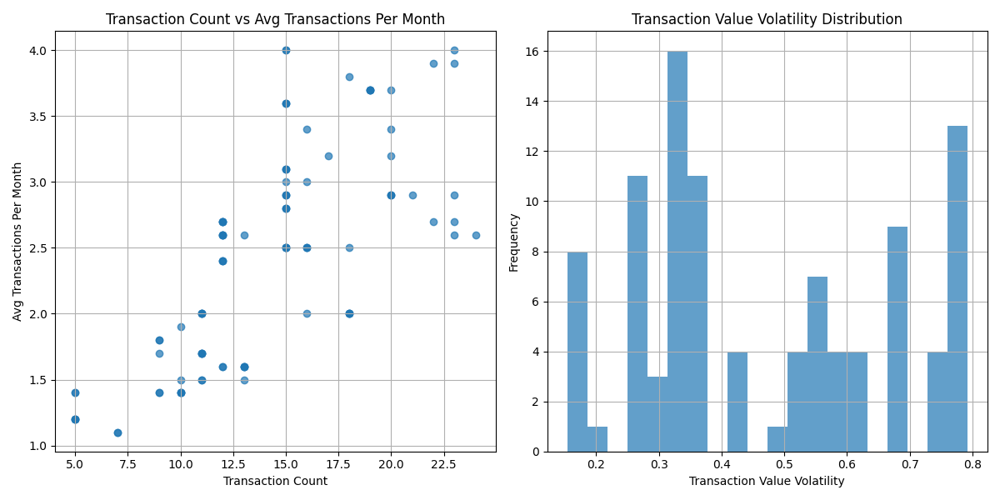
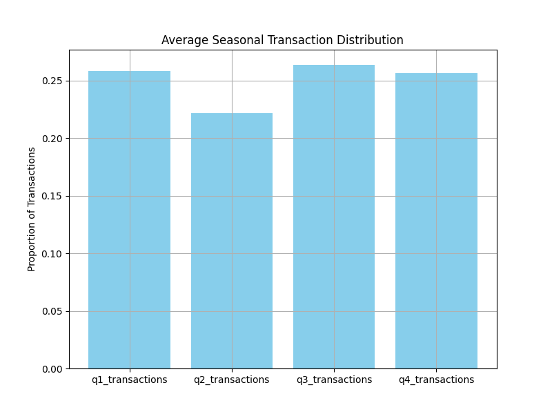
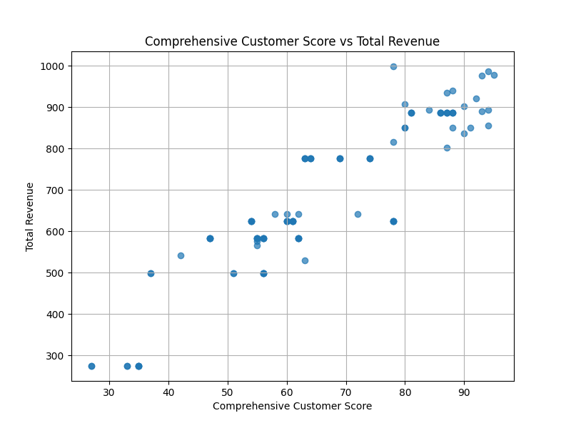
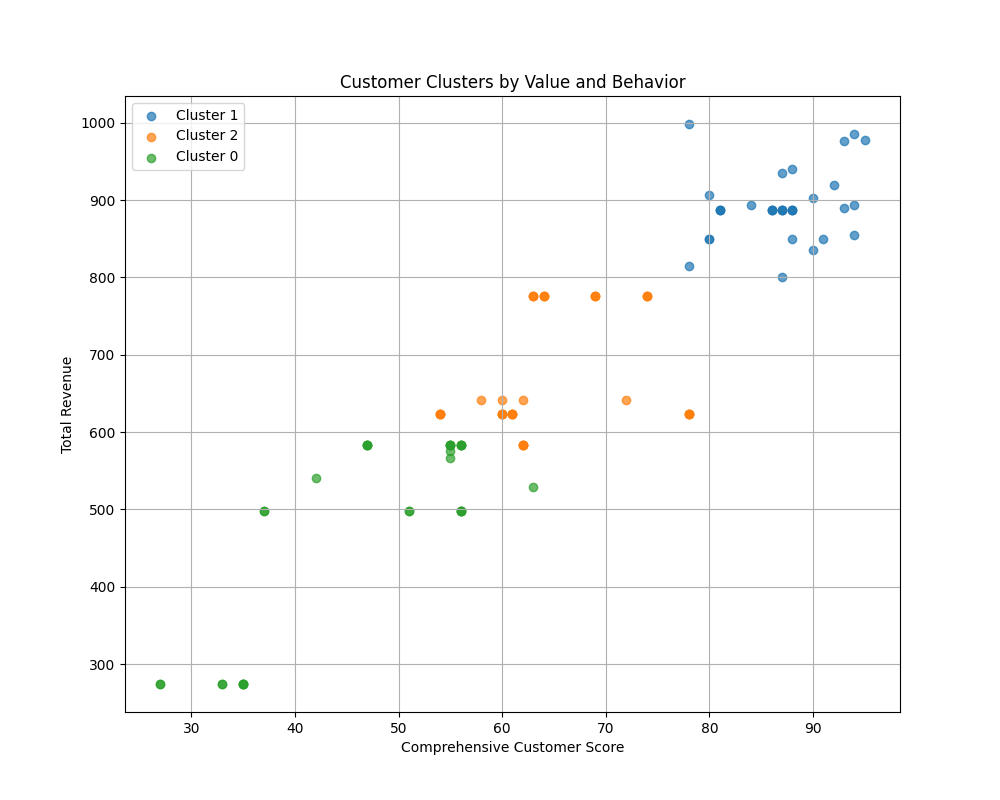

# Data Story Report: Customer Segmentation Anomaly Analysis

## Introduction
This report examines customers whose retention probability deviates significantly from their profitability segment's average. These anomalies were analyzed for transactional behavior, seasonal patterns, and value realization paths to assess the effectiveness of the current segmentation strategy.

## Observations and Insights

### Transactional Behavior

- **Transaction Count vs Avg Transactions Per Month**: This scatter plot shows the relationship between the total number of transactions and the average monthly transaction count for each anomaly customer. A high variance suggests inconsistency in customer activity levels.
- **Transaction Value Volatility Distribution**: The histogram shows that most anomaly customers exhibit moderate volatility, indicating inconsistent spending patterns.

### Seasonal Patterns

- This bar chart indicates the average seasonal distribution of transactions across Q1 to Q4 for anomaly customers. There is a visible imbalance, with anomaly customers showing a tendency towards specific quarters, particularly Q1.

### Value Realization Path

- This scatter plot compares `comprehensive_customer_score` against `total_revenue`. There is a generally positive correlation, although some high-revenue customers have relatively low scores, indicating potential misclassifications.

### Clustering Analysis

- The KMeans clustering visualization shows three distinct clusters, each exhibiting different patterns in revenue and customer scores. This suggests that introducing new dimensions like transaction stability or lifecycle stage could enhance the segmentation model.

### Decision Tree Analysis
- Classification results show high precision and recall across all segments. The model performed well in predicting profitability segments.
- **Feature Importances**:
  - `total_revenue`: 0.865
  - `transaction_count`: 0.135
  - All other features: 0.000

  The decision tree highlights `total_revenue` and `transaction_count` as the most influential factors in determining the profitability segment.

## Recommendations
1. **Revisit Segment Classification**: Given the anomalies identified, the current segment classification criteria should be revised to include more behavior-specific metrics such as transaction stability and seasonal preferences.
2. **Enhance Segmentation Model**: Introduce new dimensions:
   - **Transactional Stability**: Measure consistency in transaction value and frequency.
   - **Seasonal Preference**: Incorporate seasonal transaction patterns into segmentation.
   - **Lifecycle Stage**: Consider where a customer is in their lifecycle to tailor retention strategies.
3. **Dynamic Scoring**: Implement a dynamic scoring system that adjusts based on customer activity and behavior shifts over time.
4. **Targeted Retention Strategies**: Develop tailored retention strategies for identified clusters, especially for those with high revenue but low scores.

## Conclusion
The analysis of anomaly customers revealed significant opportunities to refine the customer segmentation strategy. By incorporating behavioral and seasonal dimensions, the company can improve targeting, enhance customer retention, and better align profitability predictions with actual performance.
