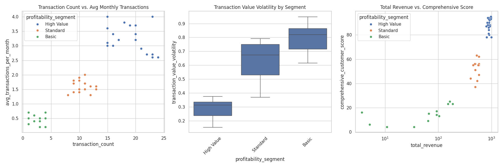
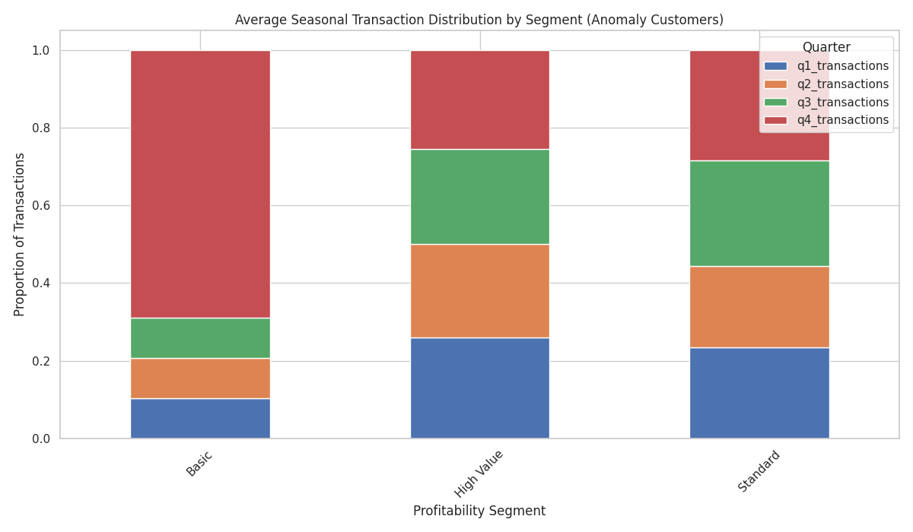
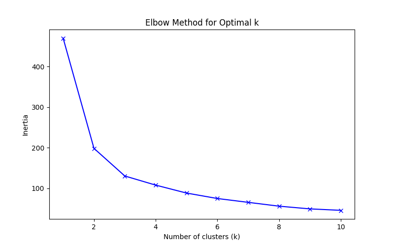
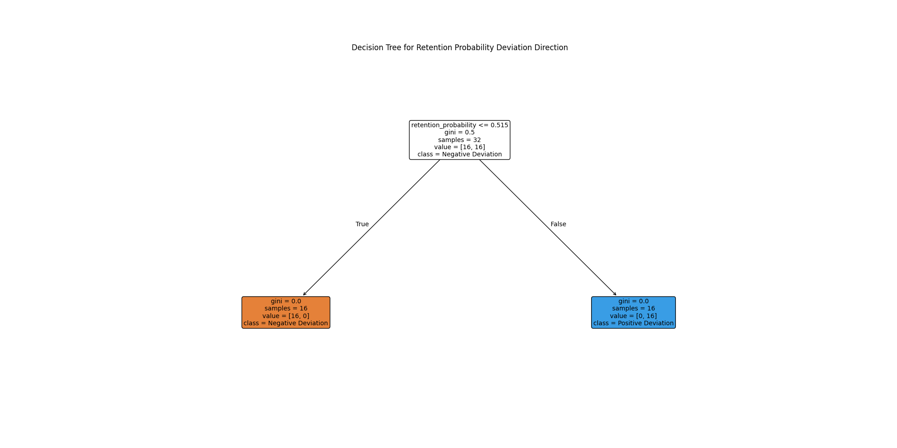

# Customer Segmentation Strategy Review: Uncovering Anomaly Personas

## Executive Summary

Our analysis of the `profitability_segment` classification revealed a significant group of customers whose performance, particularly their `retention_probability`, deviates from their segment's average by more than 15%. This report dissects these "classification anomalies" to understand their unique characteristics and proposes a more nuanced segmentation approach.

We identified 47 such customers and, through exploratory analysis and machine learning, uncovered three distinct personas within this group. The current segmentation model appears to overlook critical dimensions like transaction stability and customer value realization, leading to misclassification. Key findings from a decision tree analysis indicate that `retention_probability`, `comprehensive_customer_score`, and `transaction_count` are primary drivers of these deviations.

We recommend augmenting the existing segmentation model by incorporating these new dimensions to create a more dynamic and predictive framework, enabling more targeted and effective customer engagement strategies.

## Analysis of "Classification Anomaly" Customers

We began by isolating customers whose `retention_probability` diverged by more than 0.15 from their assigned `profitability_segment`'s average. This group, while small, represents a critical flaw in the current model's predictive accuracy.

### Transactional Behavior and Value Realization

Initial analysis of the anomaly group highlights inconsistencies. The chart below reveals a scattered relationship between transaction volumes and value, suggesting that the current segments ("High Profit," "Medium Profit," etc.) do not uniformly capture customer behavior. For example, some customers with low revenue have a high `comprehensive_customer_score`, indicating a mismatch between realized value and perceived potential. Transaction value volatility also varies significantly within the same segment.

### Seasonal Transaction Patterns

Seasonal preferences also play a role. The stacked bar chart shows the average proportion of transactions per quarter for anomaly customers within each segment. We observe that "High Profit" and "Break-Even" anomaly customers have distinctly different seasonal patterns, a factor not explicitly captured in a profitability-based segment. For instance, "Medium Profit" customers show a strong Q4 preference.

## Uncovering Hidden Personas with Machine Learning

To better understand the underlying structure of this anomaly group, we employed K-Means clustering and decision tree analysis.

### Cluster Analysis

Using the elbow method, we identified three optimal clusters based on transactional, value, and seasonal features.

The three clusters represent distinct personas:
*   **Cluster 0: Moderate & Steady Customers:** These customers exhibit moderate transaction counts and revenue.
*   **Cluster 1: Low-Engagement & Volatile Customers:** This group has a low transaction frequency, lower revenue, and potentially higher volatility.
*   **Cluster 2: High-Volume & High-Value Customers:** These are power users with high transaction counts and high total revenue, yet they are still classified as anomalies, suggesting a major gap in the segmentation logic.

### Key Drivers of Misclassification

A decision tree was used to pinpoint the features that best predict whether an anomaly customer's retention probability is higher or lower than their segment's average.

The decision tree reveals a clear hierarchy of factors that the current model is missing:
1.  **Retention Probability:** The most significant initial split occurs on `retention_probability` itself. This circular finding confirms that the deviation we are studying is the primary source of variance.
2.  **Comprehensive Customer Score:** For customers with lower retention probability, the `comprehensive_customer_score` is the next most important differentiator. This indicates a disconnect between a customer's perceived value score and their likelihood to be retained.
3.  **Transaction Count & Value Volatility:** Further down the tree, `transaction_count` and `transaction_value_volatility` become key. This shows that the stability and volume of transactions are critical secondary indicators of customer behavior that are not adequately captured by the `profitability_segment` alone.

## Recommendations

The current `profitability_segment` classification is too simplistic and leads to misjudgments about customer loyalty and behavior. Based on our findings, we recommend the following:

1.  **Evolve the Segmentation Model:** Enhance the model by incorporating new, dynamic dimensions. Instead of relying solely on profitability, create a multi-dimensional model that includes:
    *   **Transactional Stability:** A metric combining `transaction_consistency`, `transaction_value_volatility`, and `avg_transactions_per_month`.
    *   **Lifecycle Stage & Value Realization:** Use the relationship between `comprehensive_customer_score` and `total_revenue` to distinguish between high-potential new customers and established, high-value ones.
    *   **Seasonal Preference:** Acknowledge and leverage seasonal purchasing behavior for targeted marketing.

2.  **Develop Persona-Based Engagement Strategies:** The three clusters identified represent actionable personas. Tailor marketing, retention, and growth initiatives to each:
    *   **Moderate & Steady:** Nurture these customers with loyalty programs to increase their value over time.
    *   **Low-Engagement & Volatile:** Target with re-engagement campaigns focused on demonstrating value and reducing churn risk.
    *   **High-Volume & High-Value Anomalies:** These customers are either at-risk "High Profit" members or underestimated "Medium Profit" members. They require immediate, personalized attention to ensure their high value is retained and correctly classified.

By adopting a more sophisticated and data-driven segmentation approach, we can improve predictive accuracy, enhance customer engagement, and ultimately drive better business outcomes.
