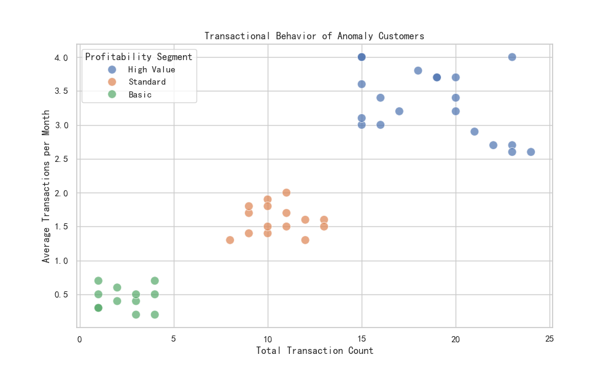
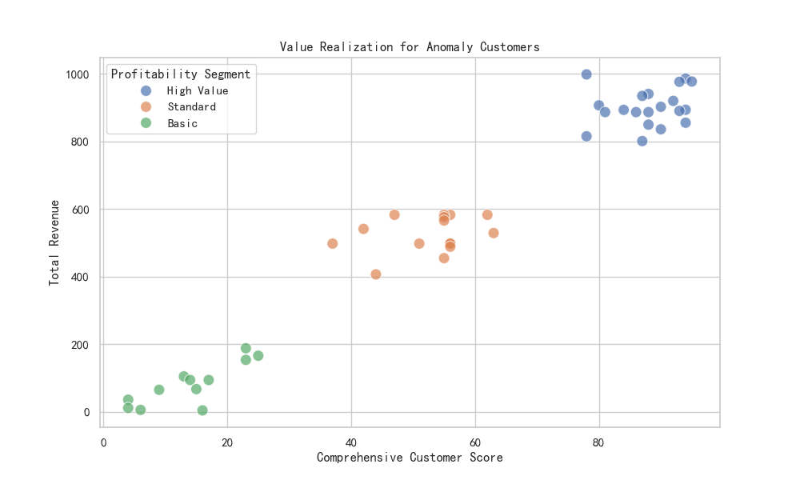
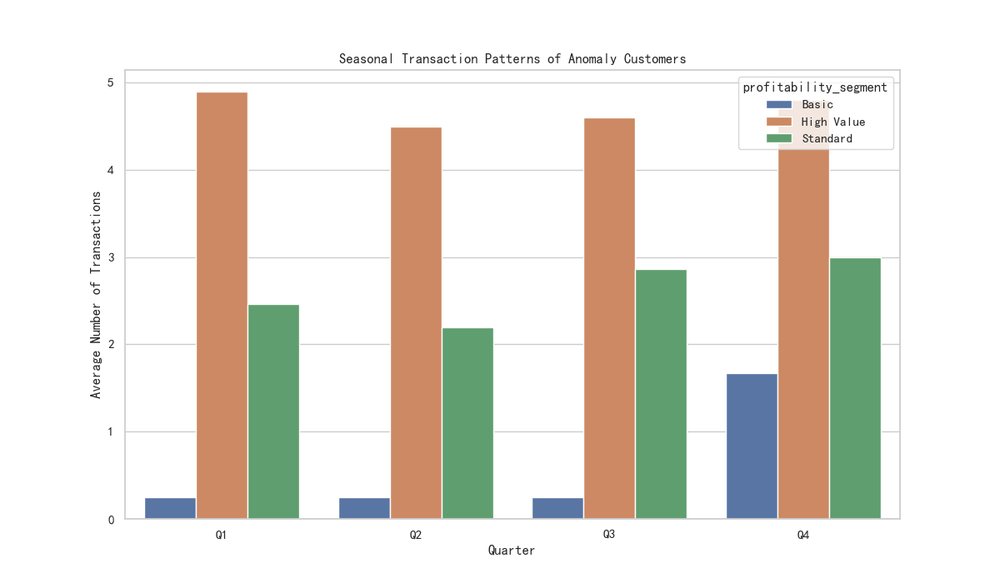

# Customer Segmentation Effectiveness Review: Uncovering Anomaly Personas

## Executive Summary

Our analysis sought to re-examine the effectiveness of the `profitability_segment` model by focusing on customers whose retention probability significantly deviates (by more than 15%) from their segment's average. We identified a group of 47 "classification anomaly" customers whose behavior is misaligned with their assigned segments.

**Key Findings:**
- **Transactional Inconsistency:** Anomaly customers, particularly in the 'High Value' segment, exhibit transactional patterns that are not consistent with their segment peers.
- **Score vs. Revenue Misalignment:** There is a noticeable disconnect between the `comprehensive_customer_score` and the `total_revenue` generated by these customers, indicating that the scoring model may not accurately reflect their true value.
- **Pronounced Seasonality:** These customers show distinct seasonal preferences, especially a dip in Q2 and a peak in Q4, which is not captured by the current segmentation.

**Recommendations:**
We recommend enhancing the customer segmentation model by incorporating new dimensions:
1.  **Transactional Stability:** Introduce metrics like `transaction_value_volatility` and the consistency between lifetime and monthly transaction rates.
2.  **Seasonal Preference:** Factor in quarterly transaction distribution to identify and target customers based on their seasonal purchasing behavior.
3.  **Value Realization Path:** Refine the `comprehensive_customer_score` to better align with actual revenue and profit contributions.

---

## In-Depth Analysis of Anomaly Customers

### 1. Transactional Behavior: Inconsistent and Unpredictable

The current segmentation appears to overlook the stability of customer transactions. By plotting total transaction count against average monthly transactions, we can see a wide dispersion, especially for 'High Value' customers. This suggests that some customers labeled as 'High Value' may have achieved this status through infrequent, high-value purchases rather than consistent engagement.

**Insight:** The `profitability_segment` does not adequately distinguish between consistently active customers and those with sporadic purchasing behavior. This misclassification can lead to inefficient resource allocation, such as spending retention efforts on customers who were never truly engaged.

### 2. Value Realization: A Mismatch Between Score and Revenue

We observed a significant misalignment between the `comprehensive_customer_score` and the `total_revenue` for anomaly customers. Ideally, a higher score should correlate with higher revenue, but the scatter plot below shows numerous exceptions. For instance, several customers with high scores have generated low to moderate revenue, while some lower-scoring customers have been highly profitable.

**Insight:** This discrepancy indicates that the factors driving the `comprehensive_customer_score` may not be the same factors that drive revenue. The segmentation model is likely overweighting certain non-financial metrics, leading to a distorted view of customer value.

### 3. Seasonal Patterns: The Overlooked Dimension of Timing

Our analysis of quarterly transaction data reveals a strong seasonal pattern among the anomaly customers that is consistent across all profitability segments. Transactions dip in Q2 and peak significantly in Q4.

**Insight:** The existing model is 'seasonally blind,' treating all transactions equally regardless of timing. By ignoring these predictable patterns, we miss opportunities for targeted marketing campaigns during peak seasons (like Q4) and proactive engagement during lulls (like Q2) to smooth out revenue cycles.

## Business Impact and Recommendations

The presence of these "classification anomalies" demonstrates a clear opportunity to refine our customer segmentation strategy. The current model provides a foundational understanding but lacks the nuance to capture complex customer behaviors.

**Recommended Actions:**

1.  **Introduce New Segmentation Dimensions:**
    *   **Transaction Stability:** Create a composite score for transaction consistency using `transaction_value_volatility` and the ratio of `avg_transactions_per_month` to `transaction_count`. This would help differentiate between 'loyal regulars' and 'opportunistic big spenders'.
    *   **Seasonal Preference:** Develop a 'Seasonal Affinity' tag (e.g., Q4-Focused, Year-Round) based on the distribution of quarterly transactions. This enables highly targeted, timely marketing.
    *   **Lifecycle Stage & Value Path:** Further investigation is needed, potentially using clustering on `comprehensive_customer_score`, `total_revenue`, and `customer_age_days`, to see if distinct lifecycle paths emerge.

2.  **Refine Predictive Models:** Use these new, richer customer profiles as features in the `retention_probability` model. We hypothesize that adding dimensions for stability and seasonality will significantly improve the model's predictive accuracy.

By evolving our segmentation from broad profitability categories to a multi-dimensional approach, we can achieve more precise targeting, improved marketing ROI, and more effective customer retention strategies.
