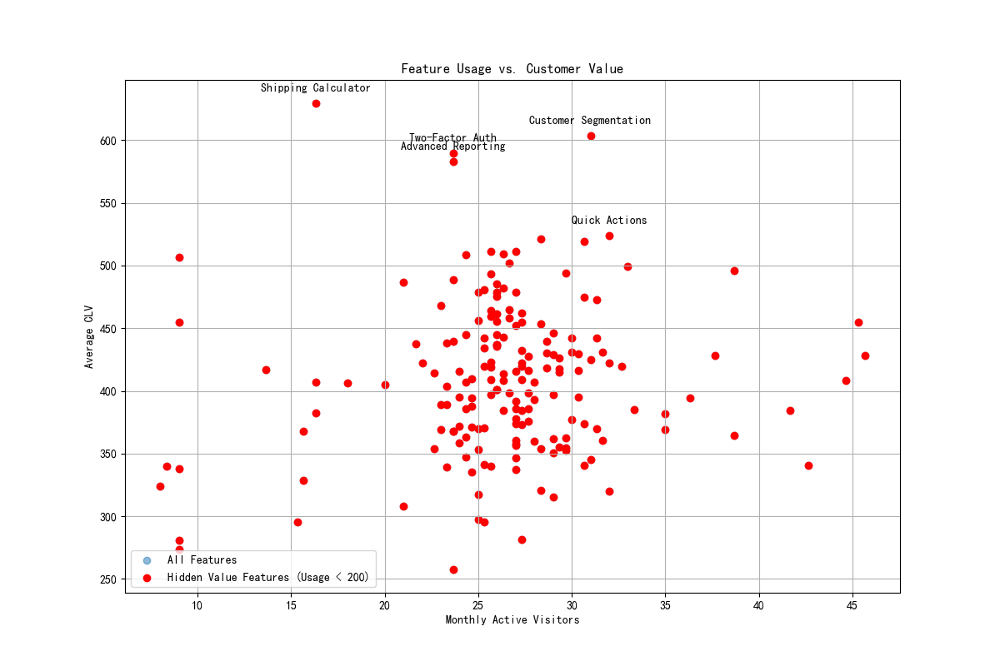

# Feature Contribution to Customer Value: Uncovering Hidden Gems

## Introduction

This report analyzes the contribution of various product features to Customer Lifetime Value (CLV). The product team has observed that out of 180 features, an average visitor uses only 12. Our goal is to identify "hidden value features" — those with low usage (fewer than 200 monthly active visitors) but a significant positive impact on customer value. These findings will provide data-driven support for the upcoming quarter's product investment decisions.

## Analysis and Findings

Our analysis combined feature usage data with customer value metrics to quantify the impact of each feature. We calculated the average monthly active visitors for each feature and the average CLV for users of that feature. By plotting these two metrics against each other, we can clearly distinguish high-value, low-usage features from the rest.

The following visualization highlights our findings:

The scatter plot shows all features based on their monthly active visitors and the average CLV of their users. The red dots represent the "hidden value features" — those with a monthly active user count of less than 200.

Our analysis revealed several features that are used by a small, yet highly valuable, segment of our customers. The top 5 hidden value features are:

| Feature Name | Monthly Active Visitors | Average CLV |
| :--- | :--- | :--- |
| Shipping Calculator | 16.3 | 629.36 |
| Customer Segmentation | 31.0 | 603.59 |
| Two-Factor Auth | 23.7 | 589.69 |
| Advanced Reporting | 23.7 | 583.14 |
| Quick Actions | 32.0 | 524.04 |

These features, despite their low usage, are associated with the highest-value customers. For example, "Shipping Calculator" is used by only a handful of visitors per month, but those visitors have the highest average CLV across our entire user base. This suggests that these features, while niche, are critical to our power users.

## Recommendations

Based on this analysis, we recommend the following actions:

1.  **Invest in "Hidden Value Features"**: The product team should prioritize further investment in the identified hidden value features. This includes not only maintaining them but also considering enhancements to increase their value proposition. Features like "Shipping Calculator" and "Customer Segmentation" are clearly resonating with a high-value customer segment.

2.  **Promote High-Value, Low-Usage Features**: Since these features are correlated with high CLV, we should investigate why their usage is so low. It could be a lack of awareness or a usability issue. We recommend targeted marketing campaigns or in-app guides to promote these features to a broader, relevant audience. Increasing their adoption could lead to a significant uplift in overall customer value.

3.  **Further Research**: Conduct qualitative research, such as user interviews, with the users of these hidden gems. Understanding *why* these features are so valuable to them can provide deeper insights that can inform future feature development and product strategy.

By focusing on these low-usage, high-impact features, we can better serve our most valuable customers and potentially unlock new avenues for growth.
