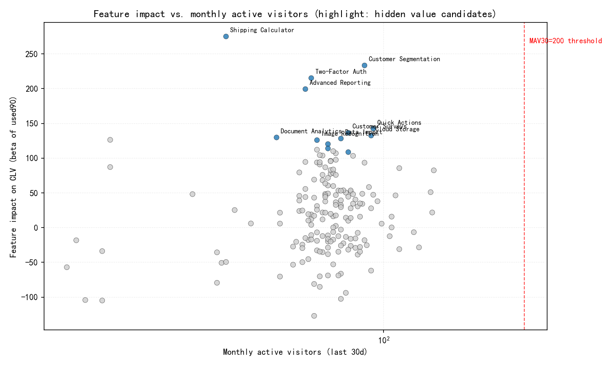
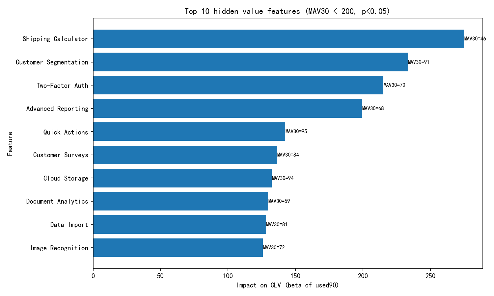

# Quantifying Feature Contribution to CLV and Identifying Hidden Value Features

## Executive summary
- Scope: 180 features analyzed across 8,000 visitors; visitor-level CLV proxy from comprehensive_customer_value.
- Method: For each feature, we estimate its marginal association with CLV using the model: CLV ~ used90(feature) + controls (log total events, log total minutes, active months). We then compute Monthly Active Visitors (MAV30) per feature.
- Findings:
  - 13 features have a significant positive association with CLV (p < 0.05); 1 feature has a significant negative association.
  - Hidden value features (MAV30 < 200 and significant positive impact): 13 features identified.
  - Popularity is only weakly related to CLV impact: Spearman rho(MAV30, beta) = 0.111 (p = 0.138). In other words, high-impact features are not necessarily widely used—clear headroom for value creation.
- Prescriptive insight: If we grow each hidden value feature to MAV30 = 200, the total estimated CLV uplift (associative, not causal) is approximately 258,219 units, with the largest opportunities in Advanced Features, User Management, and E-commerce.

Visuals:
- Feature impact vs. monthly active visitors: feature_impact_scatter.png
- Top hidden value features: hidden_value_top10.png

## Data and definitions
- Tables: pendo__visitor, pendo__visitor_feature, pendo__feature, pendo__feature_daily_metrics, pendo__customer_lifecycle_insights.
- CLV proxy: comprehensive_customer_value (visitor-level metric in pendo__customer_lifecycle_insights).
- Feature usage windows:
  - used90(feature): visitor clicked the feature in the last 90 days (from pendo__visitor_feature.last_click_at).
  - MAV30: distinct visitors with last_click_at in the last 30 days.
- Engagement controls: log(sum_events), log(sum_minutes), count_active_months.

## Methodology
- For each feature f, run a visitor-level OLS: 
  - CLV_i = α + β_f · used90_i,f + γ1·log(sum_events_i) + γ2·log(sum_minutes_i) + γ3·active_months_i + ε_i
  - β_f is interpreted as the marginal association between using feature f (in the last 90 days) and CLV, controlling for overall engagement.
- Hidden value features are defined as those with:
  - MAV30 < 200
  - β_f > 0 and p < 0.05

Note: This is an associative model; while controls mitigate some confounding, causal lift should be validated with experiments.

## Key results

1) Portfolio-level outcomes
- Total features analyzed: 180
- Significant positive (β > 0, p < 0.05): 13
- Significant negative (β < 0, p < 0.05): 1
- Popularity vs. impact: Spearman rho = 0.111 (p = 0.138), showing that usage frequency is not a reliable proxy for value contribution.

2) Top hidden value features (examples)
- Shipping Calculator (MAV30 = 46): β = +275.07, p = 0.000164
- Customer Segmentation (MAV30 = 91): β = +233.39, p = 0.000007
- Two-Factor Auth (MAV30 = 70): β = +215.21, p = 0.000282
- Advanced Reporting (MAV30 = 68): β = +199.35, p = 0.000915
- Quick Actions (MAV30 = 95): β = +142.52, p = 0.005168

These features have relatively low adoption but large positive associations with CLV after controlling for engagement, making them prime candidates for investment.

3) Potential CLV upside from growing adoption
- Estimation heuristic: If each hidden feature reaches MAV30 = 200, incremental visitors = (200 − MAV30). Estimated CLV uplift ≈ β × incremental_visitors (associative).
- Aggregate potential uplift by product area:
  - Advanced Features: 56,553
  - User Management: 42,888
  - E-commerce: 42,360
  - Integration: 29,291
  - CRM & Sales: 25,440
  - Document Management: 18,293
  - Marketing: 15,826
  - Mobile Features: 14,965
  - Project Management: 12,603
- Total estimated uplift across hidden features ≈ 258,219 CLV units.

4) Potentially harmful feature to audit
- Document Templates (MAV30 = 71): β = −126.99, p = 0.030986.
  - Action: Review UX friction points, target users, and usage contexts; consider A/B testing to validate causality before deprecation or redesign.

## Visuals
- Feature impact vs. monthly active visitors (hidden value candidates highlighted):

- Top 10 hidden value features by impact (β):

## How this was computed (reproducibility)
- Python analysis script executed: feature_clv_impact_analysis.py
  - Builds used90 visitor-feature matrix, merges with CLV and controls, runs per-feature regressions.
  - Computes MAV30, flags hidden value features, and generates the above plots.
- Key outputs:
  - feature_clv_impact_results.csv (full per-feature metrics and regression results)
  - hidden_value_features.csv (subset meeting hidden value definition)
  - hidden_value_features_uplift.csv (adds estimated uplift metrics)

## Recommendations

Near-term (next quarter)
- Double down on hidden value features
  - Product: Remove adoption friction (surface entry points, defaults, helpful presets).
  - GTM: In-app guides, targeted tooltips, email nudges to cohorts likely to benefit (based on segment fit such as product area usage or role).
  - Onboarding: Incorporate “aha” moments showcasing Shipping Calculator, Customer Segmentation, 2FA, Advanced Reporting, and Quick Actions.
  - Measurement: Track MAV30, DAU, and per-user CLV changes for these features.
- Run controlled experiments
  - A/B test activation campaigns per feature to estimate causal lift on CLV and retention.
  - Test guardrails for 2FA rollout (ensure no login friction that reduces engagement).
- Cross-team coordination by product area
  - Heaviest opportunity in Advanced Features, User Management, and E-commerce—prioritize engineering/design bandwidth there.

Medium-term
- Build a feature recommendation surface
  - Suggest high-impact but underused features to qualified users in-product.
- Expand modeling
  - Move from per-feature OLS to multi-feature regularized models (e.g., L1/L2 with interaction terms) and causal uplift modeling to disentangle correlated usage patterns.
  - Segment-specific models (new vs. power users, SMB vs. enterprise) to tailor investment.

Risk and caveats
- Association ≠ causation: High-CLV users may self-select into certain features; experiments are required to validate lift.
- Multicollinearity across related features can bias per-feature β estimates; the control set helps but does not eliminate this risk.
- MAV30 based on last_click_at; if a feature’s value is passive/consumptive, clicks may understate true engagement.

## Appendix: Top hidden value features (full list)
- Shipping Calculator, Customer Segmentation, Two-Factor Auth, Advanced Reporting, Quick Actions, Customer Surveys, Cloud Storage, Document Analytics, Data Import, Image Recognition, Contact Info Update, Custom Scripts, Risk Management.

Deliverables produced in this analysis
- Plots: feature_impact_scatter.png, hidden_value_top10.png
- Tables: feature_clv_impact_results.csv, hidden_value_features.csv, hidden_value_features_uplift.csv

With these insights, the product team can prioritize feature investments that are most likely to increase customer lifecycle value next quarter, while validating causality with targeted experiments.
