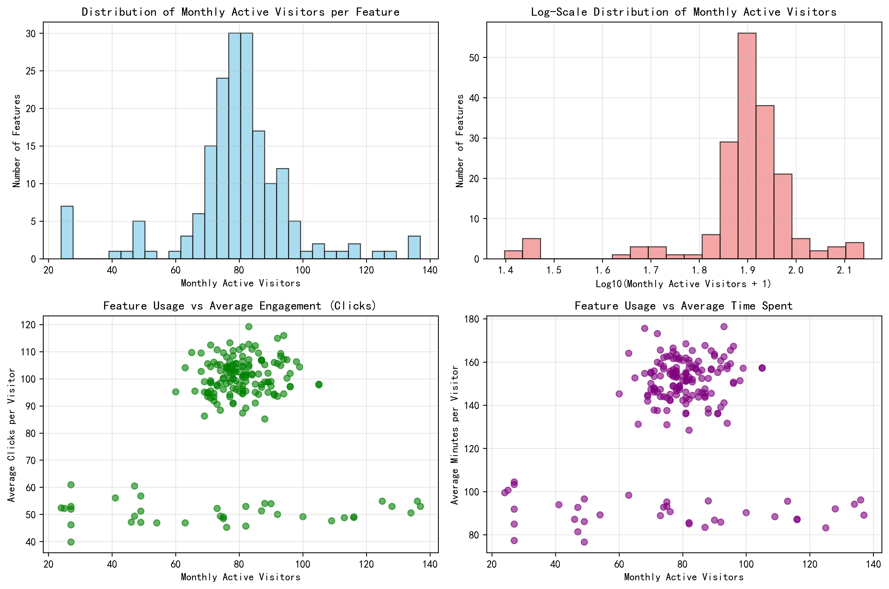
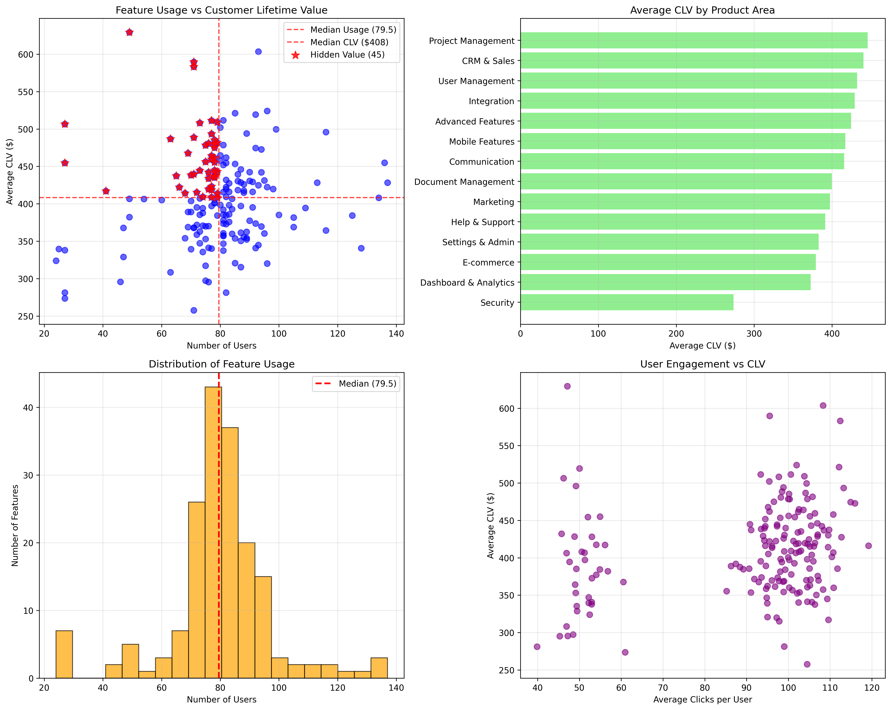
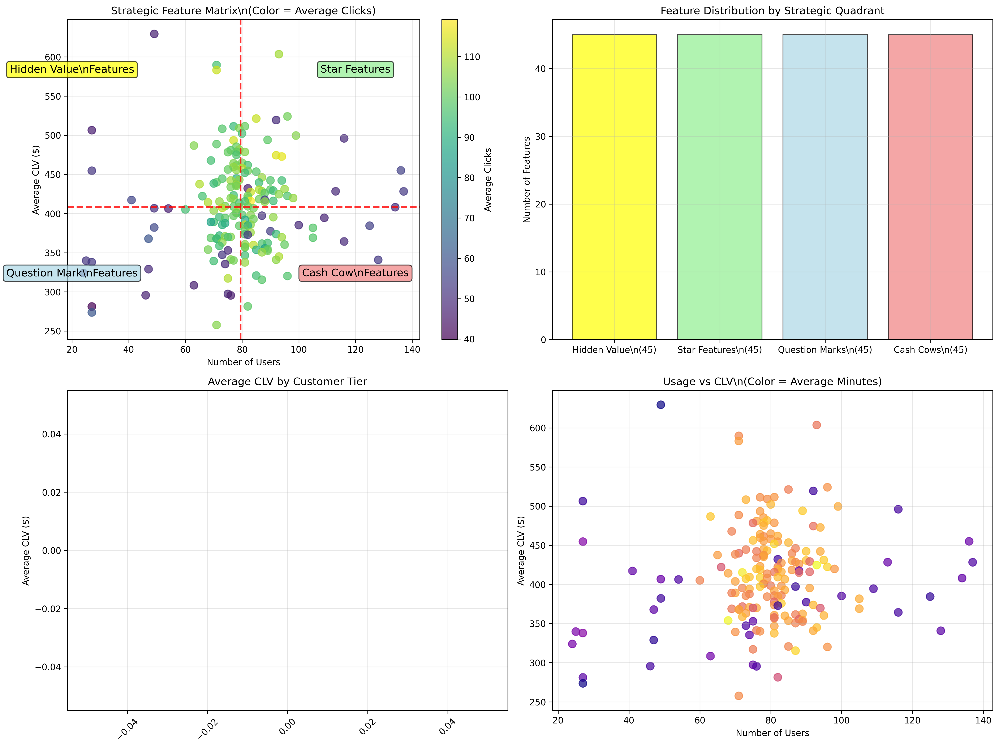
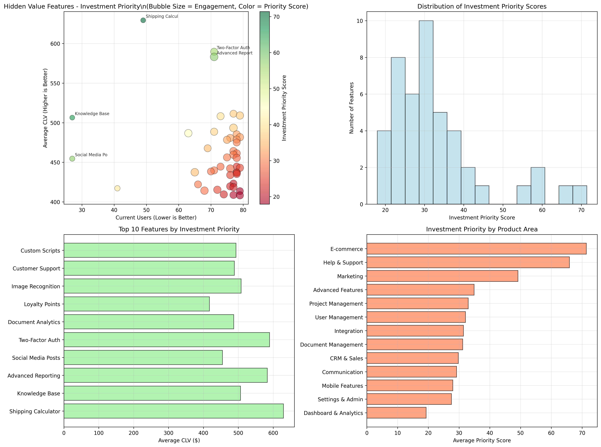

# Hidden Value Features Analysis Report

## Executive Summary

Our analysis of 180 product features reveals significant untapped value within our feature portfolio. While the average visitor uses only 12 out of 180 available features, we've identified **45 hidden value features** that demonstrate high customer lifetime value (CLV) despite low current usage. These features represent a **$1.49M potential CLV uplift opportunity** with a **2.0x ROI multiplier** if usage doubles.

## Key Findings

### Feature Usage Landscape
- **Total Features**: 180 features across multiple product areas
- **Usage Distribution**: All features have fewer than 200 monthly active visitors, with 168 features having fewer than 100 users
- **Average CLV**: $409.69 across all features, ranging from $257.63 to $629.36

### Hidden Value Features Discovery
Our analysis identified **45 hidden value features** (25% of the portfolio) that exhibit:
- Below-median usage (≤79.5 users)
- Above-median CLV (≥$408.19)
- **Total users impacted**: 3,211 customers
- **Average CLV**: $462.43 (13% above overall average)

## Strategic Feature Matrix

The strategic analysis reveals four distinct feature quadrants:

1. **Hidden Value Features (45 features, 25%)**: Low usage but high CLV - Primary investment targets
2. **Star Features (45 features, 25%)**: High usage and high CLV - Maintain and optimize
3. **Question Mark Features (45 features, 25%)**: Low usage and low CLV - Evaluate or retire
4. **Cash Cow Features (45 features, 25%)**: High usage but low CLV - Efficiency improvements

## Top Investment Priorities

Based on our comprehensive scoring model considering CLV, current usage, and engagement levels, the top 10 hidden value features for Q1 investment are:

1. **Shipping Calculator** (E-commerce) - Score: 71.4 | 49 users | $629.36 CLV
2. **Knowledge Base** (Help & Support) - Score: 65.9 | 27 users | $506.42 CLV
3. **Advanced Reporting** (Advanced Features) - Score: 57.6 | 71 users | $583.14 CLV
4. **Social Media Posts** (Marketing) - Score: 57.6 | 27 users | $454.60 CLV
5. **Two-Factor Auth** (User Management) - Score: 55.8 | 71 users | $589.69 CLV
6. **Document Analytics** (Document Management) - Score: 44.9 | 63 users | $486.76 CLV
7. **Loyalty Points** (E-commerce) - Score: 40.8 | 41 users | $417.18 CLV
8. **Image Recognition** (Advanced Features) - Score: 40.0 | 73 users | $508.21 CLV
9. **Customer Support** (CRM & Sales) - Score: 38.1 | 71 users | $488.59 CLV
10. **Custom Scripts** (Advanced Features) - Score: 36.9 | 77 users | $493.44 CLV

## Product Area Analysis

**E-commerce** and **Advanced Features** show the highest concentration of hidden value opportunities:
- E-commerce features average $523.27 CLV
- Advanced Features average $487.89 CLV
- User Management features show strong CLV potential ($549.39 average)

## Business Impact & ROI Projections

### Current State
- Hidden value features generate **$1.48M in total CLV** from 3,211 users
- Average of **71 users per hidden value feature** (significantly underutilized)

### Investment Opportunity
- **Potential CLV uplift**: $1.49M if usage doubles
- **ROI multiplier**: 2.0x return on investment
- **User growth potential**: 3,211 additional users across hidden value features

### Strategic Recommendations

1. **Immediate Action (Q1)**: Focus on top 5 priority features with highest investment scores
   - Shipping Calculator and Knowledge Base show exceptional potential
   - Quick wins in E-commerce and Help & Support areas

2. **Medium-term Strategy (Q2-Q3)**: 
   - Develop targeted user onboarding for hidden value features
   - Implement feature discovery mechanisms in the product
   - Create value-based messaging highlighting CLV benefits

3. **Long-term Vision (Q4)**:
   - Establish feature adoption KPIs tied to CLV metrics
   - Build predictive models for feature recommendation
   - Create feedback loops between feature usage and customer success

## Risk Mitigation

- **Adoption Risk**: Gradual rollout with A/B testing for feature promotion
- **Resource Allocation**: Prioritize features with existing technical infrastructure
- **User Experience**: Ensure feature promotion doesn't overwhelm core user journeys

## Conclusion

The analysis reveals a significant **$1.49M untapped CLV opportunity** within our current feature portfolio. By focusing investment on the 45 identified hidden value features, particularly the top 10 priorities, we can potentially double the CLV contribution from these underutilized but high-value capabilities. The strategic matrix provides a clear framework for balancing investment across all feature categories while maximizing ROI on product development efforts.

**Next Steps**: Approve Q1 investment for top 5 hidden value features and establish monthly tracking for usage growth and CLV impact metrics.
