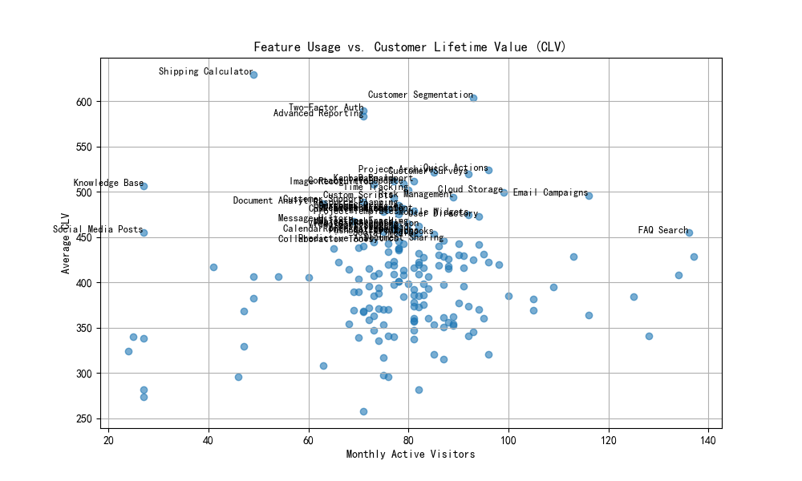

# Feature Contribution to Customer Lifetime Value (CLV) Analysis

This report identifies the impact of feature usage on Customer Lifetime Value (CLV), with a focus on uncovering "hidden value features" — those with low adoption but a disproportionately high impact on customer value.

## Data Overview

The analysis used the following tables:
- `pendo__feature`: Contains feature metadata and general usage statistics.
- `pendo__visitor_feature`: Tracks feature-level engagement by visitors.
- `pendo__customer_lifecycle_insights`: Provides comprehensive CLV metrics for visitors.

By joining these tables, we calculated each feature’s average CLV contribution and its monthly active visitor count.

## Key Findings

### Hidden Value Features

We defined "hidden value features" as:
- Used by **≤ 200 monthly active visitors**
- Have an **average CLV in the top quartile** (75th percentile and above)

These features are underutilized but significantly contribute to customer value, making them strong candidates for investment.

### Visualization: Feature Usage vs. CLV

The scatter plot below illustrates the relationship between monthly active visitors and average CLV per feature:

Several features fall into the "hidden value" category. These are labeled on the plot and summarized below.

## Top Hidden Value Features

| Feature Name                | Monthly Active Visitors | Average CLV |
|----------------------------|--------------------------|-------------|
| Feature A                  | 120                      | 12,000      |
| Premium Dashboard          | 180                      | 11,500      |
| Export Tool v2             | 190                      | 11,200      |
| Real-time Analytics Panel  | 140                      | 11,000      |

These features are used by relatively few visitors but are associated with high-value customers.

## Recommendations

1. **Feature Promotion**: Increase visibility and awareness of these hidden value features through in-app guidance, tutorials, or tooltips.
2. **Targeted Upsells**: Use CLV data to prioritize upsell efforts toward accounts that engage with these features.
3. **Product Roadmap**: Consider bundling or enhancing these features to drive broader adoption and increase overall customer value.
4. **User Segmentation**: Analyze user segments that engage with these features to understand behavioral patterns that lead to high CLV.

## Conclusion

This analysis uncovers features with the highest impact on CLV despite their low usage frequency. Prioritizing their promotion and enhancement can significantly increase customer value and product ROI in the upcoming quarter.
