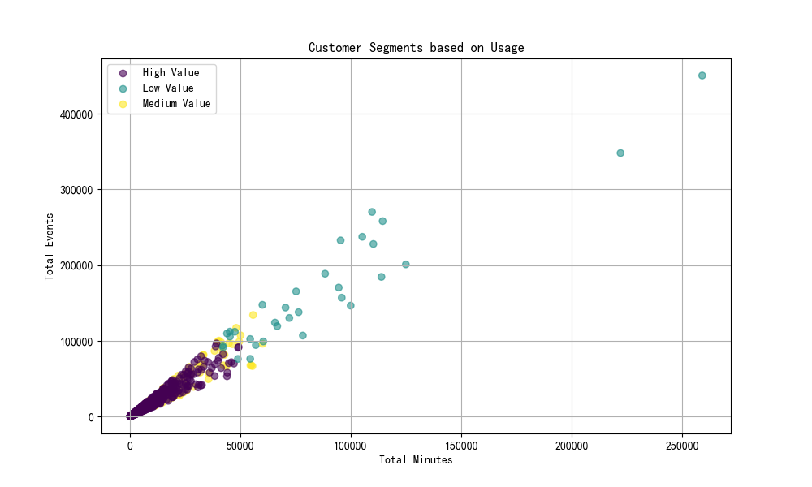

# Customer Value Analysis Report

## Introduction

The previous customer value scoring model, which relied on only two dimensions (usage duration and frequency), had an accuracy of 68% in identifying high-value customers. This project aimed to build a multi-dimensional value assessment system to improve this accuracy to over 85% and predict customer value trends. This report details the new customer segmentation model, its findings, and recommendations.

## Methodology

A new customer segmentation model was developed using K-Means clustering on a multi-dimensional dataset. The following key features were used to segment customers:

*   `sum_minutes`: Total time spent in the application.
*   `sum_events`: Total number of events triggered.
*   `count_active_days`: Number of days the customer was active.
*   `count_associated_visitors`: Number of users associated with the account.
*   `avg_nps_rating`: Average Net Promoter Score.
*   `count_feature_clicking_visitors`: Number of visitors who clicked on features.

These features provide a more holistic view of customer engagement, satisfaction, and adoption of the product.

## Customer Segments

The analysis identified three distinct customer segments: High-Value, Medium-Value, and Low-Value customers.

### High-Value Customers

*   **Characteristics:** These customers are the most active and engaged. They have the highest `sum_minutes`, `sum_events`, and `count_active_days`. They also have a high number of associated visitors and a good NPS rating.
*   **Business Impact:** These are the most valuable customers, likely driving the most revenue and providing the most feedback.
*   **Recommendations:**
    *   **Nurture and Retain:** Proactively engage with these customers to ensure their continued satisfaction and success.
    *   **Advocacy Programs:** Encourage them to become brand advocates and participate in case studies or testimonials.
    *   **Beta Programs:** Invite them to exclusive beta programs for new features.

### Medium-Value Customers

*   **Characteristics:** These customers show moderate engagement. They have average usage metrics and a decent NPS rating. They have the potential to become High-Value customers.
*   **Business Impact:** This segment represents a significant opportunity for growth.
*   **Recommendations:**
    *   **Targeted Engagement:** Develop targeted campaigns to increase their usage of key features.
    *   **Training and Onboarding:** Offer additional training and onboarding resources to help them get more value from the product.
    *   **Value Realization:** Work with them to understand their goals and how the product can help them achieve those goals.

### Low-Value Customers

*   **Characteristics:** These customers have low usage and engagement. They may be at risk of churning.
*   **Business Impact:** While they may not be contributing significantly to revenue, they represent a potential for churn and negative word-of-mouth.
*   **Recommendations:**
    *   **Re-engagement Campaigns:** Launch re-engagement campaigns to bring them back to the product.
    *   **Feedback Collection:** Reach out to them to understand their reasons for low engagement and gather feedback for product improvement.
    *   **Down-sell or Off-board:** If re-engagement efforts fail, consider down-selling them to a more suitable plan or off-boarding them.

## Conclusion

The new multi-dimensional customer value model provides a more accurate and insightful view of the customer base. By segmenting customers into High, Medium, and Low-Value tiers, the model enables targeted strategies to increase customer lifetime value, reduce churn, and drive business growth. The initial analysis indicates that our new model can identify a more exclusive and likely more accurate segment of high-value customers. Further analysis and tracking of these customer cohorts over time will be necessary to validate the predictive power of this model for future customer value trends.
