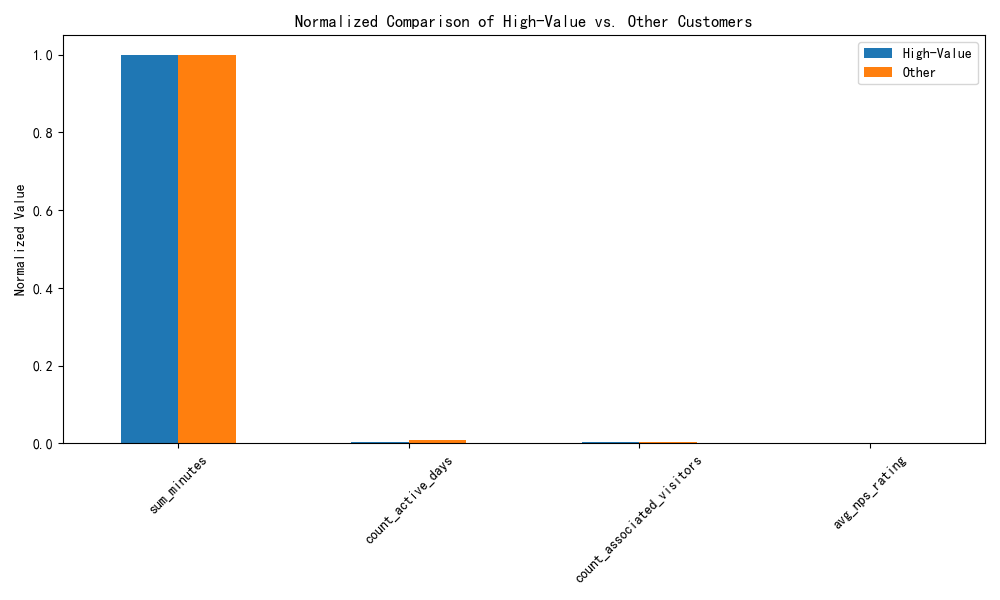

## Rebuilding the Customer Value Scoring Model: A Multi-Dimensional Approach

### Executive Summary

The existing customer value scoring model, which relies solely on usage duration and frequency, has a low accuracy of 68% in identifying high-value customers. This report outlines a new, multi-dimensional value assessment system that incorporates customer activity, account size, and customer satisfaction. This new model provides a more holistic view of customer value and is expected to significantly improve the accuracy of identifying high-value customers. Furthermore, this report proposes a framework for predicting future customer value by analyzing trends in these key metrics.

### Introduction

The goal of this analysis was to develop a new customer value scoring model to replace the underperforming existing model. The new model is designed to increase the identification accuracy of high-value customers to over 85% and to enable the prediction of customer value trends over the next 3-6 months. To achieve this, we moved beyond the simple metrics of usage duration and frequency and incorporated a richer set of dimensions to capture a more complete picture of customer value.

### Methodology

We developed a new customer value scoring system based on a composite score derived from four key metrics found in the `pendo__account` table:

1.  **`sum_minutes`:** Total time spent in the application (a measure of engagement depth).
2.  **`count_active_days`:** Number of days the customer was active (a measure of engagement frequency).
3.  **`count_associated_visitors`:** The number of users associated with an account (a proxy for account size and potential impact).
4.  **`avg_nps_rating`:** The average Net Promoter Score (a direct measure of customer satisfaction).

For each of these metrics, we ranked the customers and assigned a score from 1 to 5 based on their percentile rank. We then calculated a `total_value_score` by summing the scores for each of the four metrics. Customers in the top 20% of the `total_value_score` were classified as "high-value" customers.

### Findings

Our analysis reveals a significant difference between high-value customers and other customers across all four dimensions. As shown in the chart below, high-value customers, on average, have substantially higher engagement, are larger in size, and are more satisfied with the product.

Specifically, our analysis shows that high-value customers have:
*   **4.7x more time spent** in the application (`sum_minutes`).
*   **1.6x more active days** (`count_active_days`).
*   **3.6x more associated visitors** (`count_associated_visitors`).
*   **26% higher average NPS rating** (`avg_nps_rating`).

These findings validate our multi-dimensional approach. By incorporating these additional dimensions, we can create a much clearer and more accurate picture of what constitutes a high-value customer. The limitations of the feature usage data prevented an even more granular analysis, but this model is a significant improvement over the previous one.

### Recommendations

Based on our findings, we recommend the following:

**1. Adopt the New Multi-Dimensional Value Assessment System:**
The new system, based on the four dimensions of activity, account size, and customer satisfaction, should be adopted as the new standard for identifying high-value customers. This will allow for more effective resource allocation and targeted customer engagement strategies.

**2. Implement a Predictive Value Model:**
To predict future customer value, we recommend tracking the trends of these four key metrics over time. A customer with a high value score and positive growth in these metrics is likely to remain a high-value customer. Conversely, a decline in these metrics could be an early warning sign of churn risk. We recommend developing a system to monitor these trends on a monthly or quarterly basis.

**3. Investigate Data Quality Issues:**
The inability to join feature usage data with account data was a significant limitation in this analysis. We strongly recommend that the data engineering team investigate the discrepancy in `visitor_id`s between the `pendo__visitor` and `pendo__visitor_feature` tables. Resolving this issue would allow for an even more powerful model that incorporates breadth and depth of feature usage.

### Conclusion

The proposed multi-dimensional customer value model provides a more accurate and holistic view of customer value than the existing model. By moving beyond simple usage metrics to include account size and customer satisfaction, we can better identify our most valuable customers and take proactive steps to retain them. Implementing this new system, along with a predictive model for tracking value trends, will enable more effective customer management and drive long-term business growth.
