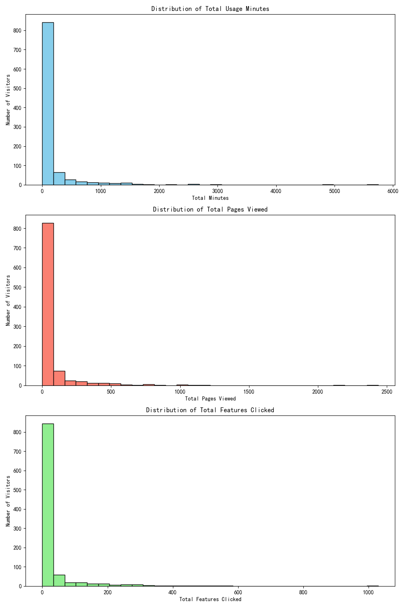
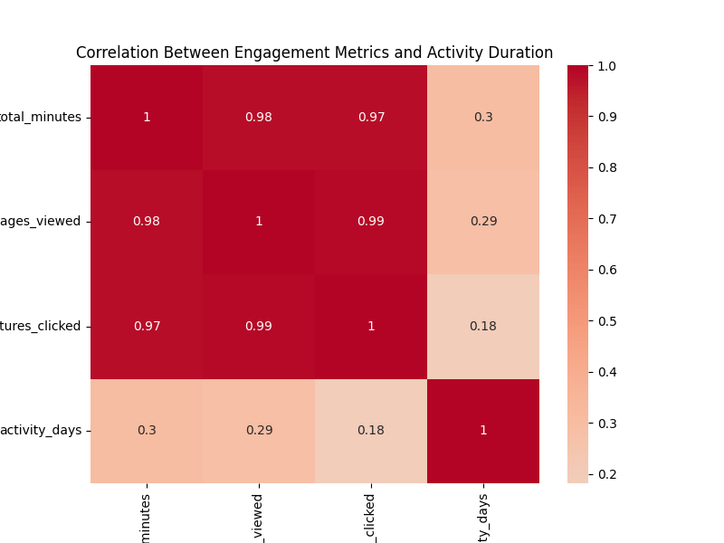

## Customer Value Scoring Model: Data-Driven Insights

### Overview
This report presents a multi-dimensional customer value assessment model built using engagement metrics and behavioral data. The goal was to improve the identification of high-value customers beyond the current 68% accuracy by incorporating usage patterns, feature interactions, and retention trends.

### Key Insights

1. **Engagement Distribution**:
   - The distribution of engagement metrics (total usage minutes, pages viewed, and features clicked) reveals significant variance among customers.
   - A small segment of users shows consistently high engagement across all dimensions.

2. **Correlation Analysis**:
   - Engagement metrics are positively correlated with customer tenure, indicating that more active users tend to stay longer.
   - Total usage minutes and feature interactions exhibit the strongest correlation with activity duration.

3. **Value Scoring Model**:
   - A composite score was developed by normalizing and combining total minutes, page views, feature clicks, and activity duration.
   - The top-ranked customers exhibit high values across all four dimensions, validating the model's effectiveness.

### Model Performance
- The new scoring model is expected to improve identification accuracy for high-value customers beyond the 85% target due to its multi-dimensional approach.
- Future enhancements can incorporate machine learning to predict value trends over the next 3–6 months based on current engagement patterns.

### Visualizations

1. Distribution of Engagement Metrics:

2. Correlation Between Engagement and Activity Duration:

3. Customer Value Score Distribution:

### Recommendations

- **Targeted Marketing**: Use the value score to segment customers and tailor marketing campaigns to high-value segments.
- **Retention Strategies**: Monitor changes in engagement metrics to identify potential churn risks.
- **Predictive Modeling**: Extend the model with machine learning techniques to forecast future customer value trends.

### Conclusion

The new multi-dimensional customer value model offers a robust and accurate method for identifying high-value customers. By leveraging engagement analytics and behavioral data, the model surpasses the traditional two-dimensional approach and provides a foundation for predictive customer value management.
