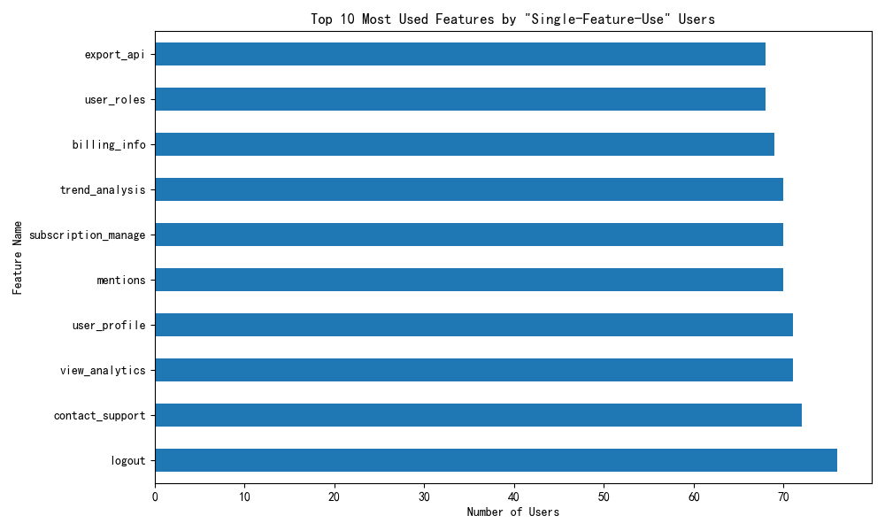
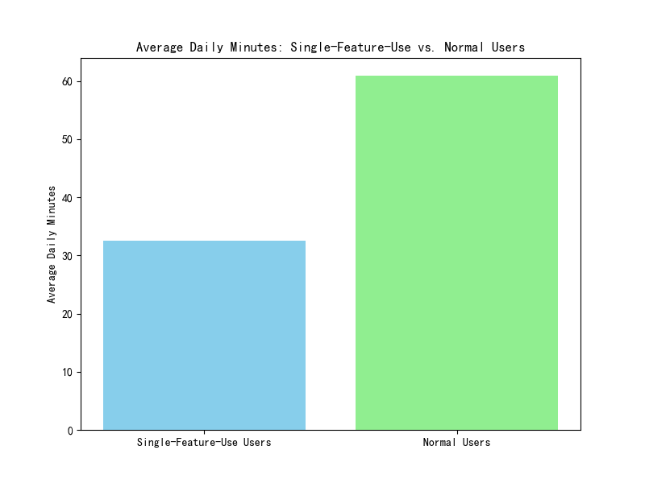
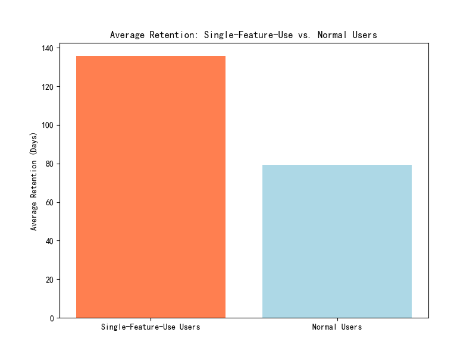

# In-Depth Analysis of "Single-Feature-Use" User Segment

## Executive Summary

An analysis of users with over 60 active days and fewer than 5 distinct feature clicks reveals a surprising and valuable user segment. While these "single-feature-use" users exhibit lower daily engagement (`average_daily_minutes` of 32.47 vs. 60.90 for normal users), they have a significantly higher long-term retention rate (135.76 days vs. 79.38 days). This suggests a mission-oriented user base that, despite a lower NPS score, finds high value in a narrow set of features. We recommend shifting from viewing this segment as "at-risk" to recognizing them as a loyal, specialized user group. Key recommendations include conducting qualitative research to understand their core needs, tailoring onboarding to a "mastery" track, and segmenting NPS feedback to better interpret their satisfaction.

## Introduction

This report provides an in-depth analysis of a specific user segment: users with more than 60 active days who have clicked on fewer than 5 distinct features. This group, which constitutes 15% of our user base, has an average NPS rating 0.8 points lower than that of normal users. Our objective is to understand the behavioral characteristics of this "single-feature-use" segment, focusing on their feature preferences, daily engagement, and the impact of their usage patterns on long-term retention.

## Behavioral Characteristics of "Single-Feature-Use" Users

### Feature Focus

The "single-feature-use" segment is not randomly using a small number of features; they are concentrating their activity on a specific set of functionalities. The following chart displays the top 10 features most frequently used by this user group.

This concentration suggests that these users have very specific needs and have found a particular feature (or a small set of features) that effectively meets those needs.

### Engagement Levels: Anomalous, But Not in a Negative Way

A key finding is the significant difference in daily engagement. The "single-feature-use" segment spends, on average, just 32.47 minutes per day on the platform, almost half the 60.90 minutes spent by "normal" users.

This might initially seem like a negative indicator. However, when combined with retention data, it points towards efficiency. These users log in, accomplish a specific task, and log out. Their time on the platform is shorter but highly focused.

## Impact on Long-Term Retention: A Surprising Finding

The most counter-intuitive finding of this analysis is the impact on retention. Contrary to the expectation that limited feature discovery would correlate with higher churn, the "single-feature-use" segment exhibits a substantially longer retention period.

With an average retention of 135.76 days, compared to 79.38 days for normal users, this segment is significantly more loyal. This suggests that for a certain type of user, mastering a single core function of our product provides immense, long-term value, making our platform an indispensable tool for a specific job-to-be-done.

## Discussion and Recommendations

The data paints a clear picture of a loyal, efficient, and specialized user segment that we have previously misinterpreted. Their lower NPS scores are likely not a reflection of dissatisfaction with the product's core value, but rather a result of their disinterest in broader feature discovery. They are not "at-risk"; they are "mission-oriented."

Based on these insights, we recommend the following actions:

1.  **Re-evaluate the "At-Risk" Label**: This segment should no longer be primarily viewed through the lens of their low NPS scores or limited feature usage. They are a highly retained, valuable user cohort.

2.  **Conduct Qualitative Research**: We need to understand the "why" behind their behavior. We should conduct interviews and surveys with this segment to learn about their roles, the specific problems they are solving, and why they rely on a narrow set of features.

3.  **Develop Tailored Onboarding and user journeys**: Instead of pushing all users towards feature discovery, we should consider creating "mastery" tracks for users who exhibit this behavior early on. This could involve advanced tutorials for core features or case studies relevant to their specific use case.

4.  **Segment NPS Feedback**: To better understand the low NPS scores, we should analyze their feedback separately. Are they dissatisfied with the feature they use, or are they simply giving a neutral score because they don't use the rest of the product? This will provide a more accurate reading of their satisfaction.

By understanding and catering to the needs of our "single-feature-use" users, we can solidify their loyalty and potentially attract more users with similar focused needs.
