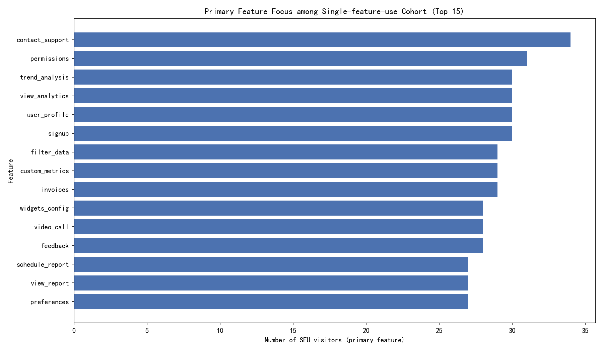
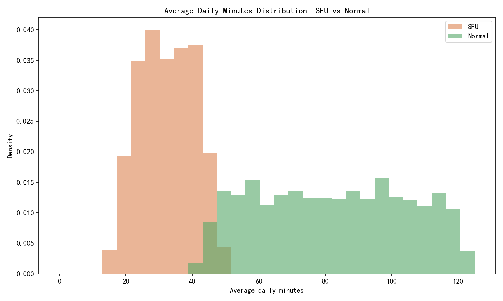
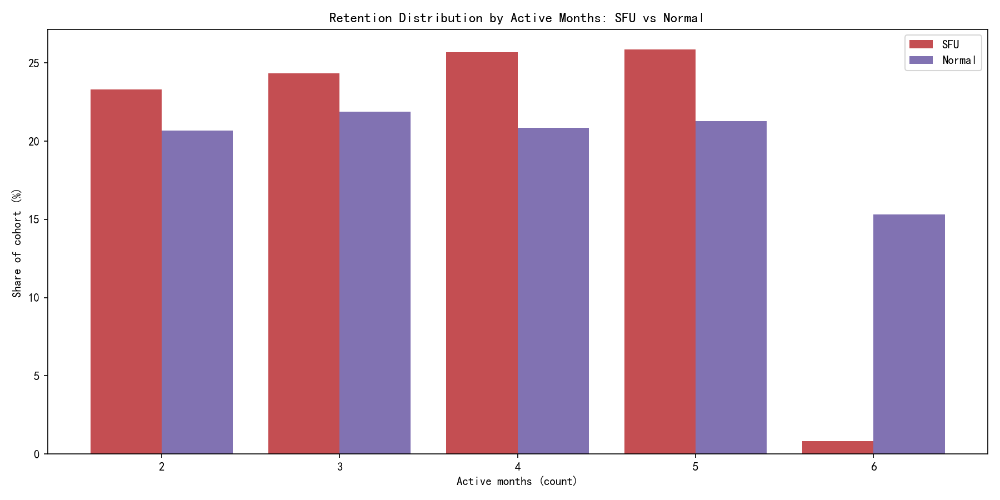

# Single-feature-use cohort deep dive: behavior, intensity, and retention

Summary
- Definition used in this analysis:
  - SFU cohort: visitors with count_active_days > 60 and distinct_features < 5.
  - Normal cohort: visitors with count_active_days > 60 and distinct_features >= 5.
- Cohort size and outcomes (from the dataset):
  - Share of SFU among active>60-day users: 37.3% (1184 of 3171).
  - Average NPS: SFU = 5.58 vs Normal = 8.01 (−2.42 gap).
  - Average daily minutes: SFU = 32.47 vs Normal = 82.27 (−49.8 min).
  - Average active months: SFU = 3.57 vs Normal = 3.89.
- Note: Your prior observation mentioned a 15% SFU share and a −0.8 NPS gap. In this dataset, the SFU share and NPS gap are larger, but the directional impact is consistent: SFU users show lower satisfaction and lower usage intensity.

What features SFU users primarily focus on
- We identify each SFU visitor’s primary feature as the feature with the highest sum_clicks (tie-breaker: sum_minutes).
- Top primary features by SFU visitor count are largely utility, analytics, and management workflows:
  - contact_support, permissions, trend_analysis, view_analytics, user_profile, signup, filter_data, custom_metrics, invoices, widgets_config, video_call, feedback, schedule_report, view_report, preferences.
- When aggregated to product areas, SFU primary focus is broadly distributed (no single area dominates):
  - reports (130), analytics (130), user_management (125), collaboration (121), authentication (121), admin (116), support (114), billing (114), integration (108), dashboard (105).
  - This spans 100% of the SFU cohort, with each area representing roughly 9–11% of SFU users.
- Median engagement at the primary feature (SFU):
  - Median clicks per primary feature ~67–86; median minutes ~21–31. This indicates repetitive interaction with a single function rather than broad exploration.

Visual: Top primary features among SFU

Is average_daily_minutes anomalous?
- Yes—SFU users spend materially less time per day:
  - SFU: mean 32.47, median 32.60; IQR [25.84, 39.09], p90 43.17, p99 48.14.
  - Normal: mean 82.27, median 82.27; IQR [62.55, 101.07], p90 113.71, p99 121.81.
- The distribution for SFU is tightly concentrated around ~26–39 minutes; the Normal cohort spreads higher and wider.
- Diagnostic relationships (among users with >60 active days):
  - Correlation(distinct_features, average_daily_minutes) = 0.63 (moderate-to-strong).
  - Correlation(distinct_features, latest_nps_rating) = 0.54 (moderate).
  - Interpretation: broader feature adoption accompanies more time in-product and higher satisfaction.

Visual: Average daily minutes distribution

Impact on long-term retention
- Average count_active_months is modestly lower for SFU: 3.57 vs 3.89 months.
- Distribution-level view shows a stark difference at the long tail:
  - Share at 6 months: SFU = 0.84% vs Normal = 15.3% (SFU representation at month 6 is ~95% lower).
  - For months 2–5, SFU representation is slightly higher or comparable, then falls off sharply by month 6.
- Diagnostic relationship:
  - Correlation(distinct_features, count_active_months) = 0.10 (small but positive).
  - Interpretation: expanding beyond a narrow feature set is associated with modestly higher long-term retention and a much better chance of persisting to 6 months.

Visual: Retention distribution by active months

Implications and root-cause hypotheses
- SFU users are not “light adopters” in the sense of inactivity—they are focused: many clicks within their primary feature but little cross-feature discovery. This may reflect:
  - Role specialization (e.g., support, admin, auth tasks).
  - Unclear value pathways from the initial/primary feature to adjacent value (e.g., from reports to analytics deep-dives).
  - Friction or awareness gaps preventing cross-feature activation.
- Consequences:
  - Lower average_daily_minutes and lower NPS suggest unmet needs or perceived limited value.
  - A sharp retention cliff by the 6th month indicates these users are at heightened risk of medium-term churn unless they broaden usage.

Recommendations (prescriptive actions)
1) Cross-feature activation journeys from top SFU features
   - For “reports” and “analytics” (≈22% of SFU):
     - Embed contextual calls-to-action on report pages to launch deeper analytics (filters, custom metrics, comparative trends).
     - Offer one-click “Explore further” walkthroughs that highlight 1–2 adjacent analytics features.
   - For “authentication” and “user_management” (≈21%):
     - Post-signup and permissions screens should route users to onboarding checklists that unlock next-value steps (profile setup, integrations, dashboards).
   - For “support” and “admin” (≈19%):
     - Replace generic help with targeted education: “Users who contacted support about X often use Y feature next” nudges.

2) Personalization and discovery
   - In-product recommendations based on current primary feature: “Users like you also use…”
   - Surface “neighbor features” in the same product area (e.g., from view_report to trend_analysis, schedule_report, custom_metrics).
   - Time-boxed nudges during weeks 2–6 (when SFU engagement is still present) to preempt the month-6 cliff.

3) Guided paths and checklists
   - Short, role-based checklists that require using at least 5 features within the first 60 active days.
   - Measure success by raising the proportion of active>60 users with >=5 features and by improving SFU’s 6-month presence.

4) Goal setting and KPIs
   - Reduce SFU share from 37% to ≤30% over the next quarter by driving cross-feature adoption.
   - Lift SFU 6-month presence from 0.84% to ≥5%.
   - Close NPS gap by ≥1.0 point via targeted value delivery in weeks 2–6.
   - Leading indicators: % of SFU who adopt 1 new adjacent feature within 14 days; average_daily_minutes lift among SFU; week-4 retention.

5) Experimentation
   - A/B test contextual cross-sell in top primary features (reports, analytics, auth, user_mgmt).
   - Test role-specific tours vs generic tours for SFU.
   - Evaluate impact on distinct_features, minutes, NPS, and 6-month retention.

Appendix: Evidence excerpts
- Cohort summary (active>60): SFU share 37.34%; NPS 5.583 vs 8.007; avg daily minutes 32.47 vs 82.27; active months 3.566 vs 3.886.
- SFU distinct_features split: 1 (294), 2 (258), 3 (310), 4 (322) — fairly even across low breadth.
- Product area concentration (primary): reports 130, analytics 130, user_management 125, collaboration 121, authentication 121, admin 116, support 114, billing 114, integration 108, dashboard 105.
- Correlations among active>60 users:
  - distinct_features with average_daily_minutes: 0.627
  - distinct_features with NPS: 0.545
  - distinct_features with active months: 0.101

Reproducibility: plotting code used
- The analysis executed a Python script (analyze_sfu.py) that:
  - Pulled cohort and feature usage from the SQLite DB.
  - Identified primary features for SFU and mapped to product areas.
  - Produced three figures saved in the working directory:
    - sfu_primary_features.png
    - minutes_distribution.png
    - retention_distribution.png

All visuals referenced above:
- sfu_primary_features.png
- minutes_distribution.png
- retention_distribution.png
