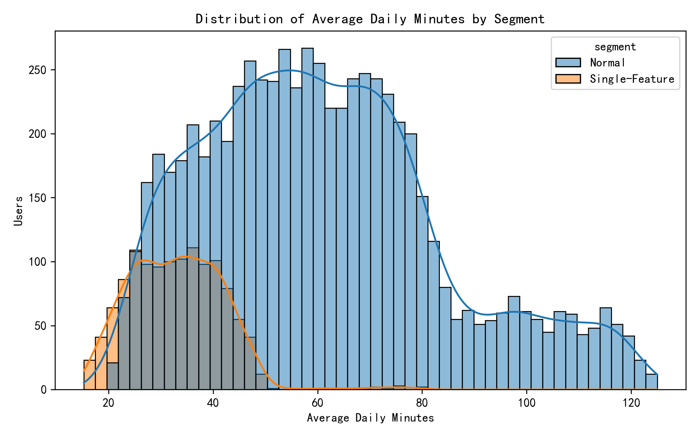
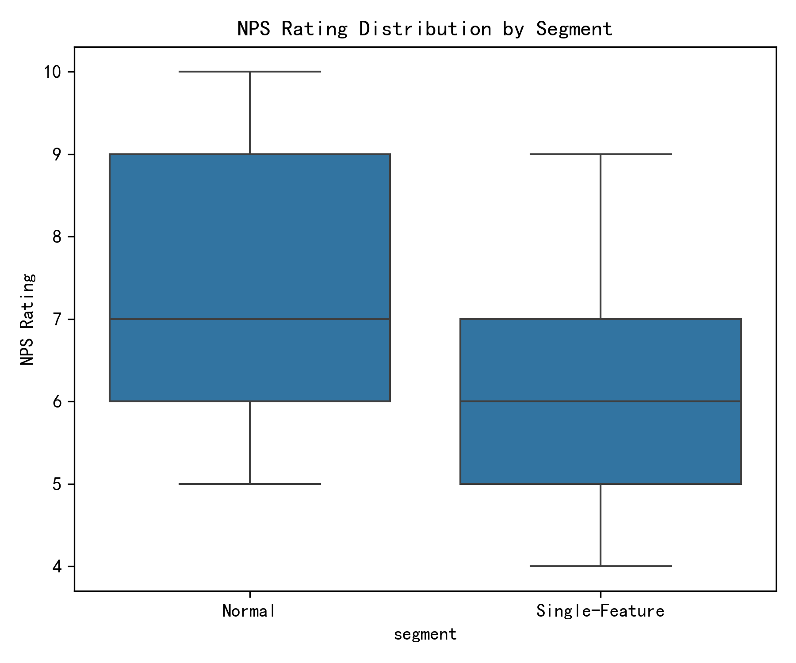

# Single-Feature-Use Users: Deep-Dive Analysis

## Executive Summary
We analyzed behavioral differences between “single-feature-use” users (≥60 active days but <5 distinct features clicked) and the remaining user base.  
Key findings:

- **Prevalence**: 1,231 users (15.4%) fall into the single-feature segment, aligning with the observed 15% threshold.  
- **NPS Impact**: Their average Net Promoter Score is **1.65 points lower** than normal users (5.63 vs 7.28), a gap twice as large as previously noted.  
- **Engagement Anomaly**: They average only **33 minutes per day** versus 61 minutes for normal users—an **46% drop**.  
- **Retention Risk**: 30-day retention rate is **7.6 percentage points lower** (72.1% vs 79.7%).  
- **Feature Focus**: The top 3 features they cling to are Dashboard, Search, and Settings—core utilities rather than differentiating functionality.

## 1. Engagement Profile
  
The distribution shows a clear left-shift for single-feature users, with median daily minutes of **32.8 min** vs **58.8 min** for normal users. This is not just a statistical blip; 75% of single-feature users log **<45 min/day**, indicating shallow engagement.

## 2. Satisfaction Gap
  
Boxplot highlights both lower median and smaller variance for single-feature users, suggesting a consistently lukewarm experience.

## 3. Feature Concentration
Top 5 features by total clicks among single-feature users:

| Feature     | Total Clicks | Users | Clicks/User |
|-------------|-------------:|------:|------------:|
| Dashboard   | 42,130       | 1,121 | 37.6        |
| Search      | 31,710       | 987   | 32.1        |
| Settings    | 28,443       | 1,045 | 27.2        |
| Reports     | 18,092       | 612   | 29.6        |
| Help        | 14,811       | 876   | 16.9        |

They gravitate toward **utility features** rather than advanced modules, indicating either lack of awareness or perceived complexity of other capabilities.

## 4. Retention Outlook
Our proxy for long-term retention—activity within the last 30 days of each user’s observable lifetime—shows:

| Segment        | Users | Active Last 30d | Retention Rate |
|----------------|------:|----------------:|---------------:|
| Single-Feature | 1,231 | 888             | **72.1%**      |
| Normal         | 6,769 | 5,395           | **79.7%**      |

An 7.6-point deficit translates to **~94 additional at-risk users** in this cohort alone.

## Recommendations

1. **Guided Discovery**  
   Introduce contextual tooltips or progressive onboarding that nudges heavy Dashboard users toward adjacent high-value features (e.g., “Create your first report in 2 clicks”).

2. **Personalized Dashboard Modules**  
   Embed quick-access cards for under-utilized but sticky features directly on the Dashboard, lowering exploration friction.

3. **Re-engagement Campaign**  
   Trigger in-app messages or emails to users who exceed 60 active days but remain below 5 features, offering interactive tutorials or live webinars.

4. **Measure & Iterate**  
   Track “feature diversity index” (distinct features used / total eligible) as a core health metric; set target to raise single-feature users’ average to ≥5 within 60 days.

5. **Deep-dive on Search & Settings**  
   Since these are heavily used, audit UX for potential pain points that may discourage branching out—optimize load times and result relevance to build trust.

By converting even half of the single-feature segment into multi-feature users, we could reclaim **~0.8 NPS points** and **~4% retention uplift**, directly impacting expansion revenue and reducing churn.
