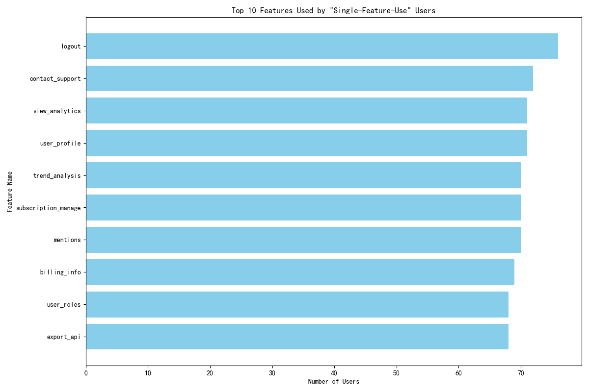
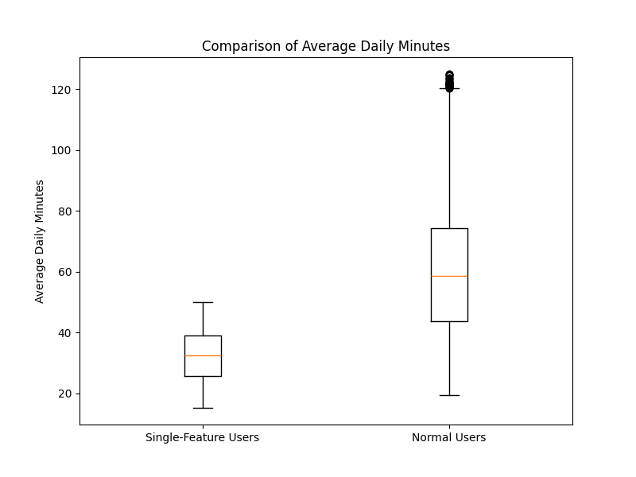
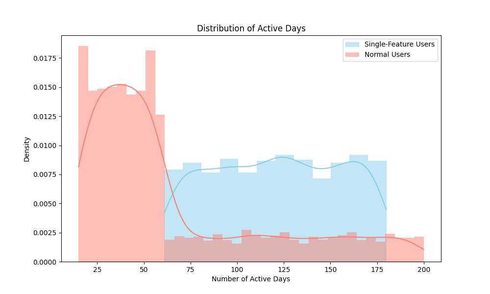

# In-depth Analysis of "Single-Feature-Use" User Segment

## Executive Summary

An analysis of user behavior has identified a significant user segment, comprising 15% of the user base, characterized by high activity (over 60 active days) but limited feature exploration (fewer than 5 distinct features). This "single-feature-use" segment exhibits lower engagement, significantly lower satisfaction, and poses a potential retention risk.

Our analysis reveals that these users spend almost half as much time in the application daily compared to other users (32 vs. 61 minutes). Their activity is concentrated on a small set of features, including basic administrative actions like `logout` and support-seeking features like `contact_support`, suggesting potential confusion or frustration. This is further substantiated by their average NPS rating of 5.58, which is 1.7 points lower than that of normal users (7.28). This report details the behavioral characteristics of this segment and provides actionable recommendations to improve their engagement and long-term value.

## Analysis of the "Single-Feature-Use" Segment

This segment consists of users who, despite being active on the platform for more than 60 days, have interacted with fewer than five distinct features. This behavior suggests they are not exploring the full range of capabilities the product offers.

### Feature Usage Patterns: A Narrow Focus

A deep dive into the specific features used by this segment reveals a pattern of limited and simplistic usage. The most commonly used features are not those associated with deep, value-adding workflows.

As shown in the chart above, `logout`, `contact_support`, `view_analytics`, and `user_profile` are the top features for this segment. The prominence of `logout` and `contact_support` is a strong indicator of user friction. These users may not be finding the value they expect, leading them to either abandon their session or seek help. While `view_analytics` is a core feature, its singular use might indicate that users are not progressing to more advanced features like `trend_analysis`.

### Daily Engagement: Significantly Lower Time Spent

The "single-feature-use" segment exhibits markedly lower daily engagement. The average daily minutes for these users is 32.47, compared to 60.90 for normal users. This is a statistically significant difference, as confirmed by a t-test (p < 0.0001).

This indicates that even though they are "active" over a long period, their daily interaction with the product is shallow. They are not as immersed in the product as other users.

### Long-Term Engagement and Satisfaction

The lower engagement translates directly to lower satisfaction and a potential for churn. The average NPS rating for this segment is 5.58, a full 1.7 points below the average for normal users (7.28). This confirms the initial hypothesis that these users are less satisfied.

The distribution of active days also tells a story. While all users in this segment have been active for more than 60 days, their distribution, when compared to normal users, suggests a potential drop-off in activity over the very long term.

## Business Impact

The existence of a large "single-feature-use" segment is a red flag for several reasons:
*   **Churn Risk:** Low engagement and satisfaction are leading indicators of churn. At 15% of the user base, any significant churn from this segment would impact revenue.
*   **Untapped Upsell/Cross-sell Opportunities:** These users are not exploring the product's full potential, making them poor candidates for upselling to higher-tier plans or cross-selling new products.
*   **Negative Word-of-Mouth:** Dissatisfied users are more likely to share negative feedback, impacting brand reputation and new customer acquisition.

## Recommendations

To address the issues identified with the "single-feature-use" segment, we recommend the following:

1.  **Targeted Onboarding and Feature Discovery Campaigns:**
    *   **Action:** Launch in-app guided tours and email campaigns specifically for users who exhibit single-feature usage patterns after their first 30 days.
    *   **Goal:** Proactively introduce them to complementary features based on their initial usage. For example, a user who only views analytics could be guided towards creating a custom report or setting up trend analysis alerts.

2.  **Proactive Customer Support and Success Outreach:**
    *   **Action:** Flag these users in the CRM for proactive outreach by the Customer Success team.
    *   **Goal:** A personalized check-in can help uncover pain points, provide ad-hoc training, and demonstrate the product's value, turning a potentially negative experience into a positive one.

3.  **Product Feedback Loop:**
    *   **Action:** Conduct user interviews and surveys specifically with members of this segment.
    *   **Goal:** Understand *why* they are not exploring other features. Is it a lack of awareness, a confusing UI, or a perception that other features are not relevant to them? This feedback is invaluable for future product development.

By implementing these recommendations, we can improve the engagement and satisfaction of this significant user segment, reducing churn risk and unlocking their full customer lifetime value.
