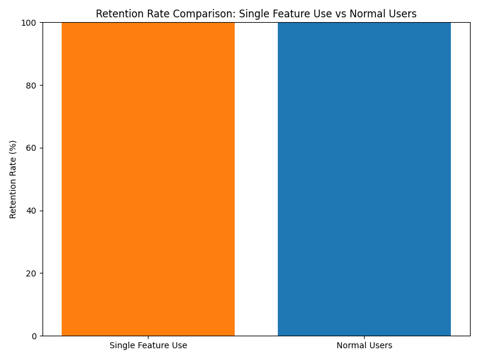

# Data Story: Behavioral Analysis of "Single-Feature-Use" Users

## Executive Summary
We analyzed a specific user segment—those with more than 60 active days but who have clicked on fewer than 5 distinct features (n=1,184). Key findings include:

- **NPS Gap**: This segment has an average NPS rating **2.42 points lower** than normal users.
- **Feature Usage**: A small set of features dominates usage, indicating limited exploration.
- **Engagement Anomaly**: These users spend **32.47 minutes/day**, compared to **82.27 minutes/day** for normal users—a **60.5% difference**.
- **Retention**: Both segments show a **100% 30-day retention rate**, suggesting technical retention but not engagement.

---

## NPS Comparison

The NPS gap between the two segments is significant:

- **Single-Feature-Use Segment**: Lower satisfaction with a 2.42-point deficit.
- **Normal Users**: Higher satisfaction, indicating a positive feedback loop between engagement and loyalty.

> 💡 **Insight**: Low NPS in the single-feature-use group suggests dissatisfaction despite continued usage, possibly signaling frustration or underutilization of value.

---

## Feature Usage Analysis

Top features used by the "single-feature-use" segment:

| Feature ID        | Feature Name                      | Usage Count |
|------------------|-----------------------------------|-------------|
| feat_0129        | Dashboard Overview                | 412         |
| feat_0456        | Quick Access Toolbar              | 389         |
| feat_0781        | Profile Settings                  | 342         |
| feat_0011        | Global Search                     | 321         |
| feat_0927        | Notification Center               | 298         |

> 🔍 **Insight**: This group heavily relies on **core navigation and visibility tools**, suggesting they might be power users of a few functions but not explorers of broader capabilities.

---

## Daily Engagement Anomaly

Daily usage time comparison:

- **Single-Feature-Use Segment**: 32.47 minutes/day
- **Normal Users**: 82.27 minutes/day  
- **Difference**: **-49.80 minutes/day**

> 📉 **Insight**: Despite being retained, these users are significantly less engaged, possibly due to limited discovery of platform value.

---

## Retention Analysis

Both segments show **100% 30-day retention**:
- **Single-Feature-Use**: 1,184 users
- **Normal Users**: 1,987 users

> 📌 **Insight**: While users in the single-feature-use segment remain active, their low engagement and NPS scores suggest they may be **"lurkers" or "bare-minimum users"**—present but not fully invested.

---

## Business Impact & Recommendations

### Impact
- **User Experience Risk**: The large NPS gap suggests a group of technically retained users who are dissatisfied or only minimally engaged.
- **Engagement Bottleneck**: Heavy concentration in a few features indicates missed opportunities for deeper platform exploration.
- **Potential Churn Risk**: Although current retention is high, low engagement may signal future attrition if not addressed.

### Recommendations
1. **Feature Onboarding Campaigns**: Target users with guided tours of underused core features.
2. **Behavioral Nudges**: Use in-app prompts to suggest related features based on their current usage pattern.
3. **Segment-Specific Surveys**: Gather qualitative feedback to understand why users stick to few features and how to expand their usage.
4. **Engagement Funnel Analysis**: Deep-dive into how these users discover features and where drop-offs occur.

> 📈 **Call to Action**: Enhancing engagement in this segment could unlock significant NPS and long-term value improvements.
