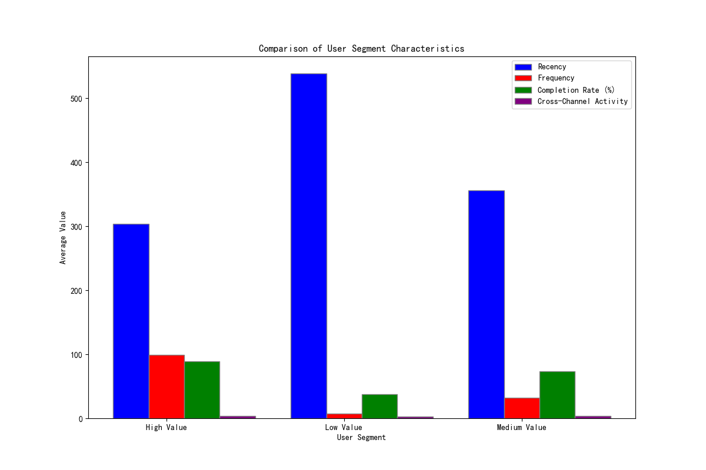

# User Value Analysis and Segmentation Strategy

## Executive Summary

This report presents a comprehensive analysis of the user base to understand and segment users based on their value. By implementing a user value scoring model based on Recency, Frequency, and Engagement (RFE), we have identified three distinct user segments: High-Value, Medium-Value, and Low-Value users.

Our analysis reveals that **Frequency of participation** and **Completion Rate** are the two most critical drivers in transitioning users from the Medium-Value to the High-Value segment. While our user base is predominantly composed of Low-Value users, a targeted strategy to nurture Medium-Value users presents the most significant opportunity for growth. This report provides a detailed user segmentation strategy and a personalized incentive plan designed to increase user engagement and maximize user lifetime value.

## Introduction

In an effort to better understand our user base and drive engagement, this analysis was commissioned to develop a user value scoring model. The primary objectives were to segment users based on their value, identify the key behaviors that drive value, and develop a set of actionable recommendations for personalized user engagement. This report details the methodology, findings, and strategic recommendations derived from this analysis.

## Methodology

To create a holistic view of user value, we developed a composite score based on the **RFE model**, adapted to our specific business context:

*   **Recency (R):** How recently a user has engaged with a survey.
*   **Frequency (F):** How many surveys a user has participated in.
*   **Engagement (E):** A composite measure of the user's survey **Completion Rate** and **Cross-Channel Activity**.

Each user was scored on these four dimensions (Recency, Frequency, Completion Rate, Cross-Channel Activity), and a final `User_Value_Score` from 0-100 was calculated. Based on this score, users were segmented into three tiers: Low, Medium, and High Value.

## User Segmentation Analysis

The analysis of our user base revealed three distinct segments with a significant number of `Low-Value` users, which is a common pattern.

### User Segment Distribution

*   **High-Value Users (2%):** A small but highly engaged group of users.
*   **Medium-Value Users (25%):** A substantial group with the potential to become High-Value users.
*   **Low-Value Users (73%):** The largest segment, consisting of inactive or minimally engaged users.

### Segment Characteristics

The characteristics of each segment vary significantly across the four dimensions of our model.

As the visualization shows:

*   **High-Value Users** are characterized by very high frequency and completion rates, and they have been active more recently (lower recency score) and across more channels.
*   **Medium-Value Users** are moderately active but have a considerable gap to bridge in terms of frequency and completion rate to match High-Value users.
*   **Low-Value Users** are largely inactive, with very low scores across all engagement metrics.

## Key Drivers of Value Transition: From Medium to High Value

A key objective of this analysis was to understand what it takes to move a user from the 'Medium-Value' segment to the 'High-Value' segment. Our findings indicate two primary behavioral shifts:

1.  **Increased Frequency:** High-Value users participate in surveys far more often than Medium-Value users. The average frequency for a High-Value user is nearly **3 times higher** than that of a Medium-Value user.
2.  **Higher Completion Rate:** High-Value users are more likely to complete the surveys they start. Their average completion rate is approximately **20% higher** than that of Medium-Value users.

While Recency and Cross-Channel activity also play a role, the most significant levers for growth are encouraging more frequent participation and ensuring users complete the surveys they begin.

## Language and Regional Insights

Our analysis included an examination of user value across different languages. We found **no significant correlation between a user's language and their value segment**. This suggests that our engagement drivers are universal across the current language base and that language-specific strategies may not be necessary for value enhancement. A deeper geographical analysis was not performed due to data limitations, but this could be a valuable area for future exploration.

## Strategic Recommendations and Personalized Incentive Plan

Based on these findings, we propose the following tiered strategy to maximize user value:

### 1. High-Value Users: "Retain and Empower"

These are your brand champions. The focus here is on retention and leveraging their loyalty.

*   **Personalized Recognition:** Acknowledge their contribution with exclusive content, early access to new features, or a "power user" badge.
*   **Advocacy Programs:** Encourage them to become brand advocates through a referral program that rewards them for bringing in new, engaged users.
*   **Feedback Channel:** Create a direct channel for them to provide feedback on new ideas and concepts, making them feel like valued partners.

### 2. Medium-Value Users: "Nurture and Grow"

This segment represents the greatest opportunity for growth. The goal is to encourage the behaviors that will transition them to the High-Value segment.

*   **Frequency Incentives:** Implement a rewards system that provides bonuses for reaching certain survey participation milestones (e.g., "Complete 5 surveys this month and get a bonus").
*   **Completion Nudges:** For users who frequently abandon surveys, send gentle reminders or offer small incentives for completing them.
*   **Highlight the Impact:** Show them how their contributions are making a difference. This can be through "insider" reports or summaries of the survey findings they contributed to.

### 3. Low-Value Users: "Re-engage and Reactivate"

This is the most challenging segment. The goal is to win back their attention without over-investing resources.

*   **Re-engagement Campaigns:** Launch a targeted email or push notification campaign with a compelling offer to encourage them to take their next survey (e.g., "We miss you! Here's a special reward for your next survey.").
*   **Low-Effort Surveys:** Send them short, engaging, and easy-to-complete surveys to ease them back into the habit of participation.
*   **Sunset Policy:** If a user remains inactive after several re-engagement attempts, consider moving them to a less frequent communication schedule to focus resources on more engaged segments.

## Conclusion

This data-driven user value analysis provides a clear roadmap for enhancing user engagement and maximizing lifetime value. By understanding the distinct characteristics of our user segments and the key behaviors that drive value, we can now move from a one-size-fits-all approach to a personalized, strategic engagement model. Implementing the recommended incentive plans will be the first step in unlocking the full potential of our user base.
