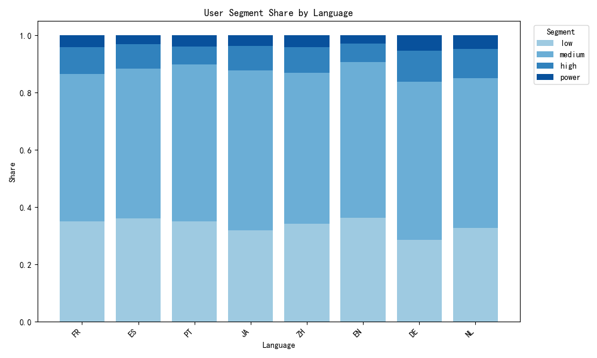
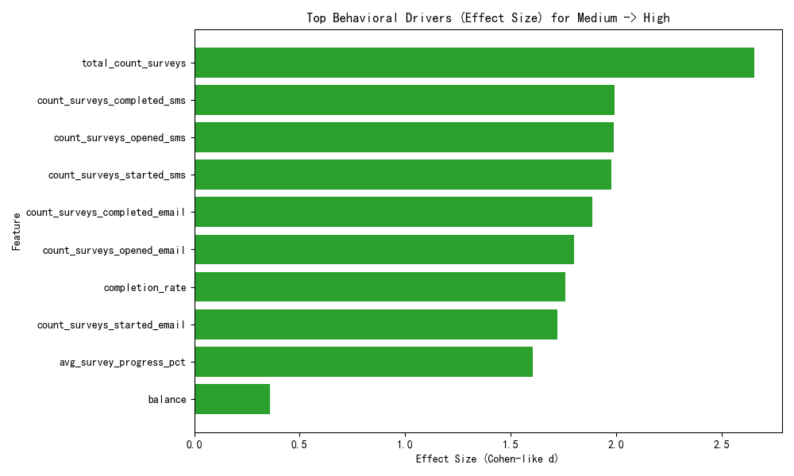

# User Value Scoring Model, Drivers, and Growth Strategy

## Executive Summary
- We built a composite user value score (0–100) per user that blends:
  - Participation frequency
  - Completion rate
  - Cross-channel engagement
- Segmentation outcome (n=4,000):
  - Medium: 53.2%
  - Low: 34.0%
  - High: 8.9%
  - Power: 3.8% (152 users) — small but disproportionately valuable
- Key drivers for moving from medium to high value:
  - Increased survey volume (total_count_surveys)
  - Stronger SMS engagement (opens/starts/completions)
  - Stronger Email engagement (opens/starts/completions)
  - Higher completion rate and progress
- Transition readiness differs by language and region:
  - Languages with highest near-high share among medium users: NL, EN, DE, IT, ZH
  - Regions: Americas shows the highest near-high share, followed by EMEA, then APAC

These findings support a targeted growth plan: prioritize multi-channel nudges (especially SMS), completion incentives, and volume-building tactics, with specific localization by language and region.

## Data and Method
- Data source: dacomp-en-080.sqlite
  - qualtrics__contact (user-level metrics)
  - qualtrics__response (response-level detail with distribution_channel, language, and geo)
  - qualtrics__user_cohort_analysis (cohort context)
- Population:
  - 4,000 contacts, 72,000 responses
- Scoring dimensions and construction:
  1) Frequency score (0–100):
     - Scaled by 95th percentile of total_count_surveys to dampen outliers.
  2) Completion score (0–100):
     - Completion rate = total_count_completed_surveys / total_count_surveys.
  3) Channel score (0–100):
     - Breadth: number of distinct distribution channels observed, blended with email/SMS engaged flags (cap at 3), normalized to 0–1.
     - Balance: similarity of email vs SMS share (1 - |share_email - share_sms|), default 0.5 if unavailable.
     - Channel score = 50% breadth_ratio + 50% balance.
  - Composite score = 0.4*Frequency + 0.3*Completion + 0.3*Channel, clipped to [0,100].
- Segments by composite score:
  - Power: ≥ 85
  - High: 60–84.9
  - Medium: 30–59.9
  - Low: < 30

## What the Data Shows

Overall segment distribution
- Medium: 2,130 (53.2%)
- Low: 1,361 (34.0%)
- High: 357 (8.9%)
- Power: 152 (3.8%)

This corroborates prior observations: a small share of users (power users) drives outsized value. The medium segment is the largest pool for potential uplift.

Behavioral drivers of Medium → High
- Effect sizes (Cohen-like d) for key features (High vs Medium):
  - total_count_surveys: diff +40.78, effect 2.65
  - SMS completions: diff +6.61, effect 1.99
  - SMS opens: diff +6.39, effect 1.99
  - SMS starts: diff +4.81, effect 1.98
  - Email completions: diff +15.13, effect 1.89
  - Email opens: diff +12.29, effect 1.80
  - Completion rate: diff +0.245, effect 1.76
  - Email starts: diff +9.75, effect 1.72
  - Avg survey progress: diff +19.88 pts, effect 1.60
  - Balance: small positive effect
- Interpretation:
  - Volume is the strongest discriminator: high-value users simply participate much more.
  - SMS engagement is a standout lever, even above email engagement.
  - Completion health (rate and progress) matters materially.
  - Cross-channel balance helps, but it’s a secondary lever relative to sheer engagement and completions.

Language and regional differences in value transition paths
- Among medium users, we define “near-high” readiness as composite_score ≥ 55 to assess who is closest to upgrading.
- Near-high share by language (top values):
  - NL: 11.1%
  - EN: 9.8%
  - DE: 9.3%
  - IT: 8.9%
  - ZH: 8.8%
- Near-high share by region:
  - Americas: 9.4%
  - EMEA: 8.8%
  - APAC: 8.3%
  - Unknown: ~0%
- Implications:
  - NL/EN/DE audiences are relatively primed to move to High with modest interventions.
  - Americas users are most ready to upgrade among regions; APAC appears to require stronger programs to close the gap.
  - Across all locales, SMS engagement emerges as a common accelerator, suggesting messaging preferences or access convenience are important.

## Visuals
- Segment share by language: see segment_share_by_language.png
- Top behavioral drivers for Medium → High: see feature_drivers_medium_vs_high.png

## Diagnostic, Predictive, and Prescriptive Insights

Diagnostic
- Power users are few but highly active across channels and complete more surveys.
- Medium users lag mainly on engagement volume and completion health; increasing either materially boosts their score.
- SMS is underleveraged for many medium users relative to high users.

Predictive
- Users with rising SMS activity and improved completion rate/progress are most likely to cross into High.
- Medium users in NL/EN/DE and in the Americas are more likely to upgrade with light-touch nudges than those in APAC, where stronger interventions may be required.

Prescriptive
- Prioritized levers (impact-weighted by effect size):
  1) Drive participation frequency:
     - Increase survey invitations and cadence (without over-fatigue) to medium users; test +20–30% cadence for those with high open rates.
     - Deploy re-engagement sequences for recent but sporadic responders (recency score mid-range).
  2) Amplify SMS engagement:
     - Add SMS as a default secondary channel for medium users who provided valid phone numbers or have shown mobile interaction.
     - A/B test concise SMS invites and reminders, and time sends to local peak hours.
  3) Lift completion rate and progress:
     - Trim surveys by 10–20% for targeted segments; clarify estimated time; add save-and-resume.
     - Offer micro-incentives for first complete in a month or streak completions.
  4) Moderate cross-channel balance:
     - Where email dominates, insert at least one SMS reminder; where SMS dominates, add a follow-up email with richer context.

## Segmentation Strategy (Actionable)

- Low (<30):
  - Goal: activate first consistent behaviors.
  - Tactics: welcome series, single-question or micro-surveys, clear value proposition, small first-completion incentive, progressive profiling.
  - KPI: first completion rate, time to second survey.
- Medium (30–59.9):
  - Goal: upgrade to High by boosting volume and completions.
  - Tactics: multi-touch cadence (email + SMS reminder), double-points for completions this month, streak badges, early-access surveys, localized messaging.
  - KPI: completions per user, completion rate, SMS open/start/complete counts.
- High (60–84.9):
  - Goal: sustain and cultivate to Power.
  - Tactics: recognition (VIP badges), quarterly sweepstakes, opt-in to more frequent participation, invite to specialized panels; occasional exclusive content.
  - KPI: retention of high score, cross-channel breadth, monthly completions.
- Power (≥85):
  - Goal: retention and advocacy.
  - Tactics: premium recognition, ambassador program, early/beta access, larger sweepstakes odds, surprise-and-delight rewards; feedback loops to co-design surveys.
  - KPI: churn from Power, NPS/advocacy metrics, referrals.

## Personalized Incentive Plan by Language and Region

By Language
- NL/EN/DE (higher readiness):
  - Offer limited-time “double completion points” and introduce SMS reminders immediately.
  - Personalize subject lines/localized copy; keep surveys slightly shorter (optimize progress).
- ZH/JA/PT/ES/FR:
  - Increase SMS adoption with informative consent copy and clear opt-out; test localized time windows for sends.
  - Emphasize completion rewards (gift cards, mobile wallet credits) and transparent time estimates.
- Tailored copy frameworks:
  - EN/NL/DE: highlight efficiency, recognition, and community impact.
  - ZH/JA: emphasize clarity, brevity, and mobile-first flows.
  - ES/PT/FR: stress relevance and reward certainty.

By Region
- Americas (highest readiness):
  - Scale SMS + email cadence; test 2–3 touchpoints per survey cycle.
  - Limited-time campaigns to push medium users over the threshold (e.g., “Complete 2 surveys this month for a bonus”).
- EMEA:
  - Keep cadence moderate; ensure GDPR-compliant opt-ins; focus on clear utility and respect for time.
- APAC (lower readiness):
  - Lead with SMS-first mobile flows; ultra-brief surveys; culturally localized incentives (e.g., mobile top-ups).
  - Consider more frequent but shorter tasks to build volume.

## Implementation Blueprint

Targeting logic
- Identify “near-high” medium users (composite 55–59.9) by language/region and prioritize:
  - NL, EN, DE in Americas/EMEA first-wave rollout.
- Channel orchestration
  - Default: email invite + SMS reminder at T+24h; if unopened/unstarted, follow up at T+72h via alternate channel.
- Incentives
  - Medium: double points for 2 completions within 30 days; streak bonus at 3.
  - High: VIP draws; Power: ambassador perks.
- Measurement framework
  - Primary: upgrade rate (Medium→High within 30–60 days).
  - Secondary: completion rate, SMS engagement lift, survey volume per user, cross-channel breadth.

## Caveats and Next Steps
- Geo derived via coarse longitude bands; improve with IP-to-region enrichment for more accurate localization.
- Consider adding Recency and Satisfaction signals into the composite for retention-aware scoring.
- Build cohort-based uplift tracking using qualtrics__user_cohort_analysis to quantify how the plan shifts cohort_health_score over time.
- Automate weekly score recomputation and trigger campaigns programmatically.

## Artifacts
- User-level scores and segments exported: user_scores.csv
- Visuals:
  - segment_share_by_language.png
  - feature_drivers_medium_vs_high.png

These results provide a concrete scoring framework, explain the behavioral levers that define high-value users, and translate into a segmented, localized plan to accelerate Medium→High upgrades and sustain Power users.
