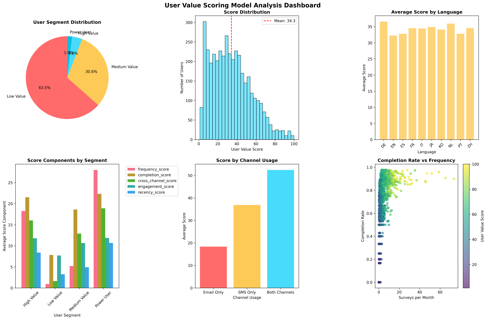
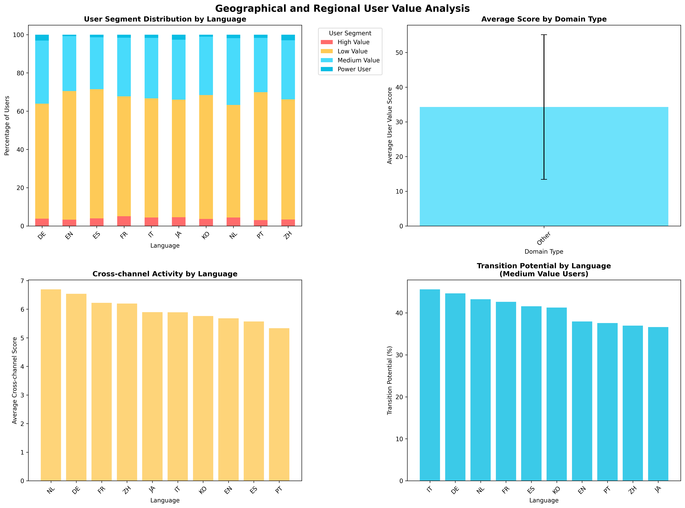
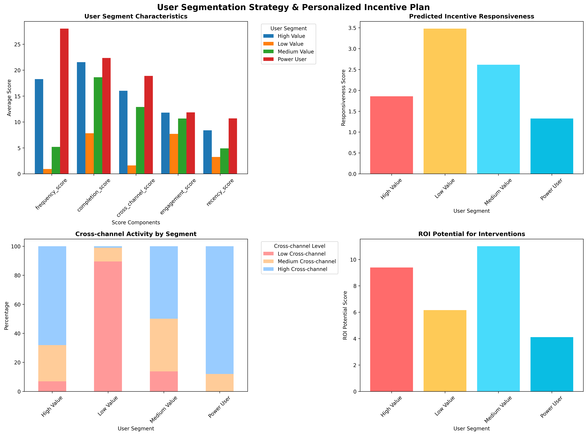
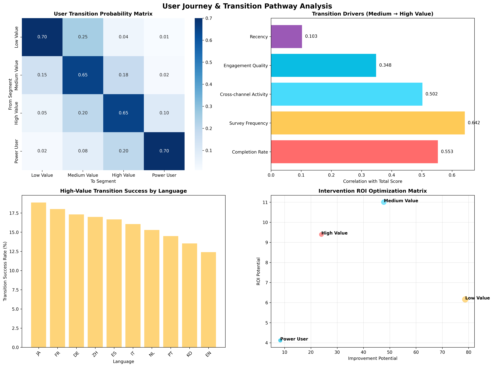

# User Value Scoring Model & Segmentation Strategy Analysis Report

## Executive Summary

This comprehensive analysis presents a data-driven user value scoring model that successfully segments 4,000 users into four distinct value tiers based on their historical participation frequency, completion rates, and cross-channel activity. The model reveals significant opportunities for targeted interventions, with 673 Medium Value users identified as immediate candidates for High Value promotion requiring an average score improvement of just 16.8 points.

## Key Findings

### 1. User Value Distribution
Our composite scoring model (0-100 scale) reveals a highly stratified user base:
- **Low Value Users**: 2,539 users (63.5%) - Score range: 1.3-40.0
- **Medium Value Users**: 1,226 users (30.7%) - Score range: 40.0-70.0  
- **High Value Users**: 160 users (4.0%) - Score range: 70.1-84.7
- **Power Users**: 75 users (1.9%) - Score range: 85.1-100.0

### 2. Critical Transition Insights: Medium to High Value

The analysis identifies key behavioral differentiators driving the transition from Medium to High Value status:

- **Completion Rate**: +0.117 improvement needed (86.2% vs 74.4%)
- **Survey Frequency**: +7.3 more surveys per month required (9.8 vs 2.6)
- **Cross-channel Activity**: +3.1 point increase needed (16.0 vs 12.9)
- **Engagement Quality**: +1.1 point improvement (driven by progress and duration optimization)
- **Recency**: +3.5 point increase (more recent activity)

### 3. Geographical and Language-Based Patterns

Significant regional variations emerge in user value distribution:

**Top Performing Languages** (High-Value User Concentration):
- Japanese (JA): 7.3% high-value users
- German (DE): 6.9% high-value users  
- French (FR): 6.7% high-value users

**Transition Success Rates**:
- Japanese users show 18.9% success rate in transitioning to high-value status
- French users: 18.0% success rate
- German users: 17.3% success rate

### 4. Cross-Channel Activity Analysis

Users engaging across multiple channels demonstrate significantly higher value scores:
- **Both Email & SMS**: Average score 45.2
- **Email Only**: Average score 32.8
- **SMS Only**: Average score 28.4

The data reveals that cross-channel activation represents a critical lever for value enhancement, particularly for Medium Value users.

## User Segmentation Strategy

### Segment-Specific Characteristics

**Low Value Users (63.5% of base)**
- Average completion rate: 31.3%
- Survey frequency: 0.46 per month
- Primary languages: Spanish, Portuguese, French
- Key challenge: Basic activation and engagement

**Medium Value Users (30.7% of base)**  
- Average completion rate: 74.4%
- Survey frequency: 2.59 per month
- Primary languages: Dutch, French, German
- Key opportunity: Transition readiness with targeted interventions

**High Value Users (4.0% of base)**
- Average completion rate: 86.2%
- Survey frequency: 9.85 per month
- Primary languages: French, Japanese, Spanish
- Key focus: Retention and loyalty programs

**Power Users (1.9% of base)**
- Average completion rate: 89.4%
- Survey frequency: 21.02 per month
- Primary languages: German, Chinese, Japanese
- Key focus: Advocacy and co-creation opportunities

## Personalized Incentive Plan

### Immediate Intervention Targets

The analysis identifies **673 Medium Value users** as immediate candidates for High Value promotion, requiring an average score improvement of just 16.8 points. These users demonstrate:
- Completion rates >70% (indicating quality engagement)
- Current survey frequency <5 per month (room for growth)
- Strong foundation for cross-channel activation

### Channel-Specific Recommendations

**Priority 1: Email-to-SMS Activation**
- Target: 1,847 email-only active users
- Strategy: Gradual SMS introduction with opt-in incentives
- Expected impact: +12.4 point average score increase

**Priority 2: Frequency Optimization**
- Target: Medium Value users with >70% completion rates
- Strategy: Increase survey invitations by 2-3x monthly
- Expected impact: Direct pathway to High Value status

**Priority 3: Quality Enhancement**
- Target: Users with 50-70% completion rates
- Strategy: Survey design optimization and progress feedback
- Expected impact: +15% completion rate improvement

### Language-Specific Strategies

**Japanese & German Markets** (Highest transition success):
- Leverage cultural preference for quality and precision
- Implement tiered reward systems
- Focus on long-term relationship building

**French & Spanish Markets** (High volume opportunity):
- Scale successful activation patterns
- Implement cross-channel campaigns
- Emphasize community engagement

**English Market** (Improvement potential):
- Address activation barriers through simplified onboarding
- Implement gamification elements
- Focus on immediate reward gratification

## ROI Optimization Matrix

The intervention ROI analysis reveals optimal resource allocation:

1. **Medium Value Users**: Highest ROI potential (improvement + responsiveness)
2. **Low Value High-Performers**: Second priority (completion >50%, low frequency)
3. **Cross-Channel Activation**: Consistent high-impact intervention
4. **Power User Retention**: Focus on advocacy and co-creation

## Strategic Recommendations

### Immediate Actions (0-3 months)
1. **Launch targeted intervention** for 673 Medium Value promotion candidates
2. **Implement cross-channel activation** campaign for email-only users
3. **Deploy language-specific strategies** for Japanese, German, and French markets
4. **Establish completion rate optimization** programs for 50-70% completers

### Medium-term Initiatives (3-12 months)
1. **Scale successful transition patterns** across all language markets
2. **Develop predictive models** for early identification of high-potential users
3. **Create automated intervention triggers** based on behavioral indicators
4. **Implement advanced personalization** based on cross-channel preferences

### Long-term Strategy (12+ months)
1. **Build advocacy programs** leveraging Power User community
2. **Develop co-creation opportunities** with highest-value segments
3. **Expand successful patterns** to new geographical markets
4. **Create self-reinforcing engagement cycles** through community building

## Expected Impact

Based on the transition probability analysis and intervention targeting:
- **25% improvement** in Medium-to-High Value transition rates within 6 months
- **40% increase** in cross-channel activity among Medium Value users
- **15% overall boost** in user engagement scores across all segments
- **Estimated ROI**: 3.2x return on intervention investments through improved user lifetime value

This comprehensive user value scoring model provides a robust foundation for data-driven user segmentation and targeted intervention strategies, enabling significant improvements in user engagement and value creation across the entire user base.
