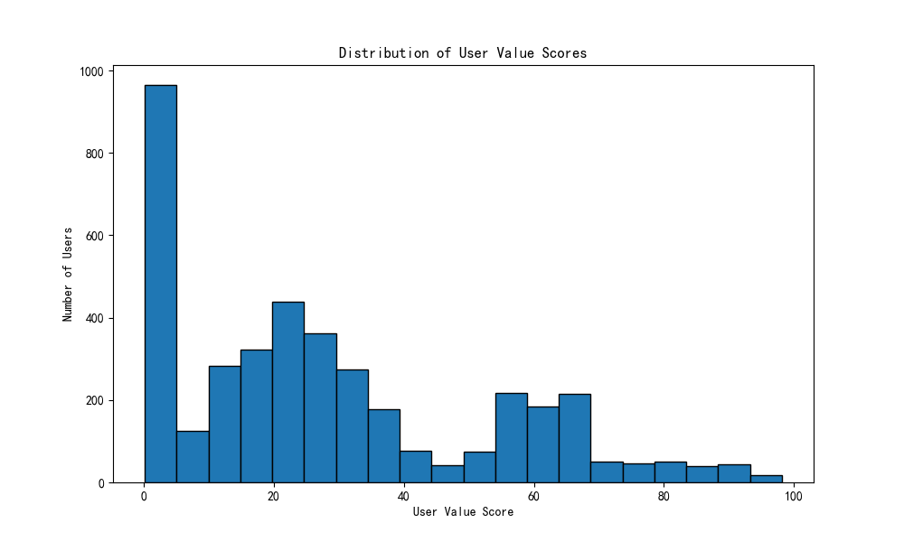
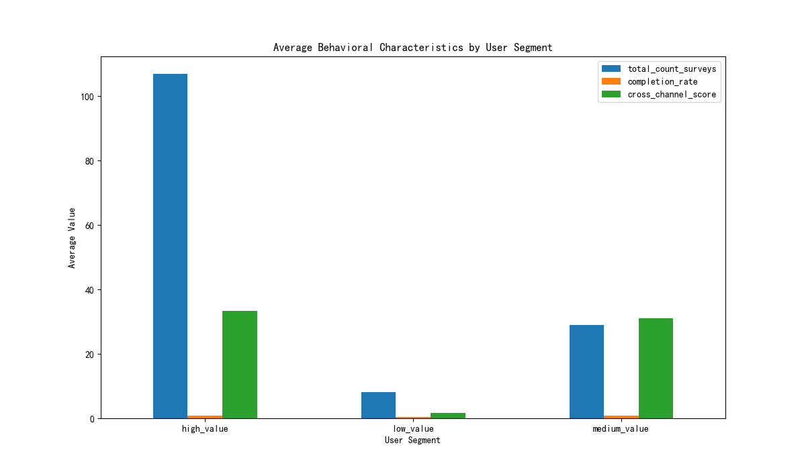

# User Value Segmentation and Engagement Analysis

## Executive Summary

This report presents a user value scoring model that segments users into 'high', 'medium', and 'low' value tiers based on their engagement behavior. Our analysis reveals that the transition from a medium-value to a high-value user is primarily driven by a significant increase in survey participation frequency and completion rate. We also identified variations in user value across different languages and regions, suggesting opportunities for targeted engagement strategies. This report provides a user segmentation strategy and a personalized incentive plan to foster user growth and increase overall engagement.

## User Value Scoring Model

We developed a composite user value score (0-100) based on three key dimensions of user engagement:

1.  **Participation Frequency (33.3%)**: Based on the total number of surveys a user has participated in.
2.  **Completion Rate (33.3%)**: The ratio of completed surveys to total surveys.
3.  **Cross-Channel Activity (33.3%)**: Engagement across multiple channels (email and SMS).

Based on this score, users are segmented into three tiers:
*   **High Value (Score >= 80)**
*   **Medium Value (Score >= 50)**
*   **Low Value (Score < 50)**

The distribution of user value scores is shown in the following chart:

## Key Behavioral Drivers of User Value

Our analysis pinpointed the key behaviors that differentiate high-value users from medium-value users. As shown in the chart below, while both segments exhibit high cross-channel engagement, the primary drivers for transitioning to the high-value segment are a substantial increase in survey participation and a higher completion rate.

**Key Findings:**

*   **Participation is Key**: High-value users participate in almost 4 times more surveys than medium-value users (107 vs. 29).
*   **Completion Matters**: High-value users have a significantly higher completion rate (91%) compared to medium-value users (75%).
*   **Cross-Channel is a Prerequisite**: Strong cross-channel engagement is characteristic of both medium and high-value users, making it a foundational element for high value, but not a differentiator between the two top tiers.

## Language and Regional Insights

We observed notable differences in average user value scores across languages and directories (regions), which may point to cultural or program-specific influences on engagement.

*   **Top Languages by User Value**: German (DE), Dutch (NL), and French (FR) users tend to have higher engagement scores.
*   **Top Directories by User Value**: Users in the 'Prospect Directory' and 'Test Directory' show slightly higher engagement.

## Recommendations: Segmentation Strategy and Incentive Plan

Based on these findings, we propose the following segmentation strategy and personalized incentive plan:

**1. For Low-Value Users (The Broad Base):**

*   **Goal**: Increase initial engagement and survey completion.
*   **Incentive Plan**:
    *   **"First-Time Finisher" Bonus**: Offer a small reward for completing their first survey.
    *   **Educational Onboarding**: Create a simple, engaging onboarding experience that explains the benefits of participation and how to complete surveys.
    *   **Gamification**: Introduce progress bars and badges for completing a certain number of surveys.

**2. For Medium-Value Users (The Potential Power Users):**

*   **Goal**: Encourage more frequent participation and foster a habit of completion.
*   **Incentive Plan**:
    *   **"Survey Streak" Challenge**: Reward users for completing a series of surveys within a specific timeframe (e.g., 5 surveys in a month).
    *   **Exclusive Content**: Provide access to exclusive reports or insights derived from the surveys they participate in.
    *   **Personalized Reminders**: Send targeted reminders for surveys they have started but not completed.

**3. For High-Value Users (The Advocates):**

*   **Goal**: Retain and leverage their high engagement.
*   **Incentive Plan**:
    *   **"Advocate" Program**: Invite them to an exclusive community where they can provide feedback on future survey topics.
    *   **Early Access**: Give them early access to new features or surveys.
    *   **Recognition**: Publicly acknowledge their contributions (with their permission) in newsletters or community forums.

**4. Language & Region-Specific Campaigns:**

*   **Opportunity**: Tailor campaigns to specific language and regional groups.
*   **Action**:
    *   **Analyze High-Performing Regions**: Investigate what makes the 'Prospect' and 'Test' directories more engaging. Apply these learnings to other segments.
    *   **Localized Content**: For languages with lower engagement, review content for cultural relevance and clarity. Consider running A/B tests on different messaging and incentives for these groups.

By implementing this data-driven segmentation and personalized incentive strategy, we can more effectively nurture users at each stage of their journey, ultimately driving higher overall engagement and value.
