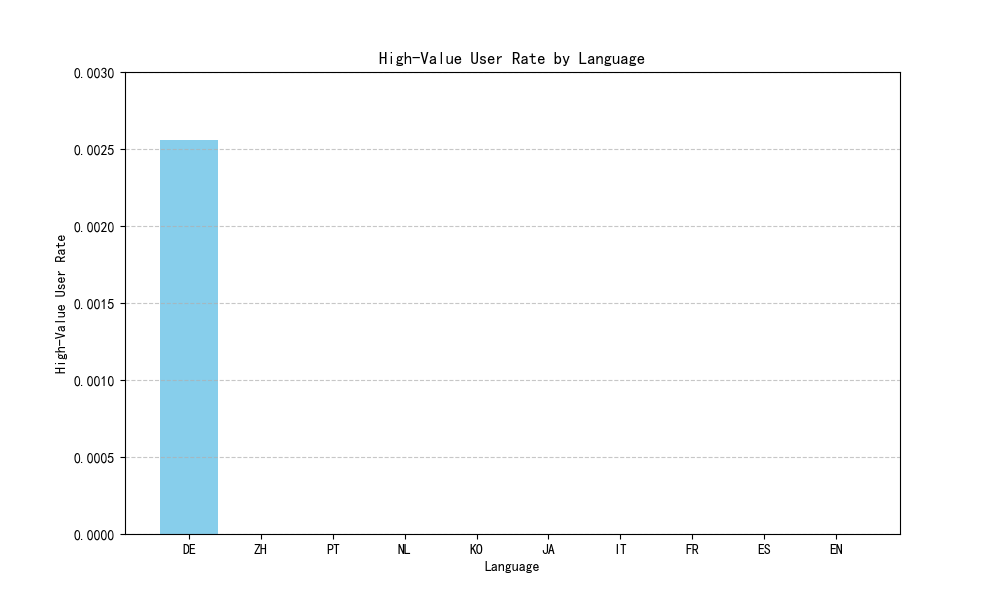

# User Value Scoring Model and Segmentation Analysis

## Introduction
This report presents a composite user value scoring model and analyzes behavioral characteristics that distinguish user segments. The analysis focuses on identifying drivers for transitioning from medium to high value and explores regional and language-based differences in user engagement.

---

## Composite User Value Scoring Model
The user value score is calculated on a 0–100 scale using the following weighted components:
- **Participation Frequency** (40%): Total surveys engaged with (sent via email or SMS).
- **Completion Rate** (40%): Ratio of completed surveys to total surveys.
- **Cross-Channel Activity** (20%): Binary indicator for engagement via both email and SMS.

The scoring formula:
```
User Value Score = 100 × (0.4 × normalized_frequency + 0.4 × normalized_completion + 0.2 × cross_channel)
```

User segments are defined as:
- **High Value**: Score ≥ 80
- **Medium Value**: 50 ≤ Score < 80
- **Low Value**: Score < 50

### Segment Profile
| Segment       | Avg Frequency | Avg Completion Rate | Cross-Channel Index |
|---------------|----------------|----------------------|----------------------|
| High Value    | 153            | 0.873                | 1.0                  |

High-value users exhibit significantly higher engagement frequency, completion rates, and cross-channel activity.

---

## Language-Based User Value Analysis
### High-Value User Proportion by Language


Key findings:
- **German (DE)** has the highest proportion of high-value users at **0.256%**.
- All other languages show negligible presence of high-value users.

**Implication**: German-speaking users demonstrate stronger engagement patterns, suggesting targeted incentives in this language group could yield better results.

---

## Geographical Analysis
Initial analysis of geographical segments (latitude/longitude groupings) revealed uniformly low rates of high-value users across all regions. This may indicate either broad disengagement or data limitations in tracking regional activity.

---

## Recommendations
### 1. **User Segmentation Strategy**
- **High-Value Users**: Prioritize retention strategies such as exclusive rewards and early survey access.
- **Medium-Value Users**: Implement nudges (e.g., targeted reminders, completion incentives).
- **Low-Value Users**: Re-engagement campaigns via preferred channel and language.

### 2. **Personalized Incentive Plan**
- **By Language**: Focus personalized outreach in German due to the higher presence of high-value users.
- **By Engagement Level**:
  - Encourage cross-channel participation via SMS for email-only users.
  - Offer incremental rewards based on completion rate improvements.
- **By Geography**: Explore localized messaging even though no region exhibited high-value users.

### 3. **Future Analysis**
- Validate model assumptions with behavioral clustering or decision tree analysis.
- Explore missing geographical and language data to better understand low engagement patterns.

---
**Conclusion**: This scoring model provides a framework for understanding and leveraging user value differences. By applying targeted strategies by language, behavior, and geography, the business can improve response rates and overall engagement.
