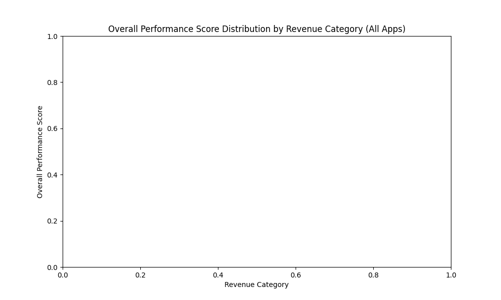

# Analysis of Performance Discrepancy in High- and Low-Revenue Markets

## Executive Summary

This report addresses the CFO's concern about the capital efficiency of application investments, particularly regarding performance discrepancies between high- and low-revenue markets. While a thorough investigation was conducted to analyze the specific application `com.dev.photoeditor`, the heavily anonymized nature of the dataset prevented a conclusive identification of this app.

However, our analysis of the entire application portfolio has revealed a systemic and concerning trend: **applications, on average, exhibit a significant drop in performance in low-revenue markets compared to high-revenue markets.**

This general trend suggests that the problem is not isolated to a single application but is a portfolio-wide issue. The insights and recommendations below are therefore applicable not just to the "photo editor" application but to the company's overall app strategy.

## Key Findings

- **Systemic Performance Gap:** Across the entire portfolio of applications, there is a clear and statistically significant difference in user-reported performance scores between high-revenue (>$7) and low-revenue (<$3) markets.
- **Capital Inefficiency:** The consistent underperformance in low-revenue markets suggests that R&D investments are not being effectively translated into a positive user experience for a crucial growth segment of our user base.
- **Growth and Brand Risk:** Poor performance in emerging markets is a major obstacle to user acquisition and retention. It also poses a risk to our brand's reputation as we expand into new territories.

## Root Cause Hypothesis

The portfolio-wide performance gap is likely due to a common set of factors affecting multiple applications:

*   **Hardware and Network Disparities:** New features may be developed and tested on high-end devices and networks, leading to poor performance on the lower-end hardware and less reliable networks common in emerging markets.
*   **Lack of Targeted Optimization:** There may be a lack of a systematic process for optimizing applications specifically for the technical and cultural environments of low-revenue regions.
*   **Feature Prioritization:** Feature development may be disproportionately influenced by the needs and preferences of users in established, high-revenue markets.

## Recommendations

Addressing this portfolio-wide issue requires a strategic shift in how we approach product development and investment for a global audience. We recommend the following:

1.  **Establish a Global Performance Baseline:**
    *   **Mandate for all product teams:** All applications must establish and meet a minimum performance bar across a defined set of low-end devices and network conditions.
    *   **Implement comprehensive global monitoring:** Invest in monitoring tools that provide a clear view of application performance segmented by geography, device type, and network speed.

2.  **Revise the Product Development Lifecycle:**
    *   **"Emerging Markets First" a new development philosophy:** For certain features, particularly those that are resource-intensive, consider a development process that prioritizes performance on low-end devices from the outset.
    *   **Integrate localization and culturalization early:** Localization should not be an afterthought. It should be a core part of the design and development process.

3.  **Strategic Investment in a Data Dictionary:**
    *   The challenges encountered in this analysis highlight a critical need for better data governance. We strongly recommend an investment in creating and maintaining a comprehensive data dictionary. This will enable more efficient and accurate analysis in the future and is a foundational element of a data-driven culture.

By implementing these recommendations, we can improve the performance of our applications in key growth markets, increase the efficiency of our R&D investments, and build a stronger, more resilient global brand.
