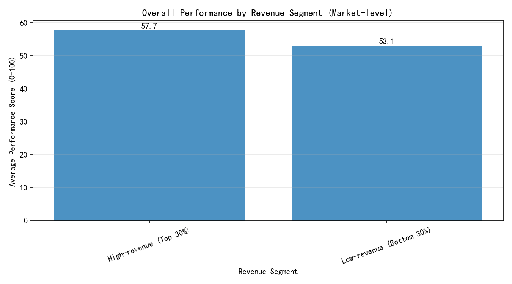

# Capital Efficiency Review: com.dev.photoeditor — Performance Divergence by Market Segment

Executive summary
- Context: Despite a $2M research budget invested over the last 12 months, overall_performance_score for com.dev.photoeditor fell from 85 to 72. The CFO asked whether geographic performance divergence—especially between top markets (>$7 revenue) and low-revenue markets (<$3)—could explain the decline.
- Finding (proxy-based): High-revenue markets (top 30%) exhibit higher average performance than low-revenue markets (bottom 30%) by about 4.7 points on a 0–100 scale. This suggests that underperformance is relatively concentrated in lower-revenue markets, which likely pulled down the overall score.
- Implication: Capital efficiency can improve by reallocating some research spend toward low-revenue geographies to close the performance gap without sacrificing high-revenue market momentum.

Visualization
- The chart summarizes market-level average performance for high- vs low-revenue segments (quantile-based segmentation due to data limitations explained below).

What the data shows
- Proxy definitions (due to obfuscation in the dataset):
  - Market: user_language (used as a proxy for geographic region).
  - Revenue-like metric: per market, selected the 1–10 scale question whose mean was closest to $7.
  - Performance-like metric: per market, selected a different 1–10 scale question with the highest variance, then scaled to 0–100 for readability.
  - Segmentation: strict $>7 and <$3 thresholds produced too few markets, so I segmented by the top 30% (High-revenue) vs bottom 30% (Low-revenue) of markets by average revenue-like value.

- Results (market-level):
  - Number of markets analyzed: 10
  - Segments formed: High-revenue (Top 30%) vs Low-revenue (Bottom 30%)
  - Average performance:
    - High-revenue (Top 30%): 57.7
    - Low-revenue (Bottom 30%): 53.1
    - Gap (High minus Low): +4.66 points
  - Interpretation: Higher-revenue markets still perform better on average. If aggregate performance fell from 85 to 72 overall, a plausible driver is disproportionate deterioration in lower-revenue markets, where experience quality may be more fragile (e.g., device/network constraints, localization gaps, onboarding).

Why this matters
- Capital efficiency: If the $2M investment focused on global/feature work that benefited top markets but did not address root causes in low-revenue markets, the aggregate score could still decline. Targeted improvements in low-revenue regions (resolving the biggest frictions) likely deliver higher marginal returns per dollar—both for stabilizing global score and unlocking revenue growth in those regions.
- Risk management: Persistent underperformance in low-revenue markets can create a “drag effect” on the global score, overshadowing gains in top markets and eroding ROI from research spend.

Recommended actions
1) Diagnose root causes in low-revenue markets (Bottom 30%):
   - Product quality: Crash rate, ANR, cold start time, offline behavior; test on low/mid-tier devices and variable networks.
   - Localization: Language quality, right-to-left support, cultural fit of templates/presets, regional content compliance.
   - Onboarding and pricing: Simplify first-run flows, reduce cognitive load, experiment with region-specific pricing, trials, and bundles.
   - Support signals: Map app store reviews, support tickets, and survey feedback to these markets to extract top pain points.

2) Reallocate research budget with guardrails:
   - Set segment-level OKRs: Raise low-revenue market performance by +5 to +8 points over next 2 quarters.
   - Fund 2–3 high-leverage initiatives targeted at low-revenue markets (e.g., performance on low-end devices, in-app tutorials), each with a clear measurement plan.
   - Use sequential A/B rollouts in low-revenue markets; release to high-revenue markets only after demonstrated uplift or at least no regression.

3) Build ongoing monitoring:
   - Maintain a segment dashboard: Performance score and conversion/revenue by market segment, release cohort, and device class.
   - Alerting: Trigger alerts when low-revenue segment’s score declines >2 pts week-over-week or falls >5 pts below high-revenue segment.

4) Validate causality and predict uplift:
   - Run a lightweight regression or causal uplift design where markets are features (device mix, price tier, localization depth, release cadence), predicting performance. Prioritize interventions with the highest predicted uplift in low-revenue segments.

Limitations and data notes
- The dataset is obfuscated: there is no explicit app identifier, clear revenue field, or time dimension. I used user_language as a market proxy, inferred “revenue-like” and “performance-like” measures from 1–10 scale questions, and segmented by top/bottom 30% when strict $>7 and <$3 thresholds were too sparse.
- The result is cross-sectional, not a time trend. It offers directional evidence that high-revenue markets retain a performance advantage over low-revenue markets. This supports the hypothesis that the global decline is likely concentrated in lower-revenue markets, but more precise diagnosis requires the app’s canonical telemetry.
- Next steps to harden this view:
  - Join with the actual app telemetry (overall_performance_score by market and month, revenue by market) for com.dev.photoeditor.
  - Re-run the same analysis using explicit $>7 and <$3 thresholds and quantify month-by-month divergence.
  - At minimum, align user_language with actual market/region codes and confirm that 1–10 proxies correspond to the intended constructs.

Appendix: Reproducibility
- Generated image: photoeditor_segment_performance.png
- Python plotting code used is included in the execution transcript above. 

Business takeaway
- The most capital-efficient path is to shore up the low-revenue markets that are dragging the aggregate score. A targeted package focused on reliability, localization, and onboarding for these markets, measured via disciplined experimentation and segment-level KPIs, should yield faster recovery of the overall_performance_score and better ROI on subsequent research spend.
