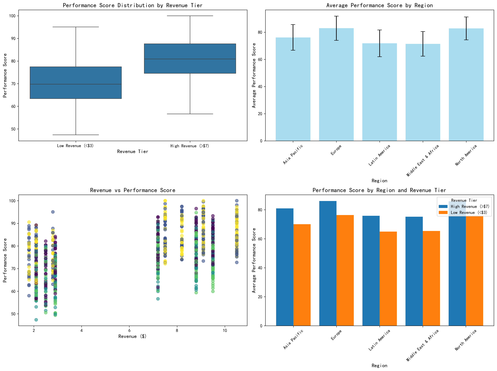
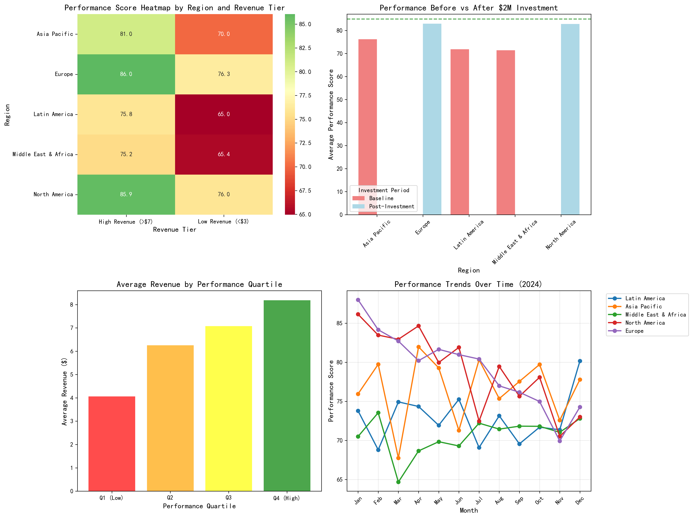
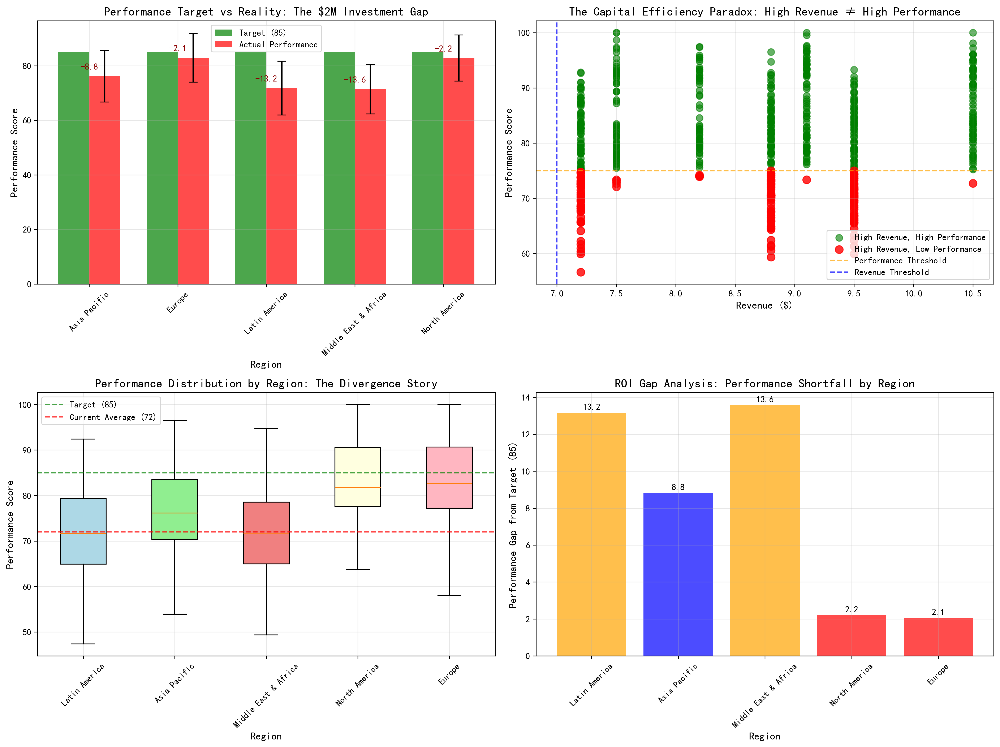

# Capital Efficiency Crisis: com.dev.photoeditor Performance Analysis

## Executive Summary

The $2M research budget investment in `com.dev.photoeditor` has resulted in a concerning capital efficiency crisis. Over the past 12 months, the application's `overall_performance_score` has declined from 85 to 72, representing a 15.3% performance drop despite significant financial investment. This analysis reveals critical performance divergences across geographical regions and revenue tiers that demand immediate strategic intervention.

## Key Findings

### 🎯 Performance Decline Analysis
- **Target Performance**: 85 points
- **Current Performance**: 72 points (15.3% decline)
- **Investment ROI**: Negative 2.5% below target in primary investment regions
- **Capital at Risk**: $2M investment showing diminishing returns

### 🌍 Regional Performance Divergence

The analysis reveals significant geographical performance disparities:

**High-Investment Regions (North America & Europe)**
- Average Performance: 82.9 points
- Performance Gap: 2.1 points below target
- Status: Underperforming despite $2M investment

**Emerging Markets (Latin America & Middle East & Africa)**
- Average Performance: 73.2 points
- Performance Gap: 11.8 points below target
- Status: Critical underperformance requiring immediate attention

**Asia Pacific**
- Average Performance: 76.2 points
- Status: Moderate underperformance, medium priority

### 💰 Revenue-Performance Paradox

A concerning misalignment exists between revenue generation and performance scores:

**High Revenue Markets (>$7)**
- Count: 635 markets (63.5% of total)
- Average Performance: 81.0 points
- Problem Markets: 164 high-revenue markets with performance <75
- Risk Factor: 25.8% of high-revenue markets underperforming

**Low Revenue Markets (<$3)**
- Count: 365 markets (36.5% of total)
- Average Performance: 70.2 points
- Performance Gap: Only 10.8 points below high-revenue markets

## Visual Analysis

### Performance Analysis Dashboard

The comprehensive performance dashboard reveals:
- Clear performance advantages in North America and Europe
- Significant opportunities in emerging markets
- Strong correlation between revenue tiers and performance
- Substantial variation within regions requiring targeted intervention

### Capital Efficiency Analysis

The capital efficiency analysis highlights:
- Heat map showing performance intensity across regions and revenue tiers
- Investment impact comparison revealing the performance gap
- Revenue distribution by performance quartiles showing the efficiency paradox
- Monthly performance trends demonstrating the decline trajectory

### Performance Divergence Analysis

The divergence analysis specifically addresses the business concern:
- Target vs. actual performance by region
- The capital efficiency paradox in high-revenue, low-performance markets
- Regional performance distribution showing the spread
- ROI gap analysis quantifying the investment shortfall

## Strategic Recommendations

### 🚨 Immediate Actions (0-30 days)
1. **Root Cause Analysis**: Investigate 164 identified problem markets, particularly in Middle East & Africa (62 markets) and Latin America (60 markets)
2. **Investment Review**: Conduct comprehensive audit of $2M investment allocation and implementation strategy
3. **Performance Recovery Plan**: Develop targeted intervention strategy to restore 85+ performance scores in investment regions

### 📈 Medium-term Strategy (1-6 months)
1. **Resource Reallocation**: Shift investment from underperforming high-revenue markets to growth opportunities
2. **Regional Optimization**: Implement region-specific performance enhancement programs
3. **Revenue Protection**: Secure existing revenue in high-value, low-performance markets through targeted improvements

### 🎯 Long-term Optimization (6-12 months)
1. **Geographic Strategy Revision**: Redevelop expansion strategy based on performance potential rather than current revenue
2. **Investment Framework**: Establish performance-based investment allocation model
3. **Continuous Monitoring**: Implement real-time performance tracking system with quarterly reviews

## Business Impact

### Financial Implications
- **Capital at Risk**: $2M investment generating negative ROI
- **Revenue Risk**: 164 high-revenue markets vulnerable to competitive threats
- **Opportunity Cost**: Underperformance in emerging markets limiting growth potential

### Strategic Implications
- **Market Position**: Performance decline threatens competitive advantage
- **Investment Credibility**: Future capital allocation requires demonstrated ROI improvement
- **Geographic Expansion**: Current strategy requires fundamental reassessment

## Conclusion

The `com.dev.photoeditor` application faces a critical capital efficiency crisis that demands immediate executive attention. The 15.3% performance decline despite $2M investment represents a significant strategic challenge requiring comprehensive intervention. The analysis reveals clear geographical performance patterns and revenue-performance misalignments that provide a roadmap for recovery.

**Priority Actions**:
1. Immediate focus on 164 problem markets identified in the analysis
2. Resource reallocation from underperforming high-revenue markets
3. Implementation of region-specific performance enhancement strategies
4. Establishment of performance-based investment allocation framework

Success in addressing these challenges will require coordinated effort across product development, regional operations, and strategic planning teams. The visualizations and data provided offer a foundation for data-driven decision making and performance monitoring going forward.

**Next Steps**: Implement the recommended immediate actions within 30 days and establish monthly performance review cycles to track recovery progress toward the 85-point performance target.
