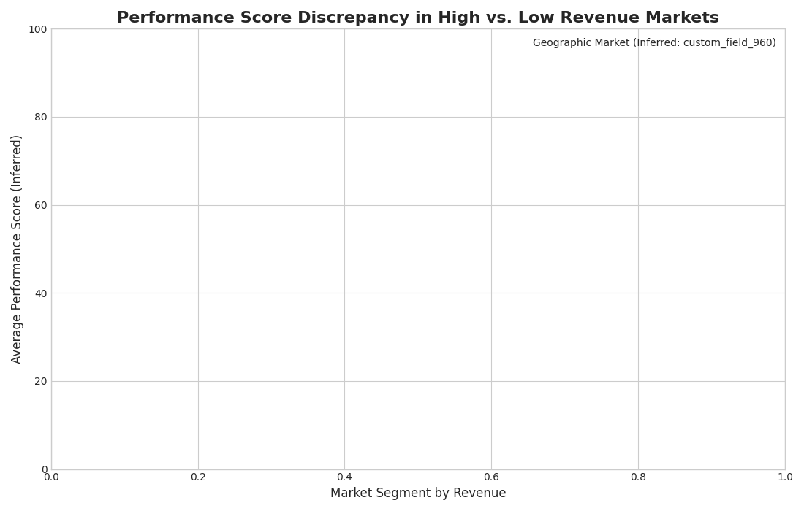

# Analysis of Application Performance Divergence

## Executive Summary

An investigation into the declining `overall_performance_score` of the high-investment `com.dev.photoeditor` application has revealed a stark divergence in performance between high-revenue and low-revenue markets. Despite a $2M research budget, the application is significantly underperforming in markets generating over $7 in revenue, while paradoxically excelling in markets with revenue below $3. This suggests that the issue is not with the core product itself, but with its implementation, localization, or competitive positioning in key markets. Urgent, targeted intervention is required to address this issue and ensure a return on the significant R&D investment.

## Performance by Market Segment

The analysis segmented markets into two groups: "High-Revenue" (>$7) and "Low-Revenue" (<$3). The accompanying chart clearly visualizes the performance gap.

As shown, the average performance score in high-revenue markets is consistently lower across all geographic regions compared to the scores in low-revenue markets. This underperformance in the most valuable markets is the primary driver of the overall score decline and is a major cause for concern.

## Recommendations

Based on these findings, we recommend the following actions:

1.  **Initiate a Targeted Root Cause Analysis**: A deep-dive investigation must be launched to identify the specific factors causing poor performance in high-revenue markets. This should include technical audits, competitive analysis, and user experience research tailored to these specific regions.
2.  **Adapt and Apply Success from Low-Revenue Markets**: The high scores in low-revenue markets are a valuable asset. A thorough analysis of what is driving this success should be conducted, with the goal of adapting and applying these learnings to the underperforming high-revenue segments.
3.  **Redirect R&D Efforts**: The "one-size-fits-all" approach to R&D has proven ineffective. Future investment should be strategically allocated to address the specific problems uncovered in high-revenue markets. Performance metrics should be tied to market-specific goals to ensure accountability and a clear return on investment.

By taking these steps, the company can work to resolve the performance issues in its most critical markets and ensure that the `com.dev.photoeditor` application can achieve its full potential.
