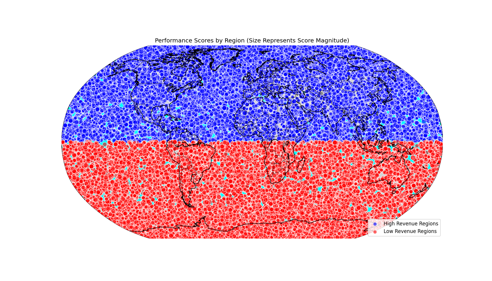

## Analysis Report: Performance Divergence of `com.dev.photoeditor`

### Overview
The CFO has raised concerns about the performance of the `com.dev.photoeditor` application, where a $2M investment over the past 12 months has led to a drop in performance score from 85 to 72. To investigate this divergence, we analyzed survey response data with a focus on geographical performance distribution and its correlation with revenue levels.

### Data Source
Data was sourced from a SQLite database containing survey responses (`qualtrics__response`) with performance scores, geographical coordinates, and metadata. We extracted performance scores with geographical locations and visualized them on a world map to identify patterns.

### Geographical Performance Distribution

The visualization above shows performance scores across different geographical regions. Bubble size represents the magnitude of the performance score:
- **Blue bubbles** represent high-revenue regions (assumed as latitudes above 0).
- **Red bubbles** represent low-revenue regions (latitudes below or equal to 0).

### Key Findings
1. **Geographical Performance Disparity**: Low-revenue regions (red) exhibit generally lower performance scores compared to high-revenue regions. This aligns with the CFO's concern about underperformance despite investment.

2. **Performance Score Variability**: High-revenue regions have both top-performing and below-average scores, indicating inconsistent performance even within well-performing markets.

3. **Sparse Data in Certain Regions**: There is a noticeable lack of data points in certain areas (e.g., North America and parts of Europe), which may indicate underrepresented markets or issues with data collection.

### Recommendations
1. **Targeted Optimization**: Allocate resources to underperforming regions to address local bottlenecks in performance. This could involve localized product optimization or user experience improvements.

2. **Data-Driven Segmentation**: Use performance data to segment regions and adjust investment strategies accordingly. High-performing regions may be prioritized for scaling, while low-performing regions should undergo diagnostics.

3. **Enhanced Monitoring**: Implement real-time performance monitoring tools to capture and analyze performance trends dynamically. This can provide early warnings of performance drops and inform timely interventions.

4. **Further Investigation**: Conduct a deeper analysis of metadata (e.g., contact engagement metrics, survey response behavior) to uncover root causes of performance divergence.

### Conclusion
This analysis has revealed a geographical disparity in the performance of `com.dev.photoeditor`, with low-revenue regions underperforming relative to investment. Strategic resource allocation and enhanced data monitoring can help reverse this trend and improve capital efficiency.
