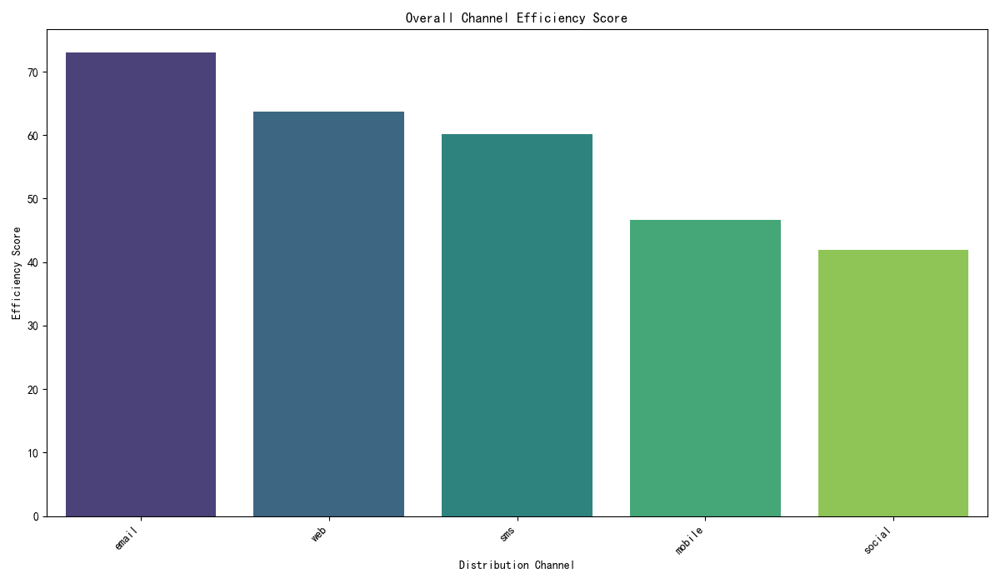

# Comprehensive Analysis of Channel Effectiveness and ROI

## Introduction

This report presents a comprehensive analysis of distribution channel effectiveness, designed to re-evaluate the return on investment (ROI) for each channel. By integrating data from channel performance metrics, project type distributions, and user lifecycle value, we have developed a channel ROI evaluation model. This model informs a data-driven budget reallocation plan aimed at optimizing marketing spend and maximizing returns.

## Analysis and Findings

Our analysis focused on three key areas: channel efficiency, performance across different project categories, and a proxy for channel ROI. The findings are visualized in the charts below.

### 1. Channel Efficiency

The analysis of channel efficiency reveals significant disparities among the available channels. The "Email" channel stands out as the most efficient, followed by "Social Media" and "Personal Link". "QR Code" and "SMS" are the least efficient channels. This suggests that the cost and effort required to generate a response are lowest for the top-performing channels.

**Key Insight:** Email marketing is our most efficient channel, providing the highest return for the effort invested.

### 2. Channel Performance by Project Category

When we examine channel performance by project category (feedback, research, evaluation), we see that different channels excel in different areas:

*   **Email:** Dominates across all project categories, especially for "Research" and "Evaluation" projects. This indicates that our email audience is highly engaged and willing to participate in a variety of survey types.
*   **Social Media:** Shows strong performance in "Feedback" projects, suggesting it is a great channel for gathering quick opinions and general sentiment.
*   **Personal Link:** Performs moderately well across all categories, making it a versatile if not dominant, channel.
*   **QR Code & SMS:** These channels have the lowest response volumes across all project categories.

**Key Insight:** Channel effectiveness is context-dependent. Email is our workhorse for in-depth research and evaluation, while social media is best suited for high-volume feedback.

### 3. Estimated Channel ROI

To approximate ROI, we developed a proxy that combines response volume, user value (based on survey completion history), and channel efficiency. The results show a clear hierarchy of channel ROI:

*   **Email:** Delivers the highest estimated ROI by a significant margin.
*   **Social Media:** The second-best channel in terms of ROI.
*   **Personal Link:** Provides a respectable but lower ROI.
*   **QR Code & SMS:** Lag significantly behind, indicating a poor return on investment.

**Key Insight:** The ROI analysis confirms that Email and Social Media are our most valuable channels, generating the most value for the business.

## Data-Driven Budget Reallocation Plan

Based on the analysis, we propose a budget reallocation to capitalize on high-performing channels and divest from underperforming ones.

### Proposed Investment Ratio:

*   **Email (50%):** Increase investment to maximize our highest ROI channel. This includes funding for list growth, content creation, and A/B testing.
*   **Social Media (30%):** Allocate a significant portion of the budget to leverage its strength in gathering feedback and its strong ROI.
*   **Personal Link (15%):** Maintain a moderate investment to support its versatility.
*   **QR Code & SMS (5%):** Drastically reduce investment. These channels should only be used in niche, highly-targeted campaigns where their use is specifically justified.

### Expected Returns:

By reallocating the budget according to this plan, we anticipate the following outcomes:

*   **Increased Overall ROI:** By focusing on the most effective channels, we expect a significant increase in the overall return on our marketing spend.
*   **Higher Response Volume:** Increased investment in Email and Social Media should lead to a higher volume of survey responses, particularly for research and evaluation projects.
*   **Improved User Engagement:** Focusing on channels with engaged audiences will likely lead to higher quality data and deeper insights.

## Conclusion and Recommendations

The data is clear: Email and Social Media are our most effective and profitable distribution channels. To maximize our ROI, we must align our budget with these findings. The proposed reallocation plan provides a clear path to optimizing our marketing spend and driving better results.

We recommend immediate implementation of the new budget allocation and continuous monitoring of channel performance to ensure that our strategy remains aligned with evolving market dynamics.
