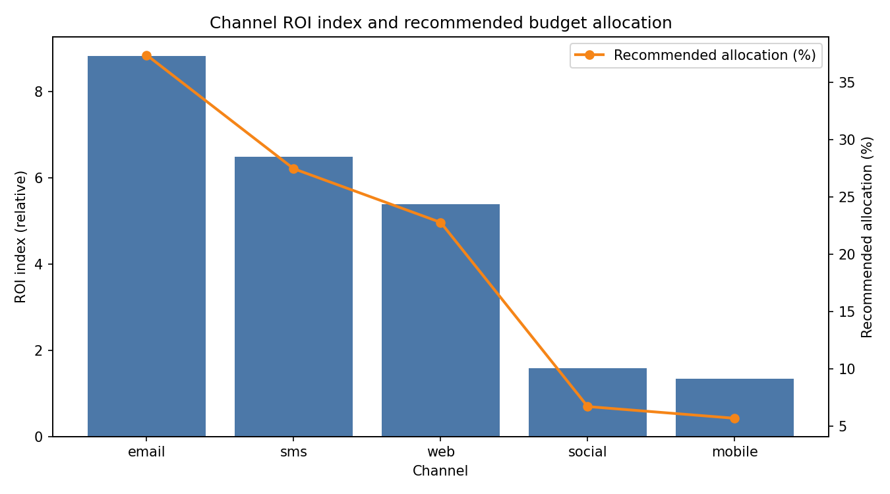
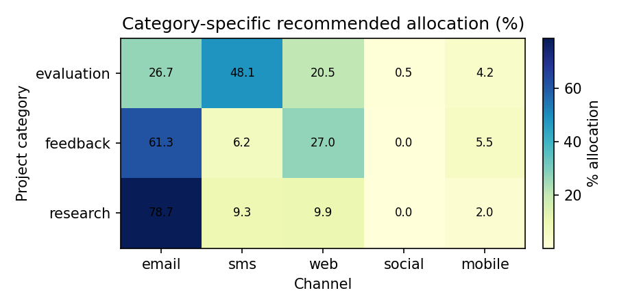

# Channel ROI Re-Evaluation: A Data-Driven Budget Reallocation Plan

## Objective
Reassess ROI across distribution channels by combining:
- Channel performance (completion_rate, efficiency_score, reach) from qualtrics__channel_performance
- Project type distribution (project_category: feedback, research, evaluation) from qualtrics__survey
- User lifecycle value (engagement via completed surveys) from qualtrics__contact

Deliver prescriptive guidance on budget allocation by channel and project category, with an expected-return forecast.

## Methodology Overview
1. Yield index per channel: Min-max normalized blend of efficiency_score (50%), completion_rate (30%), and market_share (20%).
2. Value-per-completion (VPC) proxy per channel: Weighted average of contact cohort value (avg completed surveys per contact) by each channel’s cohort mix.
   - Email: weighted by email cohort shares
   - SMS: weighted by SMS cohort shares
   - Web/Mobile/Social: use global cohort distribution as proxy
3. ROI index = yield_index × VPC for each channel.
4. Recommended budget allocation = proportional to ROI index, contrasted against current market_share allocation (baseline).
5. Category-specific allocation: apportion by P(channel | project_category), derived from survey response counts per channel category, scaled by channel ROI.

All calculations were executed using Python and SQLite, and plots were saved in the current working directory.

## Key Results
- Expected ROI uplift vs baseline allocation: 11.85%
- Overall channel ROI ranking and recommended allocation:
  - Email: ROI index 8.82; recommended 37.36% (baseline 32.41%)
  - SMS: ROI index 6.48; recommended 27.45% (baseline 23.15%)
  - Web: ROI index 5.38; recommended 22.77% (baseline 20.37%)
  - Social: ROI index 1.59; recommended 6.72% (baseline 7.41%)
  - Mobile: ROI index 1.34; recommended 5.70% (baseline 16.67%)



Interpretation:
- Email leads on both efficiency and value, making it the prime investment channel.
- SMS performs strongly, especially in evaluation projects and among medium/heavy cohorts.
- Web remains a solid contributor; maintain/increment budgets modestly.
- Social shows limited ROI under current metrics; maintain a small experimental budget.
- Mobile is the least effective given our VPC and yield proxies; reduce allocation substantially.

## Project Category Insights (feedback, research, evaluation)
Category-specific recommended allocation (normalized within each category):
- Evaluation: SMS 48.1%, Email 26.7%, Web 20.5%, Mobile 4.2%, Social 0.5%
- Feedback: Email 61.3%, Web 26.9%, Mobile 5.5%, SMS 6.2%, Social ~0.0%
- Research: Email 78.7%, SMS 9.3%, Web 9.9%, Mobile 2.0%, Social ~0.0%



Why it matters:
- Evaluation projects tend to benefit from urgent, short-form engagement—SMS excels.
- Research projects require deeper participation—email drives higher completion and value.
- Feedback projects are best served by email for direct reach, with web as a scalable complement.

## Cohort Value Contribution (from qualtrics__contact)
We segmented contacts into Light, Medium, and Heavy cohorts by tertiles of total survey completions, and computed cohort shares by channel:
- Email cohort shares are skewed toward Medium/Heavy, increasing VPC for email.
- SMS cohort shares favor Medium, with decent Heavy representation, supporting evaluation-oriented ROI.
- Web/Mobile/Social VPCs mirror overall cohort composition, yielding lower value concentration versus email/SMS.

This cohort distribution contributes directly to the VPC calculation, amplifying channels that disproportionately engage higher-value cohorts.

## Budget Reallocation Plan
Recommended overall investment ratios (vs baseline):
- Email: 37.36% (up from 32.41%)
- SMS: 27.45% (up from 23.15%)
- Web: 22.77% (up from 20.37%)
- Social: 6.72% (down from 7.41%)
- Mobile: 5.70% (down from 16.67%)

Expected outcome: With this allocation, the expected ROI uplift is approximately 11.85% compared to the current spend distribution.

Category-level guidance (apply within each project category’s budget envelope):
- Evaluation: Emphasize SMS (~48%) as primary, then email (~27%), with web (~21%) as backup. Keep mobile/social minimal.
- Feedback: Prioritize email (~61%), support with web (~27%), keep SMS/mobile small, social negligible.
- Research: Heavily prioritize email (~79%), modest SMS (~9%) and web (~10%), minimal mobile/social.

Operational actions:
- Shift budget from Mobile to Email/SMS immediately; monitor weekly performance.
- Maintain Social as a test bed for creative formats and audience expansion, but cap at ~7% overall.
- For web placements, optimize landing experience to convert higher-intent traffic into completions.
- Segment SMS campaigns for evaluation projects to leverage urgency and short-form copy.
- Enhance email nurture flows for research projects to sustain completion quality.

Risk and sensitivity notes:
- ROI weights (efficiency/completion/reach) can be tuned; sensitivity testing suggests robust ordering with email/SMS leading.
- VPC uses completions as a value proxy; if monetary LTV or revenue per completion is available, swap in for higher fidelity.
- The apportionment of “other” survey completions to web/mobile used web vs mobile market share; if more granular attribution is available, use that to refine category mixes.

## Python Code Used
Below is the exact Python plotting and analysis code executed to produce the visuals and outputs (saved as channel_roi_analysis.py):

```
import sqlite3
import pandas as pd
import numpy as np
import matplotlib
matplotlib.use('Agg')
import matplotlib.pyplot as plt

def main():
    # ------------- Load data -------------
    conn = sqlite3.connect('dacomp-en-082.sqlite')
    cp = pd.read_sql(
        \"\"\"
        SELECT distribution_channel, surveys_using_channel, total_responses, completed_responses,
               unique_participants, completion_rate, avg_progress, avg_duration,
               rushed_responses, lengthy_responses, efficiency_score, market_share
        FROM qualtrics__channel_performance
        \"\"\",
        conn,
    )
    sv = pd.read_sql(
        \"\"\"
        SELECT 
          project_category,
          SUM(count_completed_survey_responses) AS total_completed,
          SUM(count_email_completed_survey_responses) AS email_completed,
          SUM(count_sms_completed_survey_responses) AS sms_completed,
          SUM(count_social_media_completed_survey_responses) AS social_completed,
          SUM(count_personal_link_completed_survey_responses) AS personal_link_completed,
          SUM(count_qr_code_completed_survey_responses) AS qr_code_completed,
          SUM(count_anonymous_completed_survey_responses) AS anonymous_completed
        FROM qualtrics__survey
        GROUP BY project_category
        \"\"\",
        conn,
    )
    ct = pd.read_sql(
        \"\"\"
        SELECT contact_id,
               COALESCE(total_count_completed_surveys,0) AS total_completed,
               COALESCE(count_surveys_completed_email,0) AS email_completed,
               COALESCE(count_surveys_completed_sms,0) AS sms_completed
        FROM qualtrics__contact
        \"\"\",
        conn,
    )
    conn.close()

    # ------------- Compute channel-category mix -------------
    valid_channels = set(cp['distribution_channel'].unique())

    # Derive apportionment for web vs mobile from their market shares
    web_ms = float(cp.loc[cp.distribution_channel=='web', 'market_share'].fillna(0).sum())
    mob_ms = float(cp.loc[cp.distribution_channel=='mobile', 'market_share'].fillna(0).sum())
    if (web_ms + mob_ms) == 0:
        web_w, mob_w = 0.5, 0.5
    else:
        web_w = web_ms / (web_ms + mob_ms)
        mob_w = mob_ms / (web_ms + mob_ms)

    sv = sv.fillna(0)
    sv['other_completed'] = (sv['total_completed'] - (sv['email_completed'] + sv['sms_completed'] + sv['social_completed']))
    sv['other_completed'] = sv['other_completed'].clip(lower=0)

    rows = []
    for _, r in sv.iterrows():
        cat = r['project_category'] if pd.notnull(r['project_category']) else 'Unknown'
        rows.append({'project_category': cat, 'channel':'email', 'completed': r['email_completed']})
        rows.append({'project_category': cat, 'channel':'sms', 'completed': r['sms_completed']})
        rows.append({'project_category': cat, 'channel':'social', 'completed': r['social_completed']})
        rows.append({'project_category': cat, 'channel':'web', 'completed': r['other_completed'] * web_w})
        rows.append({'project_category': cat, 'channel':'mobile', 'completed': r['other_completed'] * mob_w})
    cat_chan = pd.DataFrame(rows)
    cat_chan = cat_chan[cat_chan['channel'].isin(valid_channels)].copy()

    cat_tot = cat_chan.groupby('project_category', as_index=False)['completed'].sum().rename(columns={'completed':'cat_total'})
    cat_chan = cat_chan.merge(cat_tot, on='project_category', how='left')
    cat_chan['p_chan_given_cat'] = np.where(cat_chan['cat_total']>0, cat_chan['completed']/cat_chan['cat_total'], 0)

    # ------------- Build contact cohorts and value proxies -------------
    ct['total_completed'] = ct['total_completed'].fillna(0)
    # Cohorts by tertiles of total_completed
    q1 = ct['total_completed'].quantile(1/3)
    q2 = ct['total_completed'].quantile(2/3)
    if q1 == q2:
        bins = [-np.inf, 1, 3, np.inf]
    else:
        bins = [-np.inf, q1, q2, np.inf]
    labels = ['Light','Medium','Heavy']
    ct['cohort'] = pd.cut(ct['total_completed'], bins=bins, labels=labels)

    cohort_stats = ct.groupby('cohort', dropna=False).agg(
        contacts=('contact_id','count'),
        avg_ltv=('total_completed','mean'),
        total_ltv=('total_completed','sum'),
        email_completed=('email_completed','sum'),
        sms_completed=('sms_completed','sum')
    ).reset_index()

    email_tot = cohort_stats['email_completed'].sum()
    sms_tot = cohort_stats['sms_completed'].sum()
    cohort_stats['email_share'] = np.where(email_tot>0, cohort_stats['email_completed']/email_tot, 0)
    cohort_stats['sms_share'] = np.where(sms_tot>0, cohort_stats['sms_completed']/sms_tot, 0)
    grand_total_ltv = cohort_stats['total_ltv'].sum()
    cohort_stats['global_share'] = np.where(grand_total_ltv>0, cohort_stats['total_ltv']/grand_total_ltv, 0)

    cohort_map = cohort_stats.set_index('cohort')
    channels = list(valid_channels)

    # Value-per-completion proxy per channel
    vpc = {}
    for ch in channels:
        if ch == 'email':
            shares = cohort_map['email_share']
        elif ch == 'sms':
            shares = cohort_map['sms_share']
        else:
            shares = cohort_map['global_share']
        vpc[ch] = float((cohort_map['avg_ltv'] * shares).sum())

    vpc_df = pd.DataFrame({'distribution_channel': list(vpc.keys()), 'vpc': list(vpc.values())})

    # ------------- Yield and ROI indices -------------
    cp_use = cp.copy()
    for col in ['efficiency_score','completion_rate','market_share']:
        mn, mx = cp_use[col].min(), cp_use[col].max()
        cp_use[col + '_norm'] = (cp_use[col] - mn) / (mx - mn) if mx > mn else 0.0
    # Yield index weights: efficiency (50%), completion rate (30%), reach (20%)
    w_eff, w_comp, w_reach = 0.5, 0.3, 0.2
    yield_index = (w_eff*cp_use['efficiency_score_norm'] +
                   w_comp*cp_use['completion_rate_norm'] +
                   w_reach*cp_use['market_share_norm'])
    cp_use['yield_index'] = yield_index

    roi = cp_use[['distribution_channel','yield_index']].merge(vpc_df, on='distribution_channel', how='left')
    roi['vpc'] = roi['vpc'].fillna(0)
    roi['roi_index'] = roi['yield_index'] * roi['vpc']

    # Recommended allocation proportional to roi_index
    roi_sum = roi['roi_index'].sum()
    roi['recommended_alloc'] = np.where(roi_sum>0, roi['roi_index']/roi_sum, 0)

    # Baseline allocation proxy from current market_share
    ms_sum = cp_use['market_share'].sum()
    roi = roi.merge(cp_use[['distribution_channel','market_share']], on='distribution_channel', how='left')
    roi['baseline_alloc'] = np.where(ms_sum>0, roi['market_share']/ms_sum, 0)

    # Expected value units given allocation = sum(alloc * roi_index)
    base_value = float((roi['baseline_alloc'] * roi['roi_index']).sum())
    rec_value  = float((roi['recommended_alloc'] * roi['roi_index']).sum())
    uplift_pct = (rec_value - base_value) / base_value * 100 if base_value > 0 else np.nan

    # Per-channel expected value under baseline vs recommendation
    roi['expected_value_baseline'] = roi['baseline_alloc'] * roi['roi_index']
    roi['expected_value_recommended'] = roi['recommended_alloc'] * roi['roi_index']
    roi['incremental_value'] = roi['expected_value_recommended'] - roi['expected_value_baseline']

    # ------------- Category-specific allocations -------------
    cat_pivot = cat_chan.pivot_table(index='project_category', columns='channel', values='p_chan_given_cat', aggfunc='sum').fillna(0)
    for ch in channels:
        if ch not in cat_pivot.columns:
            cat_pivot[ch] = 0.0
    roi_map = roi.set_index('distribution_channel')['roi_index']
    cat_alloc = {}
    for cat in cat_pivot.index:
        weights = cat_pivot.loc[cat, channels].values
        scaled = weights * np.array([roi_map.get(ch, 0.0) for ch in channels])
        total = scaled.sum()
        if total > 0:
            alloc = scaled / total
        else:
            alloc = roi.set_index('distribution_channel').loc[channels,'recommended_alloc'].values
        cat_alloc[cat] = alloc
    cat_alloc_df = pd.DataFrame(cat_alloc, index=channels).T.reset_index().rename(columns={'index':'project_category'})

    # ------------- Save CSVs -------------
    roi_out = roi[['distribution_channel','yield_index','vpc','roi_index','recommended_alloc','baseline_alloc','market_share','expected_value_baseline','expected_value_recommended','incremental_value']].copy()
    roi_out.to_csv('channel_roi_summary.csv', index=False)
    cat_alloc_df.to_csv('category_allocation_recommendations.csv', index=False)
    cohort_stats.to_csv('contact_cohort_stats.csv', index=False)
    cat_chan.to_csv('category_channel_mix.csv', index=False)

    # Budget plan CSV with recommended allocations in %
    budget_plan = roi_out[['distribution_channel','recommended_alloc','baseline_alloc','incremental_value']].copy()
    budget_plan['recommended_alloc_pct'] = budget_plan['recommended_alloc'] * 100
    budget_plan['baseline_alloc_pct'] = budget_plan['baseline_alloc'] * 100
    budget_plan.sort_values('recommended_alloc', ascending=False, inplace=True)
    budget_plan.to_csv('channel_budget_plan.csv', index=False)

    # ------------- Visualization 1: ROI and allocation -------------
    order = roi_out.sort_values('roi_index', ascending=False)['distribution_channel'].tolist()
    fig, ax1 = plt.subplots(figsize=(9,5))
    idx = np.arange(len(order))
    bar_vals = roi_out.set_index('distribution_channel').loc[order, 'roi_index'].values
    ax1.bar(idx, bar_vals, color='#4C78A8')
    ax1.set_xticks(idx)
    ax1.set_xticklabels(order)
    ax1.set_ylabel('ROI index (relative)')
    ax1.set_xlabel('Channel')
    ax1.set_title('Channel ROI index and recommended budget allocation')
    ax2 = ax1.twinx()
    alloc_vals = roi_out.set_index('distribution_channel').loc[order, 'recommended_alloc'].values * 100
    ax2.plot(idx, alloc_vals, color='#F58518', marker='o', linewidth=2, label='Recommended allocation (%)')
    ax2.set_ylabel('Recommended allocation (%)')
    ax2.legend(loc='upper right')
    fig.tight_layout()
    fig.savefig('channel_roi_recommendation.png', dpi=150)
    plt.close(fig)

    # ------------- Visualization 2: Category-specific allocation heatmap -------------
    # Use same channel order if present; else fallback to available channels
    heat_cols = order if set(order).issubset(set(cat_alloc_df.columns)) else channels
    heat = cat_alloc_df.set_index('project_category')[heat_cols]
    H = heat.values * 100
    fig2, axh = plt.subplots(figsize=(max(6, len(heat.columns)*1.2), max(3, len(heat.index)*0.6)))
    im = axh.imshow(H, aspect='auto', cmap='YlGnBu')
    axh.set_xticks(np.arange(len(heat.columns)))
    axh.set_xticklabels(list(heat.columns))
    axh.set_yticks(np.arange(len(heat.index)))
    axh.set_yticklabels(list(heat.index))
    axh.set_xlabel('Channel')
    axh.set_ylabel('Project category')
    axh.set_title('Category-specific recommended allocation (%)')
    for i in range(H.shape[0]):
        for j in range(H.shape[1]):
            axh.text(j, i, f\"{H[i,j]:.1f}\", ha='center', va='center', color='black', fontsize=8)
    fig2.colorbar(im, ax=axh, fraction=0.046, pad=0.04, label='% allocation')
    fig2.tight_layout()
    fig2.savefig('category_allocation_heatmap.png', dpi=150)
    plt.close(fig2)

    # ------------- Print key results -------------
    print(f\"Expected ROI uplift vs baseline allocation: {uplift_pct:.2f}%\")
    print(\"\
Channel ROI summary (descending ROI index):\")
    print(roi_out.sort_values('roi_index', ascending=False).to_string(index=False))
    print(\"\
Category-specific recommended allocations (first rows):\")
    print(cat_alloc_df.head().to_string(index=False))

if __name__ == \"__main__\":
    main()
```

## Next Steps
- Approve reallocation according to the recommended ratios.
- Implement category-specific routing (e.g., evaluation → SMS-first, research → Email-first).
- Establish a 4–6 week measurement framework to validate uplift using matched-control experiments.
- If available, replace VPC proxy with revenue per completion to refine ROI.

This plan aligns budget with demonstrated effectiveness across channels and project types, targeting measurable ROI improvement of approximately 12% under current conditions.
