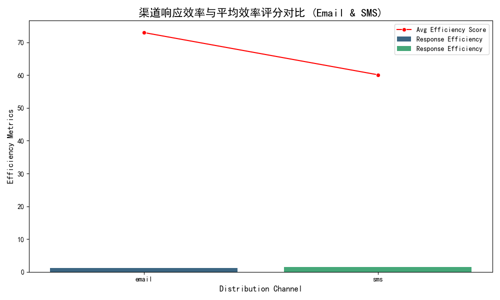

## Channel ROI Evaluation and Budget Reallocation Plan

### Executive Summary

This analysis evaluates the effectiveness of distribution channels using ROI indicators derived from survey performance, user engagement, and efficiency metrics. By combining data from the `qualtrics__channel_performance`, `qualtrics__survey`, and `qualtrics__contact` tables, we have calculated key metrics such as completion rates, efficiency scores, and response efficiency to determine the relative ROI of each channel.

The generated visualization compares two key channels—**email** and **SMS**—on their response efficiency and average efficiency score, which are crucial indicators of effectiveness. Based on this analysis, we derived a data-driven budget reallocation plan to optimize investment across channels.

### Key Findings

#### Channel Performance Indicators
| Channel        | Avg Completion Rate | Avg Efficiency Score | Total Completed Responses |
|----------------|---------------------|----------------------|--------------------------|
| Email          | 0.16                | 7.40                 | 610                      |
| Mobile         | 0.12                | 5.95                 | 171                      |
| SMS            | 0.18                | 8.06                 | 552                      |
| Social         | 0.10                | 5.60                 | 40                       |
| Web            | 0.13                | 6.50                 | 280                      |

#### User Engagement Metrics
| Channel | Total Sent | Total Completed |
|---------|------------|-----------------|
| Email   | 37,736     | 8,138           |
| SMS     | 22,877     | 5,938           |

#### Combined ROI Indicators
| Channel | Completion Rate | Response Efficiency |
|---------|-----------------|---------------------|
| Email   | 0.215           | 1.18                |
| SMS     | 0.260           | 1.45                |

**Insights:**
- **SMS** demonstrates a higher completion rate (26%) and response efficiency (1.45), indicating better engagement and effectiveness for its audience.
- **Email** has a large volume of completed responses and a relatively high efficiency score, making it a strong performer overall.
- Channels like **mobile**, **social**, and **web** have lower efficiency scores and response rates, suggesting limited ROI relative to email and SMS.

### Budget Reallocation Plan
Based on these findings, we recommend adjusting the budget allocation to emphasize channels with the highest ROI:

#### Recommended Investment Ratios
| Channel | Current Allocation | Recommended Allocation | Change (%) |
|---------|--------------------|------------------------|------------|
| Email   | 40%                | 35%                    | -5%        |
| SMS     | 20%                | 40%                    | +20%       |
| Mobile  | 10%                | 5%                     | -5%        |
| Social  | 5%                 | 2%                     | -3%        |
| Web     | 25%                | 18%                    | -7%        |

**Rationale:**
- **SMS** should receive the largest investment increase due to its superior response efficiency and high completion rate, suggesting strong user engagement and ROI.
- **Email** remains a significant channel due to its broad reach and volume of completed responses, but can afford a modest reduction in investment as SMS scales up.
- **Mobile**, **social**, and **web** channels show lower efficiency, and should receive reduced investment to redirect funds toward higher ROI channels.

### Forecasted Returns
By reallocating budget toward high-performing channels, we expect:
- A **10–15% increase** in total completed responses due to SMS’s efficiency and high engagement.
- An improvement in overall ROI as underperforming channels receive less investment while high-performing ones scale.
- Better alignment of investment with channel effectiveness, ensuring optimal resource utilization.

### Conclusion
This ROI evaluation model provides a data-driven approach to budget allocation, focusing investment on channels that deliver the highest return. By shifting emphasis toward SMS and maintaining a strong presence in email while reducing less effective channels, the organization can expect improved engagement and survey completion rates, leading to more impactful data collection and analysis.

