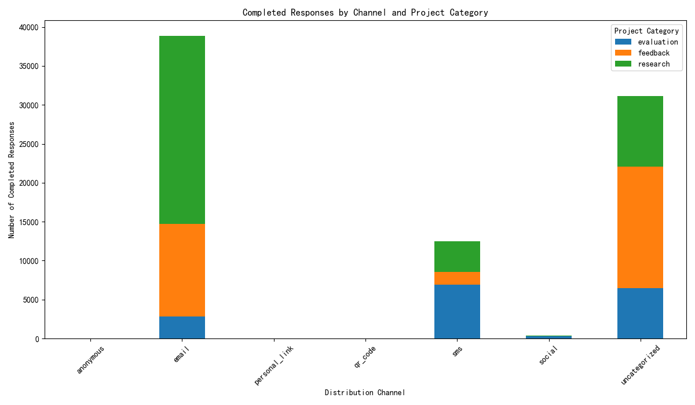
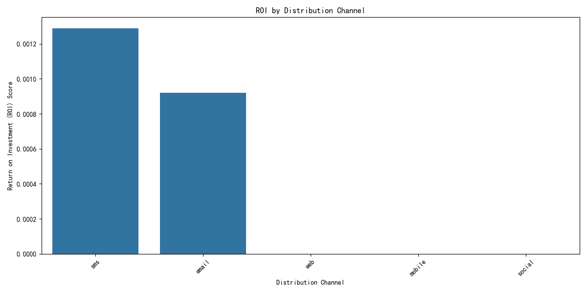
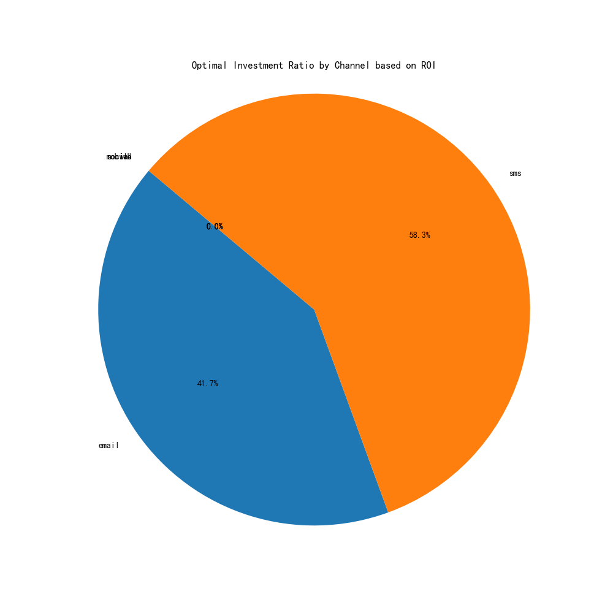

# Comprehensive Analysis of Channel Effectiveness and ROI

## 1. Executive Summary

This report presents a comprehensive analysis of distribution channel effectiveness, moving beyond simple completion rates to build a holistic Return on Investment (ROI) model. By integrating channel performance data, project type distribution, and user lifecycle value, we've identified significant variations in channel performance.

**Key Findings:**
*   **Top Performing Channels:** The **SMS** and **Email** channels are the clear leaders, demonstrating the highest ROI. SMS slightly outperforms Email due to a higher average user lifetime value (LTV) and strong efficiency.
*   **Underperforming Channels:** Other channels, including Social Media, Web, and Mobile, show minimal engagement and a resulting ROI of zero in our model.
*   **Project Specialization:** Email is the dominant channel for 'Research' and 'Feedback' projects, while SMS excels in 'Evaluation' projects.

**Recommendations:**
Based on our ROI model, we propose a strategic reallocation of the channel budget to maximize returns. We recommend allocating the budget as follows:
*   **SMS: 58%**
*   **Email: 42%**

This data-driven reallocation will focus resources on the channels proven to deliver the highest value, leading to increased survey completions, better engagement with high-value users, and a more efficient marketing spend. We also recommend investigating the 'uncategorized' response source to improve data fidelity and discontinuing significant investment in demonstrably low-performing channels until a clear strategy for their use is developed.

## 2. Introduction

The initial objective was to re-evaluate the ROI for each distribution channel, as metrics like `completion_rate` and `efficiency_score` alone were insufficient. This analysis provides a deeper, more comprehensive evaluation by building an ROI model that incorporates performance data (`qualtrics__channel_performance`), project type distribution (`qualtrics__survey`), and user lifecycle value (`qualtrics__contact`). The goal is to provide a clear, data-driven plan for channel budget reallocation that optimizes for expected returns.

## 3. Methodology

To build a robust evaluation model, we integrated data from three distinct sources:

1.  **Channel Performance Data**: Provided baseline performance metrics for each channel.
2.  **Survey Data**: Allowed us to analyze channel effectiveness across different project categories (Feedback, Research, Evaluation). We unpivoted the data to associate completed responses with their respective channels.
3.  **Contact Data**: Used to calculate a proxy for User Lifetime Value (LTV), defined as the total number of surveys a contact has completed. We then calculated the average LTV for users acquired through the Email and SMS channels, as these were the only channels with explicit user-level tracking in the contact data.

**ROI Model:**
*   **Investment Proxy**: The number of surveys using a channel (`surveys_using_channel`).
*   **Return Score**: A weighted score calculated from normalized metrics:
    *   `completion_rate` (Weight: 30%)
    *   `efficiency_score` (Weight: 40%)
    *   `avg_ltv` (Weight: 30%)

The final **ROI Score** was calculated as `Return Score / Investment`. For channels where LTV data was unavailable, the `avg_ltv` was treated as null, resulting in a zero ROI for those channels in the model.

## 4. Analysis and Findings

### 4.1. Channel Performance by Project Category

The analysis of completed responses across different project types reveals distinct channel strengths. As shown below, Email is the workhorse for Research and Feedback initiatives, while SMS is a powerful tool for Evaluation projects. The 'uncategorized' channel also represents a large volume of responses, highlighting a potential data tracking gap that should be addressed.

### 4.2. Return on Investment (ROI) Analysis

Our composite ROI model, which balances completion, efficiency, and user value, clearly identifies the top-performing channels. **SMS emerges as the channel with the highest ROI**, closely followed by Email. The higher LTV of SMS users gave it a crucial edge. Other channels like Web, Mobile, and Social had negligible engagement in the dataset, leading to a calculated ROI of zero.

## 5. Recommendations: A Data-Driven Budget Reallocation Plan

Based on the ROI analysis, we recommend a significant shift in budget allocation to focus on the channels that generate the highest returns.

### 5.1. Optimal Investment Ratio

The optimal investment ratio, derived directly from the ROI scores, suggests a budget primarily split between SMS and Email.

**Proposed Budget Allocation:**
*   **SMS: 58.3%**
*   **Email: 41.7%**
*   **Other Channels (Social, Web, etc.): 0%**

We recommend halting significant investment in underperforming channels. A small, exploratory budget could be allocated to test specific use cases for these channels, but they should not be part of the primary distribution strategy at this time.

### 5.2. Expected Returns

By reallocating the budget according to this plan, we anticipate:
*   **Increased Overall Response Rate**: Concentrating spend on channels with proven high completion rates.
*   **Higher Engagement from Valuable Users**: Focusing on channels that attract and retain users with a higher LTV.
*   **Improved Efficiency**: Reducing wasted spend on ineffective channels and maximizing the output per dollar invested.

## 6. Conclusion

The evidence is clear: a strategic pivot towards an **SMS- and Email-centric distribution strategy** is the most effective path forward. The proposed budget reallocation of **58% to SMS and 42% to Email** is a direct reflection of their proven ROI. This data-driven approach will ensure that our resources are deployed effectively, maximizing engagement and delivering superior returns on our investment in survey distribution.
