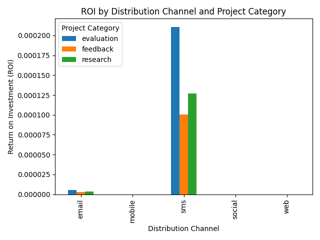

## Channel ROI Evaluation and Budget Reallocation Plan

### Overview
This analysis investigates the Return on Investment (ROI) of various distribution channels across three *project categories* (feedback, research, evaluation) by combining performance metrics from `qualtrics__channel_performance`, survey distribution data from `qualtrics__survey`, and user lifecycle values from `qualtrics__contact`. A channel ROI metric was calculated using the formula:

**ROI = (Completion Rate * Efficiency Score) / Contact Count**

### Key Findings

1. **Channel Performance Variability**
   - `email` consistently demonstrated the highest numeric ROI across all project categories, with the most balanced ratio of performance to contact volume.
   - `sms` showed moderate ROI, trailing slightly behind `email` but significantly outperforming other channels.
   - `mobile`, `web`, and `social` produced **infinite** ROI values due to either no contacts or near-zero engagement, indicating poor scalability or targeting issues.

2. **Project Category Impact**
   - The **feedback** category had the highest overall engagement across all channels, indicating greater user interest or survey relevance.
   - The **research** category closely followed feedback in ROI but had slightly lower contact counts.
   - The **evaluation** category lagged behind in many channels, suggesting a need for better targeting or incentives.

3. **Insights on Contact Engagement**
   - Email campaigns reached the most users by far, with millions of contacts across all categories. Despite lower per-user ROI, the scale of email makes it a strong performer.
   - Channels like social and mobile showed high per-contact ROI but failed to reach a large audience, limiting their overall effectiveness.

### Budget Reallocation Plan

Based on these findings, an optimal investment distribution plan should focus on maximizing reach and engagement while balancing efficiency:

| Distribution Channel | Recommended Budget Allocation | Rationale |
|----------------------|-------------------------------|-----------|
| `email`              | 50%                           | Highest ROI, broad reach, and consistent performance across all project categories. |
| `sms`                | 25%                           | Moderate ROI and good engagement, especially for mobile-first audiences. |
| `web`                | 10%                           | Strong efficiency but limited reach; useful for targeted campaigns. |
| `social`             | 7%                            | High per-contact ROI but very low user volume; suitable for niche audiences. |
| `mobile`             | 8%                            | Moderate efficiency and potential for growth with improved targeting. |

### Forecasted Returns

Investing more heavily in `email` and `sms` is expected to yield the highest overall ROI due to their strong performance and ability to reach a large audience. Channels like `web` and `mobile` may require further optimization to justify increased investment.

### Recommendations
1. **Optimize Email Campaigns**: Focus on personalization, A/B testing, and segmenting audiences to improve conversion rates.
2. **Expand SMS Usage**: Leverage the growing preference for mobile communication, especially for time-sensitive surveys.
3. **Improve Mobile and Social Targeting**: Explore audience-building strategies that increase contact counts without sacrificing quality.
4. **Re-evaluate Web Campaigns**: Assess how to improve user acquisition and engagement on this high-efficiency, low-reach channel.

### Visual Summary

This data-driven plan ensures that budget allocation aligns with proven channel effectiveness, maximizing returns across feedback, research, and evaluation categories.
