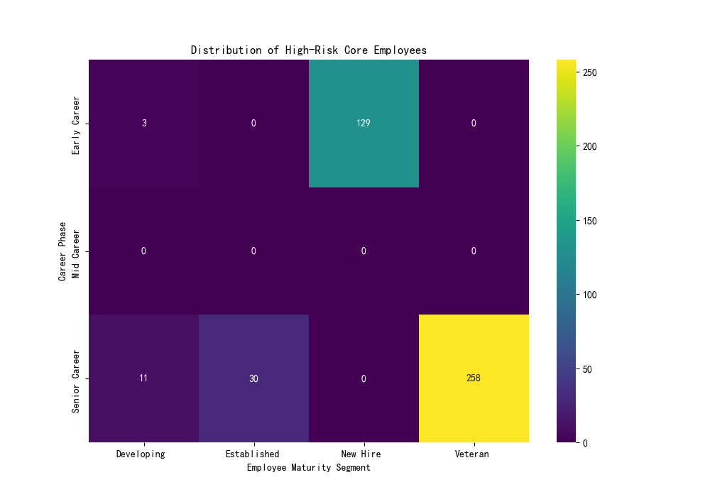

# Employee Value and Risk Assessment Report

## 1. Executive Summary

This report presents a comprehensive analysis of the company's workforce, focusing on identifying core employees, assessing attrition risks, and providing a tiered system of management recommendations. Our analysis reveals distinct employee segments that require targeted strategies to maximize their value and mitigate risks. Key findings indicate that a significant number of new hires and veteran employees are at high risk, and a large group of high-value employees are at risk of attrition. The recommendations provided aim to improve retention, foster development, and optimize human resource allocation.

## 2. Profile of Core Employees

We defined "core employees" as those with an `overall_employee_score` greater than 75 and a `career_development_score` above the median of 78.5. This segment consists of **29,438** employees. A profile of these employees reveals the following:

*   **Age:** The average age is around 40, with a range from 23 to 65.
*   **Tenure:** The average tenure is approximately 5.5 years.
*   **Career Progression:** On average, core employees have held 3-4 positions, with about one promotion.

## 3. High-Risk Core Employees Analysis

Within the core employee group, we identified a high-risk segment based on the `employee_risk_level` attribute. The distribution of these high-risk employees is particularly concerning in two main groups as shown in the visualization below:

**Distribution of High-Risk Core Employees**

*   **Early Career / New Hires (129 high-risk employees):** This suggests potential issues in the onboarding process, mismatched expectations, or a lack of early career support.
*   **Senior Career / Veterans (258 high-risk employees):** This is the largest high-risk group, indicating that long-tenured employees may be experiencing burnout, career stagnation, or a lack of new challenges.

## 4. High-Value Attrition Risk Employees

We identified **4,706** "high-value attrition risk employees," defined as those with a `retention_stability_score` below 60 but an `overall_employee_score` above 80.

*   **Value Segments:** A majority of these employees fall into the "Developing - Moderate Risk" (2,301) and "Developing - Stable" (813) categories. This highlights a critical need to support and stabilize this group to prevent the loss of future high-performers.
*   **Work Conditions:** 1,048 of these employees are required to work in shifts, and 1,816 are eligible for union membership, suggesting that work environment and compensation are likely key factors in their retention.

## 5. Tiered Employee Management Recommendations

Based on our analysis, we propose a tiered management system targeting specific employee segments with tailored strategies.

### Segment 1: Emerging Leaders (4,281 employees)
*   **Profile:** Core employees with proven management experience (`highest_management_level_reached` > 0) in 'Good' or 'Average' performing departments.
*   **Retention Strategy:**
    *   **Priority:** High. These are valuable leaders in effective teams.
    *   **Actions:** Offer advanced leadership training, executive mentorship, and opportunities for cross-functional projects to keep them engaged. Provide clear pathways to senior leadership roles.
    *   **Expected Effectiveness:** High. These employees are already on a positive trajectory; targeted investment will likely yield significant returns in leadership strength and retention.

### Segment 2: Untapped Potential (12,641 employees)
*   **Profile:** Core employees who are individual contributors (`highest_management_level_reached` == 0) in departments that 'Need Improvement'.
*   **Development & Retention Strategy:**
    *   **Priority:** High. This is a large group of valuable employees whose potential is likely hampered by their environment.
    *   **Actions:**
        1.  **Diagnose Departmental Issues:** Investigate the root causes of the low performance in these departments (e.g., poor management, resource constraints, toxic culture).
        2.  **Provide Growth Opportunities:** Offer lateral moves to higher-performing departments, targeted skill development, and mentorship from successful individual contributors.
        3.  **Identify Future Leaders:** Pilot a "Future Leaders" program for this segment to identify and nurture management potential.
    *   **Expected Effectiveness:** Moderate to High. The success of these strategies is contingent on addressing the systemic issues within their departments. If the environment can be improved, the potential for retaining and developing these employees is substantial.
