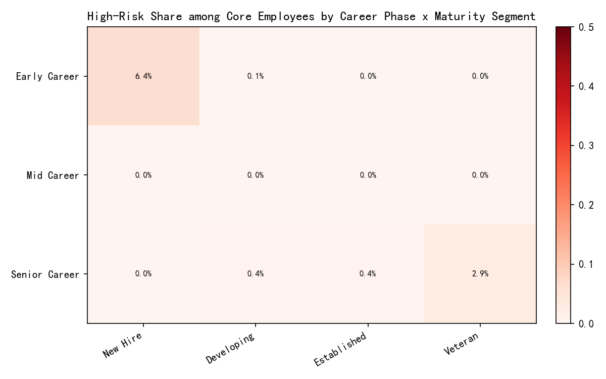
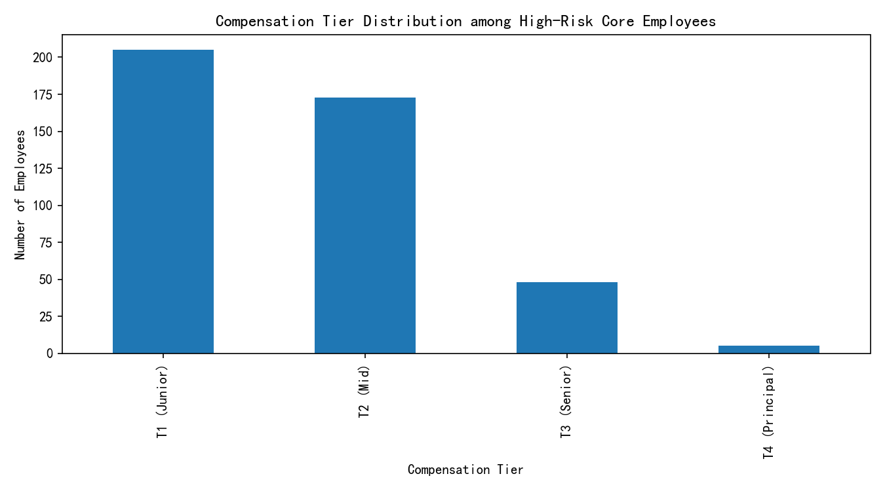

# Employee Value and Risk Assessment: Insights and Tiered Recommendations

## Executive Summary
- Scope: 156,205 employees analyzed from workday__employee_overview.
- Core employees: 29,438 (18.9%) defined as overall_employee_score > 75 and career_development_score above the median (78.50).
- Risk levels: [High, Medium, Low]; analysis treats “High” as elevated risk.
- Key findings:
  - Risk concentration among core employees is highest in Early Career — New Hire (6.4% high-risk) and Senior Career — Veteran (2.85% high-risk), indicating two critical inflection points: onboarding and late-career plateau.
  - High-risk core employees skew towards lower compensation tiers (T1/T2), and are most numerous in Business Units; Engineering shows the highest turnover environment among high-risk core.
  - High-value attrition risk cohort (retention_stability_score < 60 AND overall_employee_score > 80) totals 4,706 employees; almost half are “Developing - Moderate Risk.” Shift work and union eligibility are notable factors.

The results point to targeted retention and development strategies: strengthen early-career onboarding and role fit, create senior-career renewal pathways, and address department-level conditions where risk and impact are highest.

## Reproducibility note
The analysis and visualizations were generated by the included Python code executed in this session. Images referenced below are saved in the working directory:
- core_risk_heatmap.png
- comp_tier_distribution_high_risk_core.png

## How “Core Employees” Were Defined
- Thresholds:
  - overall_employee_score > 75
  - career_development_score > median (78.50)
- Core size: 29,438 employees.

## Core Employee Profile (Deep-Dive)
Quantitative profile of 29,438 core employees:
- Age: mean 47.8 (P25=44, P50=47, P75=51; range 41–65)
- Tenure years: mean 6.28, median 4.10 (IQR: 2.37–9.67)
- Positions held: mean 3.41 (median 3)
- Promotions: mean 1.47 (P75=2)
- Lateral moves: mean 0.94 (median 1)
- Management positions held: mean 0.38 (median 0; P75=0)
- Marital status (top): Married (71%), Single (15%), Divorced (12%), Widowed (~2%)
- Ethnicity codes (top): White (40.8%), Asian (34.8%), Hispanic (10.7%), Black (8.4%), Mixed (3.0%)

Interpretation:
- Core talent is relatively experienced and stable (median tenure ~4 years), with measured mobility (median promotions=1, lateral moves=1).
- Most core employees have not held management posts, implying a large pool of high-performing individual contributors.

## High-Risk Distribution among Core Employees
The following heatmap shows the share of “High” employee_risk_level in each career_phase x employee_maturity_segment combination (values displayed as percentages within the cells).

Highlights:
- Early Career — New Hire: 6.4% high-risk (highest)
- Senior Career — Veteran: 2.85% high-risk (second highest)
- Other combinations are low to near-zero (e.g., Mid Career segments show negligible high-risk rates in core).

Diagnosis:
- New Hire risk suggests onboarding, role clarity, and early expectation-setting gaps.
- Senior Veteran risk suggests stagnation, career ceiling effects, or alignment issues with evolving organizational priorities.

## Environmental Characteristics of High-Risk Core Employees
Compensation tier distribution indicates concentration at lower tiers:

Counts (high-risk core):
- T1 (Junior): 205
- T2 (Mid): 173
- T3 (Senior): 48
- T4 (Principal): 5

By organization_type (high-risk core):
- Business Unit: n=188; work_conditions_score=6.09; dept_turnover_rate=0.131; dept_health_score=44.3
- Support Function: n=126; work_conditions_score=6.67; dept_turnover_rate=0.136; dept_health_score=54.6
- Engineering: n=117; work_conditions_score=7.35; dept_turnover_rate=0.189 (highest); dept_health_score=51.3

Interpretation:
- High-risk core skewing to T1/T2 reinforces early-career vulnerability (pay, growth trajectory, and onboarding quality matter).
- Engineering shows the highest underlying turnover context for high-risk core employees, despite relatively higher work condition scores—suggesting external market pull or career-path gaps.

## High-Value Attrition Risk Employees
Definition: retention_stability_score < 60 AND overall_employee_score > 80

- Count: 4,706 employees
- Employee_value_segment distribution (%):
  - Developing - Moderate Risk: 48.90%
  - High Value - Stable: 20.31%
  - Developing - Stable: 17.28%
  - Standard Performer: 11.73%
  - High Value - Flight Risk: 1.76%
  - Low Performer - High Risk: 0.02%
- Work condition features:
  - Share requiring work shifts: 22.27%
  - Share union eligible: 38.59%

Diagnosis:
- Nearly half of this cohort is “Developing - Moderate Risk”—they are valuable but at a tipping point. Early retention levers (mentorship, stretch projects, clear pathing) and schedule/location flexibility can reduce risk. Union eligibility suggests the need for proactive labor relations and fair, transparent practices.

## Priority Map for Targeted Interventions (Core Employees)
We evaluated combinations of highest_management_level_reached x dept_performance_category x organization_sub_type for:
- Priority score: high_risk_share × normalized_turnover × inverted_dept_health × size_weight
- Effectiveness potential: higher when work_conditions_score and management_ratio leave room for improvement

Top observed priority combinations (high impact-leverage):
1) Quality Assurance — Needs Improvement — IC-level (n_core=318)
   - High-risk share ≈ 17.3%; Priority score ≈ 0.210; Effectiveness potential ≈ 0.924
   - Why: Elevated risk in a weak-performing context with sizable core headcount. Likely process/role clarity/QA standards/talent pipeline issues.

2) Customer Operations — Needs Improvement — IC-level (n_core=2,424)
   - High-risk share ≈ 5.5%; Priority ≈ 0.164; Effectiveness ≈ 0.935
   - Why: Large scale and elevated turnover exposure; shift scheduling, workload, and frontline support are key levers.

3) Human Resources — Needs Improvement — IC-level (n_core=741)
   - High-risk share ≈ 7.7%; Priority ≈ 0.134; Effectiveness ≈ 0.930
   - Why: HR’s own experience often mirrors org pain points; addressing HR well-being and enablement amplifies downstream impact.

4) Marketing & Growth — Needs Improvement — Level 1/3 (smaller n but notable risk)
   - Risk rates 4.9%–22% in small cohorts; priority moderate due to scale but heightened need for career planning and role-fit.

5) Administrative / Product Management / Product Development — Average/Needs Improvement — IC-level
   - Moderate risk with mid-scale presence; targeted improvements yield solid returns.

Note: Engineering contexts show highest underlying turnover in high-risk core but did not appear in the top priority-score rows because core risk share within those combinations may be lower; still, Engineering warrants monitoring due to environmental turnover pressure.

## Tiered Retention and Development Playbook
Guided by career stage, maturity, and combination-level priorities:

A) Early Career — New Hire (highest risk share)
- Retention:
  - 30-60-90 day onboarding with clear outcomes and feedback.
  - Buddy program plus biweekly manager touchpoints in first 6 months.
  - Compensation check vs. market for T1/T2; accelerate first raise window for top performers.
- Development Path:
  - Skills bootcamps, micro-certifications, and structured rotation after 9–12 months to reduce misfit.
- Expected Effectiveness: High in Business Units and Customer Operations (effectiveness potential ~0.93). Monitor Engineering for market-driven attrition; emphasize learning and career story.

B) Senior Career — Veteran (second-highest risk share)
- Retention:
  - Career renewal: expert tracks, advisory roles, or internal consulting projects.
  - Recognition and flexible arrangements (reduced travel/onsite, sabbatical options).
- Development Path:
  - Coaching for mentorship leadership; opportunities to lead internal guilds/COEs.
- Expected Effectiveness: Medium-High, especially where dept_health_score is <55 and turnover is elevated.

C) Mid Career (very low risk share but strategic to preserve pipeline)
- Retention:
  - Performance-linked career pathing; avoid stall points by clarifying next-level competencies.
- Development Path:
  - Lateral-to-strategic transitions (IC to Lead), cross-functional project ownership.

D) Department-Level Targeting (by priority score)
1) Quality Assurance — Needs Improvement — IC-level
   - Actions (0–3 months): Role clarity and process redesign; test automation investment; immediate coaching for QA leads; fast-track merit corrections for top T1/T2.
   - Actions (3–6 months): Establish QA career ladder; fund certifications; set defect escape KPIs.
   - KPIs: High-risk share ↓ by 40% in 6 months; defect escape ↓20%; engagement +10 points.

2) Customer Operations — Needs Improvement — IC-level
   - Actions: Shift optimization, micro-shifts, overtime governance; deploy mental health and wellness; enhance tooling/knowledge bases.
   - KPIs: High-risk share ↓ by 30%; AHT and CSAT improvement; absenteeism ↓15%.

3) Human Resources — Needs Improvement — IC-level
   - Actions: Resource balancing, digital tooling, internal mobility for HRBPs; recognition and workload guardrails.
   - KPIs: High-risk share ↓ by 30%; time-to-fill ↓15%; HR satisfaction +10.

4) Engineering (high turnover environment)
   - Actions: Competitive pay bands, advancement to Staff/Principal tracks, internal guilds, patent/innovation recognition.
   - KPIs: Turnover rate in high-risk core ↓25%; time-in-grade variance ↓.

E) High-Value Attrition Risk (retention_stability_score < 60 & overall_employee_score > 80)
- Target segments:
  - “Developing - Moderate Risk” (48.9% of this cohort): priority mentorship + stretch assignments + promotion pipeline checks.
  - “High Value - Stable” here signals potential misclassification by stability or recent shocks; conduct manager 1:1 reviews to calibrate risk.
- Work condition levers:
  - Shift flexibility and predictability; location flexibility where feasible.
  - Proactive union engagement; transparent scheduling/pay differentials for shifts.
- Success metrics: Reduce this cohort by 35–40% in 2 quarters; retention_stability_score +10 points on average.

## Prescriptive Roadmap and Expected Impact
- Implementation priority (highest to lower), blending scale and risk:
  1) Customer Operations (Needs Improvement, IC) — large scale, high priority score, high effectiveness potential.
  2) Quality Assurance (Needs Improvement, IC) — very high risk share, high leverage in quality outcomes.
  3) Human Resources (Needs Improvement, IC) — multiplier effect across the org.
  4) Marketing & Growth (small high-risk pockets) — selective, career-pathing intensive.
  5) Engineering (monitor and invest) — address turnover environment; maintain competitive edge.

- Expected effectiveness:
  - Where effectiveness_potential ~0.92–0.94 (e.g., QA, Customer Ops), we expect 30–40% reduction in high-risk share within 2–3 quarters, with measurable improvements in dept_health_score and engagement.
  - For environments with highest external pull (Engineering), 15–25% reduction is realistic alongside improved internal mobility.

## Risks, Controls, and Measurement
- Risks: Pay equity compression when accelerating T1/T2; manager execution variance; labor relations complexity.
- Controls: Governance for compensation adjustments, playbook standardization, and proactive union communications.
- Measurement:
  - Leading indicators: high-risk share, engagement pulse, internal mobility rate, time-to-promotion.
  - Lagging indicators: turnover, retention_stability_score, dept_health_score, quality/CSAT/throughput.

## Appendix: Key Numbers From Analysis
- Core employees: 29,438; median career_development_score: 78.50.
- High-risk core concentration:
  - Early Career — New Hire: 6.4%
  - Senior Career — Veteran: 2.85%
- High-risk core compensation tiers: T1=205; T2=173; T3=48; T4=5.
- By organization_type among high-risk core (n, turnover, health):
  - Business Unit (188, 0.131, 44.3), Support Function (126, 0.136, 54.6), Engineering (117, 0.189, 51.3).
- High-value attrition risk: 4,706 employees; 22.3% shift-required; 38.6% union-eligible.

Images:
- core_risk_heatmap.png
- comp_tier_distribution_high_risk_core.png

Python plotting code executed (excerpt included in the session transcript) generated these visuals and all quantitative outputs above.
