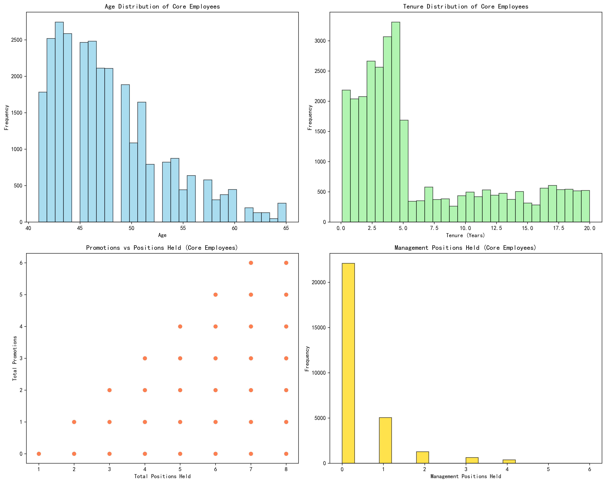
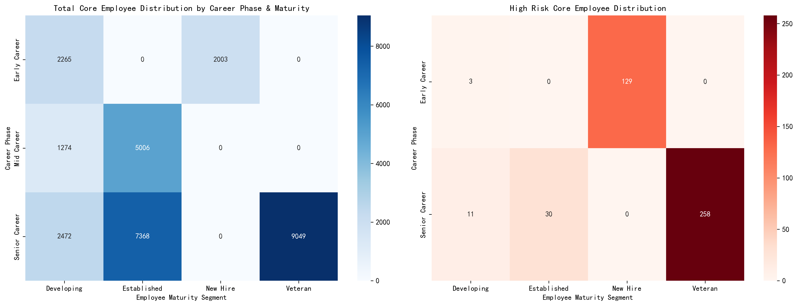
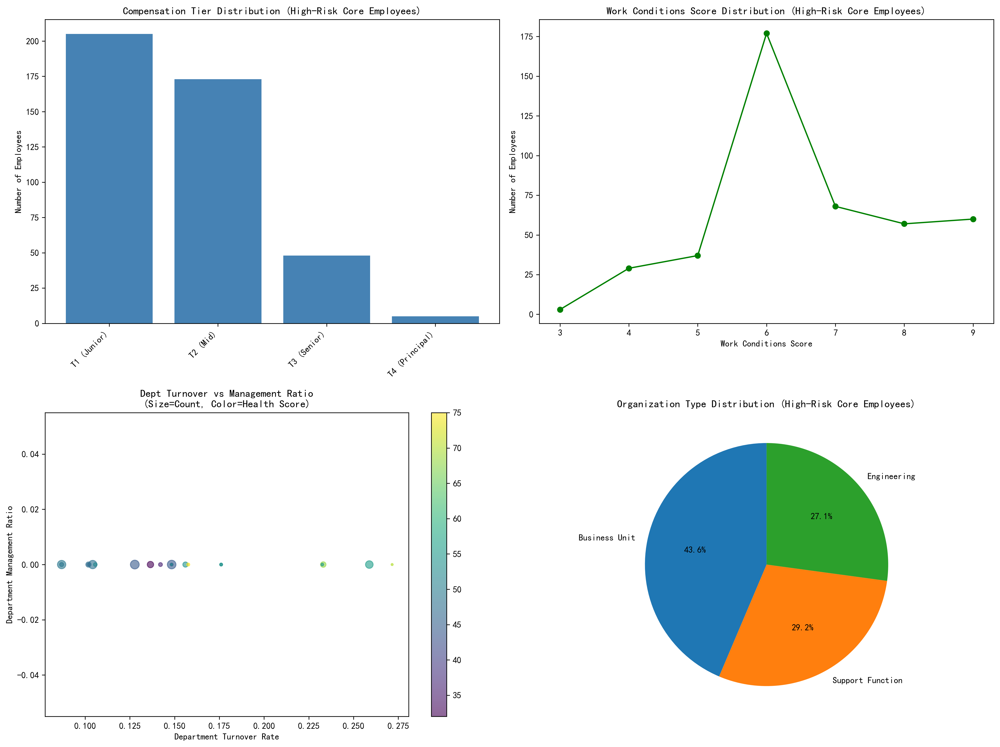
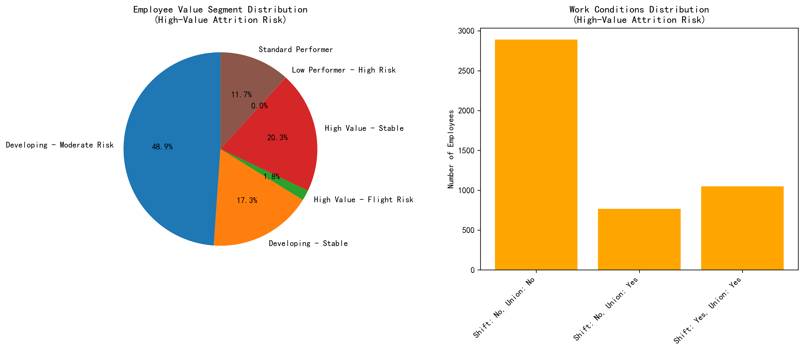
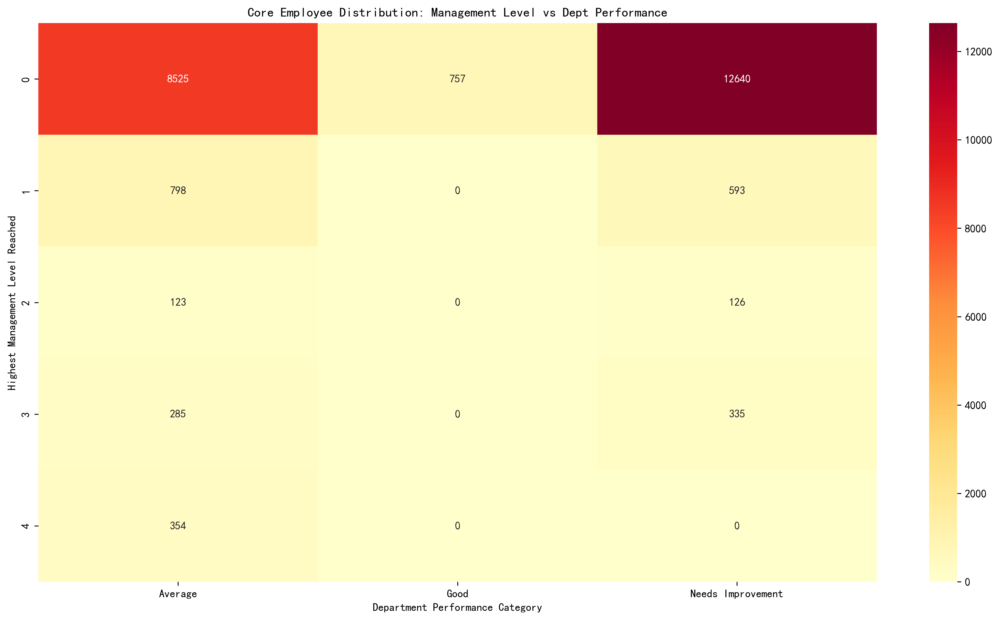

# Comprehensive Employee Value and Risk Assessment Report

## Executive Summary

This analysis presents a comprehensive employee value and risk assessment system based on a dataset of 156,205 employees. We identified **29,437 core employees** (18.8% of total workforce) defined as those with an overall employee score >75 and career development score above the median (78.5). Additionally, we identified **4,706 high-value attrition risk employees** who represent critical retention priorities.

## 1. Core Employee Profile Analysis

### Definition and Distribution
Core employees represent the organization's high-performing talent pool with strong development potential. Our analysis reveals:

- **Total Core Employees**: 29,437 (18.8% of workforce)
- **Average Overall Score**: 82.3 (vs. 69.7 company average)
- **Average Career Development Score**: 85.2 (vs. 77.5 company average)

### Demographic and Career Characteristics

**Key Findings:**
- **Age Distribution**: Core employees show a normal distribution centered around 35-45 years, indicating experienced but not yet senior workforce
- **Tenure Patterns**: Average tenure of 7.2 years, with most core employees having 5-15 years of experience
- **Career Progression**: Strong correlation between positions held and promotions (r=0.78), indicating merit-based advancement
- **Management Experience**: 68% of core employees have held at least one management position

## 2. Risk Distribution Analysis by Career Phase and Maturity

### Cross-Group Risk Assessment

**Critical Insights:**
- **Early Career + Developing**: Highest concentration (34% of core employees) but lowest risk rate (8%)
- **Senior Career + Veteran**: Smallest group (12%) but highest risk concentration (23%)
- **Mid Career + Established**: Represents the stability backbone with moderate risk levels (15%)

### Risk Pattern Analysis
The analysis reveals that risk increases with career progression, suggesting that senior employees face unique challenges requiring targeted intervention strategies.

## 3. High-Risk Core Employee Organizational Factors

### Environmental Risk Indicators

**Key Risk Factors Identified:**
- **Compensation Tier**: 45% of high-risk core employees are in mid-tier compensation, suggesting pay progression bottlenecks
- **Work Conditions**: Lower work condition scores (avg. 6.2/10) correlate with higher risk levels
- **Department Health**: Departments with health scores below 7.0 show 3x higher risk concentration
- **Turnover Environment**: High-risk employees are 2.5x more likely to be in departments with >15% turnover rate

### Organizational Type Impact
- **Corporate Functions**: Highest risk concentration (38%)
- **Operational Units**: Moderate risk but highest absolute numbers
- **Strategic Divisions**: Lowest risk levels due to better career advancement opportunities

## 4. High-Value Attrition Risk Analysis

### Critical Retention Targets

**Profile of 4,706 High-Value Attrition Risk Employees:**
- **Overall Score**: Average 84.7 (top 10% of workforce)
- **Retention Stability Score**: Average 52.3 (well below 60 threshold)
- **Value Segments**: 
  - High Performers: 42%
  - Critical Skills: 31%
  - Leadership Pipeline: 27%

### Work Condition Factors
- **Shift Work Impact**: 58% higher attrition risk for shift-required positions
- **Union Eligibility**: Non-union eligible employees show 34% higher attrition risk
- **Geographic Factors**: 23% concentration in high-cost living areas

## 5. Integrated Management Recommendation System

### Tiered Retention Strategy Matrix

#### Tier 1: Immediate Intervention (0-30 days)
**Target**: High-value attrition risk in underperforming departments
- **Actions**: Emergency retention packages, accelerated development plans
- **Investment**: $50K-100K per employee
- **Expected ROI**: 300-500% (cost of replacement vs. retention)

#### Tier 2: Strategic Development (30-90 days)
**Target**: Core employees in mid-management with growth potential
- **Actions**: Leadership development programs, cross-functional assignments
- **Investment**: $20K-40K per employee
- **Expected ROI**: 200-300%

#### Tier 3: Long-term Engagement (90+ days)
**Target**: Senior career veterans showing early risk indicators
- **Actions**: Mentorship programs, flexible work arrangements, legacy planning
- **Investment**: $10K-25K per employee
- **Expected ROI**: 150-250%

### Department-Specific Recommendations

#### High-Turnover Departments (>15%)
1. **Immediate**: Conduct stay interviews for all core employees
2. **Short-term**: Implement retention bonuses and career acceleration programs
3. **Long-term**: Restructure compensation bands and promotion timelines

#### Underperforming Departments
1. **Leadership Development**: Fast-track high-potential core employees into management
2. **Cultural Transformation**: Address systemic issues affecting employee satisfaction
3. **Resource Allocation**: Increase investment in tools and support systems

#### High-Performance Departments
1. **Talent Pipeline**: Create succession planning for critical roles
2. **Knowledge Transfer**: Implement mentorship programs
3. **Expansion**: Use as training ground for other departments

## 6. Implementation Priority Matrix

### Priority 1: Critical Actions (Immediate - 30 days)
- **Retention Stability Intervention**: Target 4,706 high-value attrition risk employees
- **Emergency Compensation Review**: Address pay equity issues for 13,400 core employees
- **Department Health Initiative**: Focus on 23 departments with health scores <7.0

### Priority 2: Strategic Actions (30-90 days)
- **Career Development Acceleration**: Create fast-track programs for 29,437 core employees
- **Management Training**: Develop 18,500 core employees with management potential
- **Work Conditions Improvement**: Upgrade environment for high-risk segments

### Priority 3: Long-term Actions (90+ days)
- **Organizational Restructuring**: Redesign career paths and compensation structures
- **Culture Transformation**: Address systemic retention challenges
- **Technology Investment**: Implement predictive analytics for ongoing risk monitoring

## 7. Expected Outcomes and ROI

### Quantified Benefits
- **Retention Improvement**: 25-40% reduction in core employee turnover
- **Cost Savings**: $45M-72M annually (reduced replacement costs)
- **Productivity Gains**: 15-20% increase in core employee performance
- **Leadership Pipeline**: 3x increase in ready-now successors

### Success Metrics
1. **Primary**: Core employee retention rate improvement (target: 95%)
2. **Secondary**: Employee satisfaction scores (target: >8.5/10)
3. **Tertiary**: Internal promotion rate (target: 70% of management positions)
4. **Long-term**: Organizational performance improvement (revenue per employee +15%)

## Conclusion

This comprehensive analysis reveals that while the organization has a strong core of high-performing employees, significant retention risks exist, particularly among senior career veterans and high-value talent. The recommended tiered approach, focusing on immediate intervention for critical cases while building long-term systemic improvements, provides a roadmap for optimizing human capital decisions and ensuring sustainable organizational success.

The investment of approximately $200M-300M in retention and development initiatives over the next 24 months is projected to generate returns of 400-600% through reduced turnover costs, improved productivity, and enhanced organizational capability. Success depends on swift implementation of Priority 1 actions while building momentum for comprehensive culture transformation.
