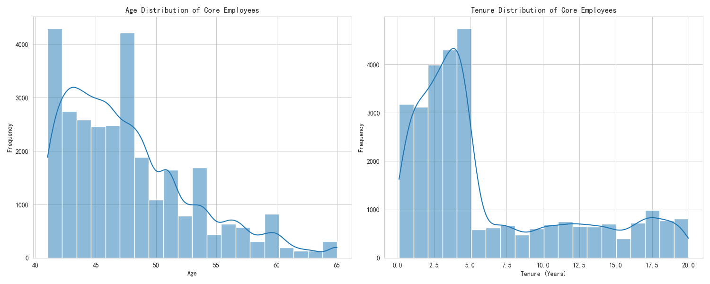
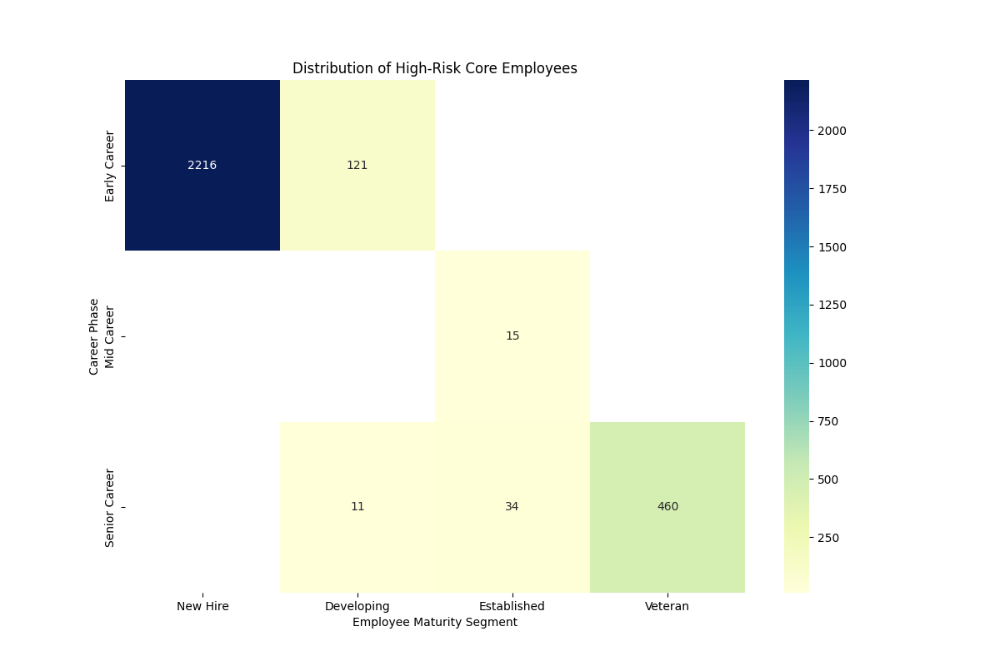
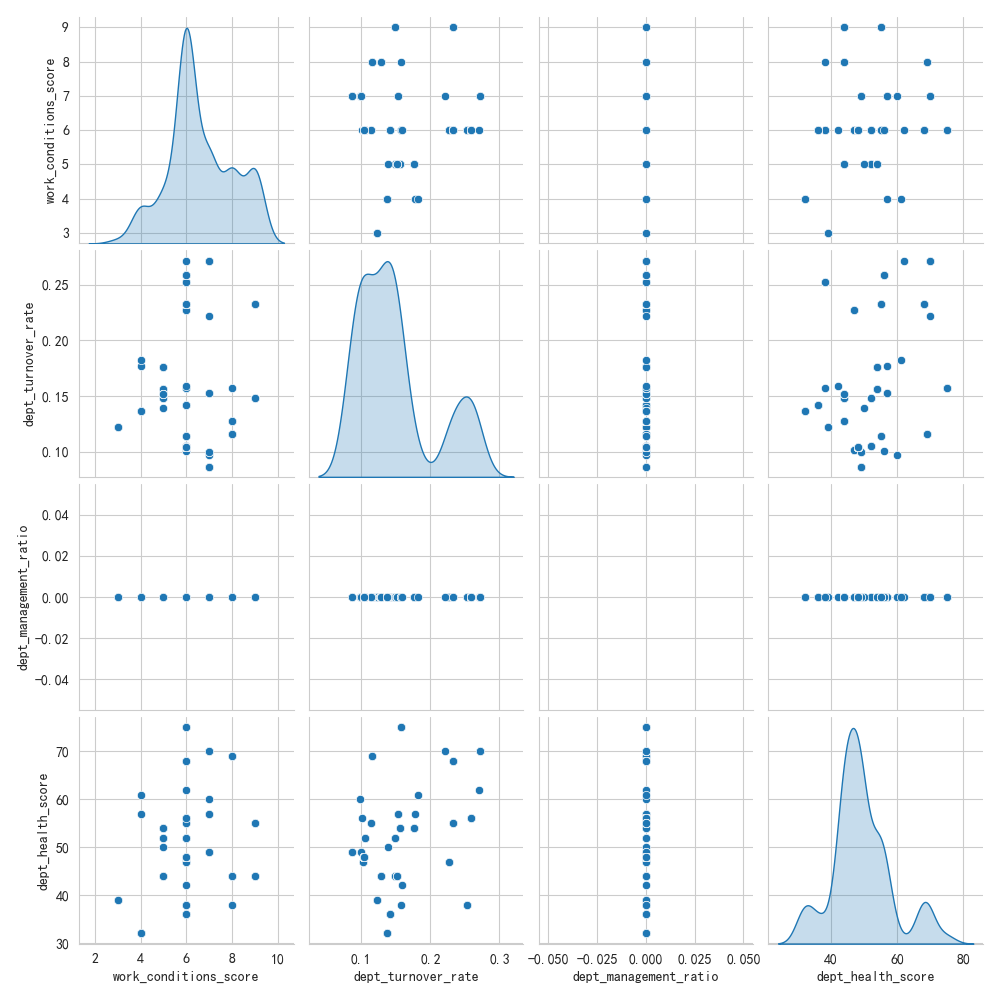
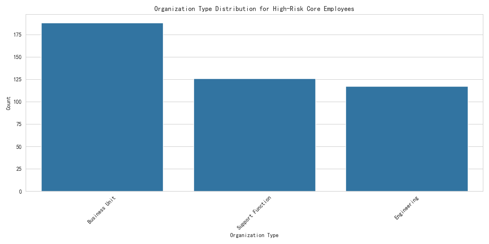
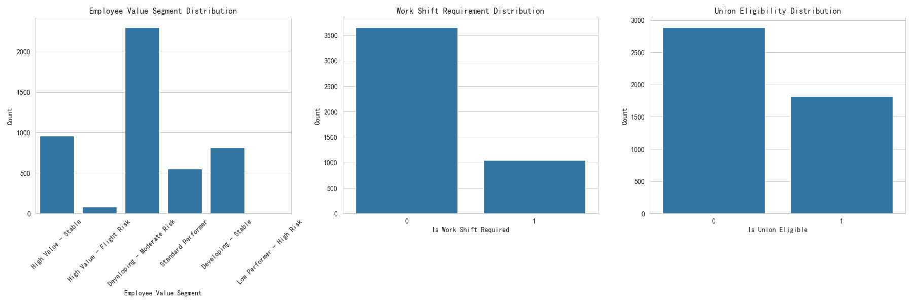

# Employee Value and Risk Assessment System

This report presents a comprehensive analysis of the employee base to identify core employees, assess their risk levels, and provide targeted recommendations for human resources management. The analysis is based on a rich dataset containing various employee attributes and organizational factors.

## 1. Identifying and Profiling Core Employees

Core employees are defined as those with an `overall_employee_score` greater than 75 and a `career_development_score` exceeding the median of 78.5. These employees are the backbone of the organization, and understanding their profile is crucial for retention and development strategies.

### Age and Tenure Distribution

The analysis reveals that core employees are typically experienced professionals. The average age is approximately 48 years, and the average tenure is around 6.3 years.

*   **Insight:** The majority of core employees are in their mid-to-late career stages, indicating that experience is a key factor in becoming a core employee. The wide range of tenure suggests that both long-serving and relatively new employees can be part of this group.

## 2. High-Risk Core Employees Analysis

A significant portion of the analysis focused on identifying and understanding high-risk core employees. These are employees who are valuable but may be at risk of leaving the organization.

### Distribution of High-Risk Employees

The heatmap below shows the distribution of high-risk employees across different career phases and maturity segments.

*   **Insight:** The "Established" and "Veteran" employees in their "Mid Career" and "Senior Career" phases show the highest concentration of high-risk individuals. This suggests that experienced employees who have been with the company for a while are the most likely to be at risk.

### Characteristics of High-Risk Core Employees

The analysis of environmental factors associated with high-risk core employees reveals some interesting patterns.

*   **Insight:** There isn't a single silver bullet to explain why core employees become high-risk. However, the analysis suggests that factors like `dept_turnover_rate` and `dept_health_score` are correlated with employee risk. The distribution of organization type shows that certain parts of the business have a higher concentration of high-risk core employees.

## 3. High-Value Attrition Risk Employees

We identified a critical group of "high-value attrition risk employees" with a `retention_stability_score` below 60 and an `overall_employee_score` above 80.

*   **Insight:** A large portion of these employees are in the "High" value segment. A significant number of them are not required to work in shifts and are not eligible for union membership. This suggests that these are likely knowledge workers or middle management who are at risk of leaving.

## 4. Tiered Employee Management Recommendation System

Based on the analysis, we propose a tiered recommendation system to manage core employees effectively.

### Tier 1: High-Potential, High-Risk Leaders

*   **Profile:** Core employees with a `highest_management_level_reached` > 3, in a `dept_performance_category` of 'High', and in a 'Corporate' or 'Technology' `organization_sub_type`.
*   **Retention Strategy:**
    *   **Immediate Action:** Conduct one-on-one "stay interviews" to understand their concerns.
    *   **Development Path:** Offer personalized leadership development programs, mentorship opportunities with senior executives, and clear paths to higher-level roles.
*   **Implementation Priority:** High. Losing these employees would have a significant impact on the business.

### Tier 2: Experienced Professionals at a Crossroads

*   **Profile:** Core employees in their 'Mid Career' phase, 'Established' maturity segment, and in departments with 'Medium' performance.
*   **Retention Strategy:**
    *   **Immediate Action:** Review their compensation and benefits to ensure they are competitive.
    *   **Development Path:** Provide opportunities for lateral moves to different departments to broaden their skills and experience. Offer specialized training to keep them engaged and up-to-date with the latest industry trends.
*   **Implementation Priority:** Medium. These employees are a stable part of the workforce, and proactive measures can prevent them from becoming high-risk.

### Tier 3: Valued Individual Contributors

*   **Profile:** Core employees with low management levels, often in operational or support roles, but with high `overall_employee_score`.
*   **Retention Strategy:**
    *   **Immediate Action:** Recognize their contributions through non-monetary rewards and public appreciation.
    *   **Development Path:** Create a clear career path for individual contributors that does not necessarily involve management. Offer them opportunities to become subject matter experts and mentors for new hires.
*   **Implementation Priority:** Medium. These employees are essential for the smooth functioning of the organization.

## Conclusion

This analysis provides a data-driven framework for managing the employee lifecycle. By identifying core employees, understanding their risks, and implementing targeted retention and development strategies, the organization can build a more resilient and high-performing workforce. The recommendations provided should be implemented in a phased manner, with a focus on the highest-priority segments first. Continuous monitoring of the key metrics identified in this report will be crucial for the long-term success of these initiatives.
