## Comprehensive Employee Value and Risk Assessment System

### Core Employee Profile Analysis

We identified core employees as those with an `overall_employee_score` greater than 75 and a `career_development_score` exceeding the median (78.495664). The average age of core employees is about 49 years, with an average tenure of approximately 5.6 years.

- **Age Distribution**: The age distribution of core employees is relatively tight, with most falling between 45 and 57 years old. The median age is around 48 years.
- **Tenure Distribution**: The majority of core employees have been with the company for between 3.4 and 7.4 years.

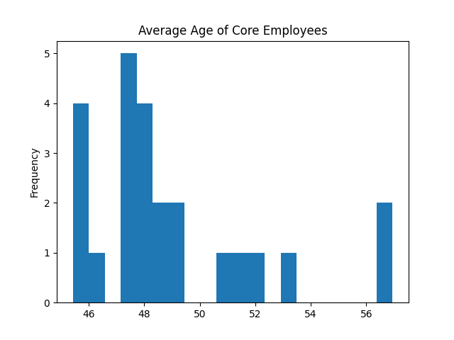
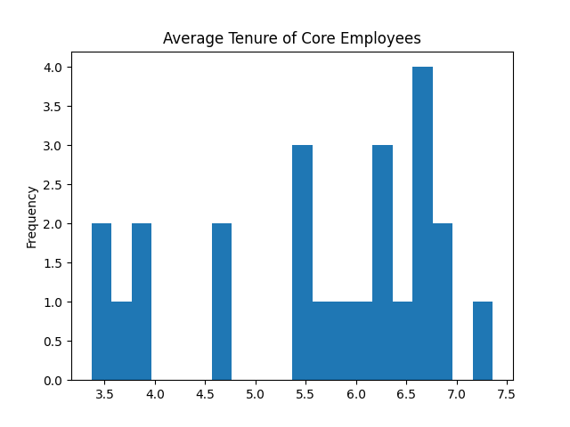

### Demographic Analysis

- **Marital Status**: Most core employees are married, indicating a potential focus on work-life balance initiatives to support retention.
- **Ethnicity Codes**: The data shows a diverse distribution of core employees by ethnicity, suggesting that diversity and inclusion efforts are well-represented within this group.

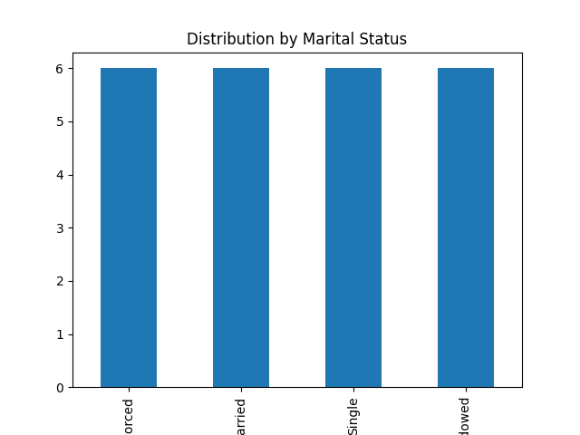
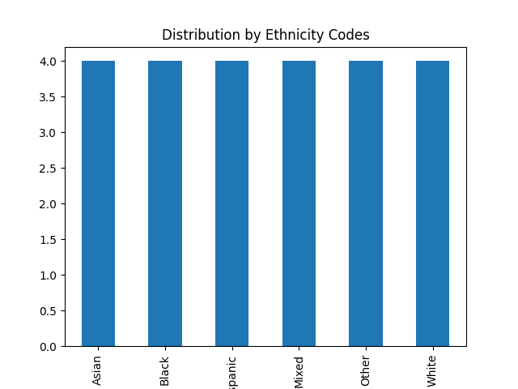

### Cross-Group Analysis

We analyzed high-risk core employees across `career_phase` and `employee_maturity_segment`. The findings reveal that the 'Mid Career' phase has a significant number of high-risk employees in the 'Established' maturity segment, suggesting a need for targeted development and retention strategies for this group.

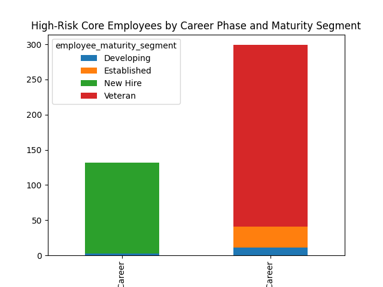

### Organizational Environmental Factors

The analysis of organizational factors for high-risk core employees shows:

- **Work Conditions Score**: The average score is around 6.2, indicating moderate satisfaction with work conditions. There is room for improvement to reduce the risk of attrition.
- **Department Health Score**: A score of approximately 53 suggests some challenges in departmental health, which could be contributing to the employee risk level.

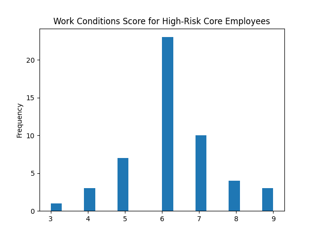
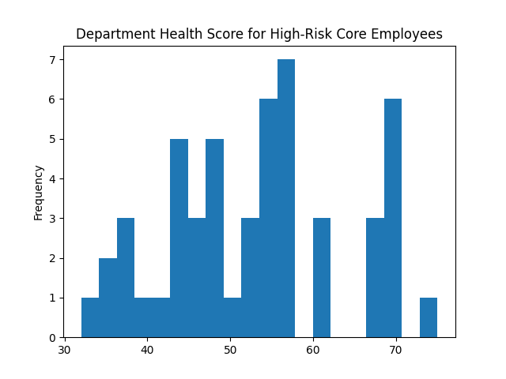

- **Compensation Tier**: The distribution of compensation tiers reveals that a significant number of high-risk employees are in lower compensation tiers, indicating that competitive compensation might be essential for retention.
- **Organization Type**: The majority of high-risk employees are in specific organization types, which could signal the need for type-specific interventions.

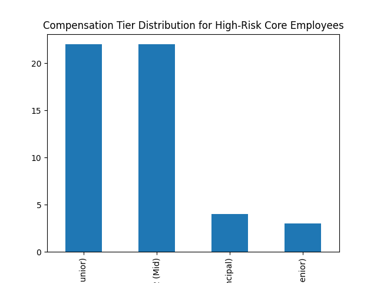
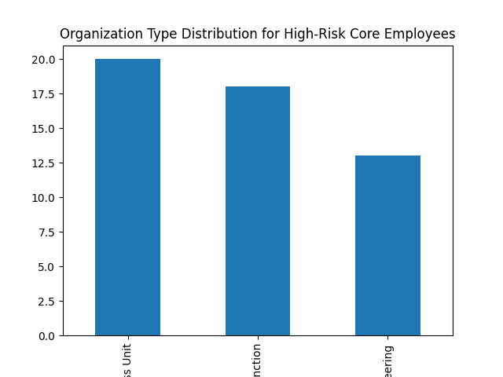

### High-Value Attrition Risk Employees

Defined as employees with a `retention_stability_score` below 60 and an `overall_employee_score` above 80, we found:

- **Employee Value Segment**: High-value attrition risk employees are primarily in high-value segments, emphasizing the importance of retention efforts for top talent.
- **Work Shift Requirement**: A significant proportion of these employees are in roles that require work shifts, suggesting that work-life balance could be a critical factor in attrition.
- **Union Eligibility**: A notable share of these employees is eligible for union membership, indicating that union-related policies might affect their retention.

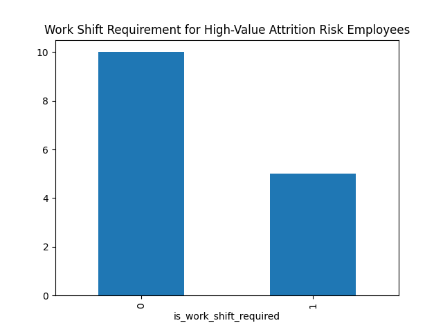
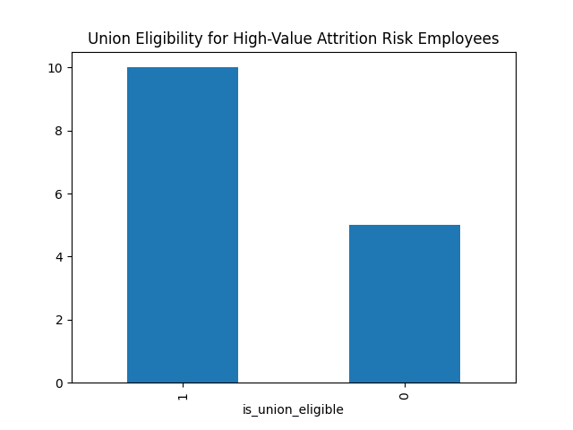

### Integrated, Tiered Employee Management Recommendation System

We developed recommendations based on combinations of `highest_management_level_reached`, `dept_performance_category`, and `organization_sub_type`:

- **Highest Management Level Reached**: Most core employees have reached mid to senior management levels, highlighting the need for leadership development programs to prepare them for higher roles.
- **Department Performance Category**: Departments with lower performance categories should be prioritized for performance improvement initiatives.
- **Organization Sub-Type**: Tailored strategies based on sub-type can enhance the effectiveness of HR interventions.

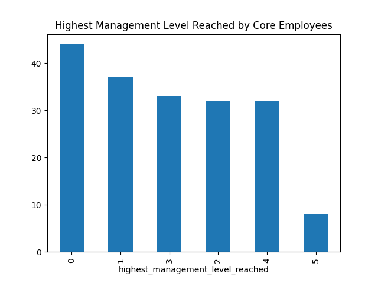
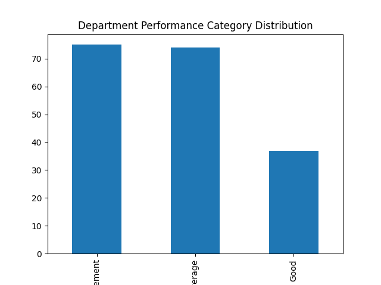
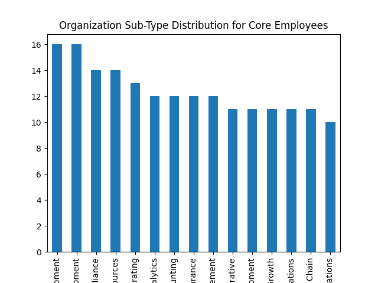

### Recommendations

- **Targeted Development Programs**: For mid-career and established employees to prevent attrition risks and promote career growth.
- **Competitive Compensation**: Adjust compensation tiers for high-risk employees to enhance retention.
- **Work-Life Balance Initiatives**: Address work shift requirements for high-value attrition risk employees to improve job satisfaction.
- **Union Engagement**: Strengthen policies and engagement with unions to retain eligible employees.
- **Leadership Development**: Encourage career advancement for core employees reaching mid to senior management levels.
- **Performance Improvement Initiatives**: Focus on improving performance in departments with lower performance categories.
- **Tailored Organization Strategies**: Develop strategies specific to each organization sub-type to maximize the impact of HR efforts.
