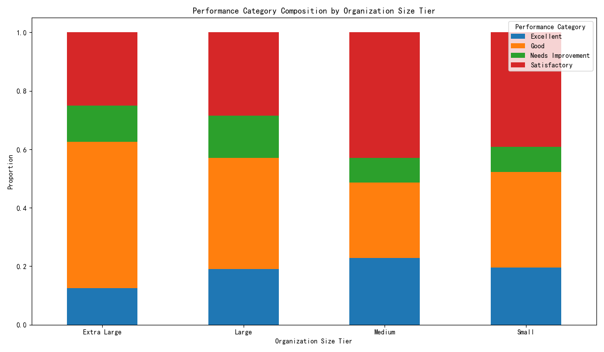
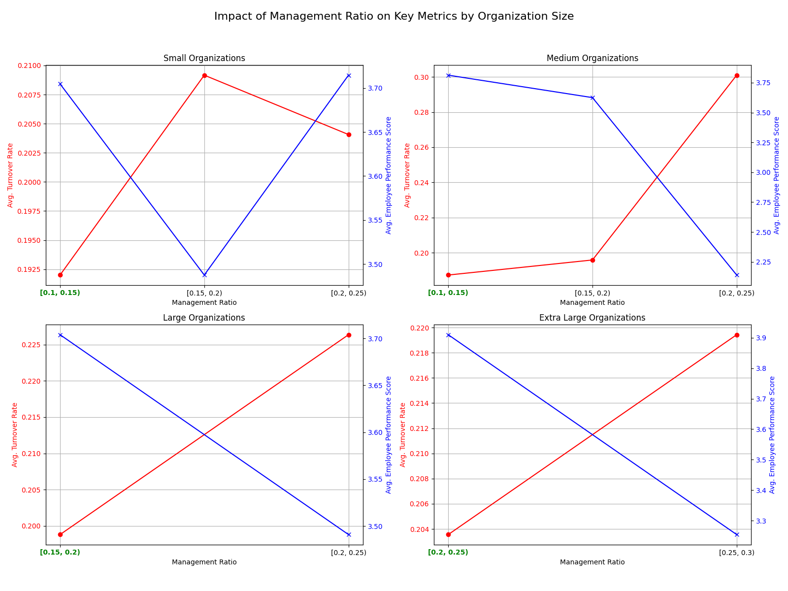

# Optimizing Organizational Structure: A Data-Driven Approach to Management Configuration

## Introduction
In the pursuit of organizational excellence, the right management structure is paramount. This analysis delves into our organizational data to uncover the optimal management configuration across different organization sizes. By segmenting our organizations and analyzing key performance indicators, we can derive data-driven recommendations for management ratios and staffing models that foster high performance and stability.

## Analysis of Organizational Tiers

Organizations were segmented into four tiers based on the number of active employees: Small (<30), Medium (30-120), Large (120-300), and Extra Large (>300). Our analysis reveals distinct characteristics for each tier.

### Performance and Health Score Distribution
While the average organizational health score remained relatively consistent across all tiers (around 65-67), the composition of employee performance varied significantly. Medium-sized organizations, for instance, showed a high proportion of both 'Excellent' and 'Satisfactory' performers, suggesting a potential for targeted talent management initiatives. The distribution of performance categories across all tiers is visualized below.

### The Quest for the Optimal Management Ratio

The core of our analysis focused on identifying the optimal management ratio (the proportion of managers to total employees) that correlates with the best organizational outcomes. We balanced three key metrics: employee performance score, position fill rate, and annual turnover rate. The following visualization illustrates the relationship between management ratio and key outcomes for each organization size.

The analysis reveals a clear "sweet spot" for management ratios, which varies by organization size. A ratio that is too low can lead to lack of direction and support, while a ratio that is too high can create bureaucracy and increase costs.

## Key Findings and Recommendations

Our analysis has yielded several key findings that lead to actionable recommendations:

**1. Optimal Management Ratios Vary with Scale:**
There is no one-size-fits-all solution. The optimal management ratio shifts as an organization grows:
*   **Small & Medium Organizations (<120 employees):** The optimal management ratio is **10-15%**. This provides a good balance of support and autonomy for smaller, often more agile teams.
*   **Large Organizations (120-300 employees):** The ideal management ratio increases to **15-20%**. As complexity grows, more management overhead is required to maintain coordination and alignment.
*   **Extra Large Organizations (>300 employees):** For our largest organizations, a management ratio of **20-25%** proves most effective. This suggests that at a very large scale, a more hierarchical structure is necessary to manage the increased complexity.

**2. Characteristics of Top-Performing Organizations:**
The top 10% of organizations in our dataset share common traits that we should strive to replicate:
*   **Low Turnover:** Their annual turnover rate is consistently around **10-12%**, almost half the organizational average of ~20%. This highlights the critical importance of retention.
*   **High Health Scores:** Their organizational health scores are exceptional, typically **above 90**.
*   **Alignment with Optimal Ratios:** These top-tier organizations tend to operate within the optimal management ratio ranges identified in our analysis.

## Actionable Recommendations

Based on this analysis, we propose the following quantitative recommendations for management configuration:

1.  **Realign Management Ratios:**
    *   Conduct a review of all organizations to assess their current management ratio against the optimal ranges identified.
    *   For organizations outside the optimal range, develop a plan to realign. This may involve restructuring teams, promoting high-potential individuals into management roles, or consolidating management layers.

2.  **Focus on Retention as a Primary Metric:**
    *   Given the strong correlation between low turnover and high performance, we recommend that reducing turnover should be a key strategic priority.
    *   Implement targeted retention strategies, especially for high-value employees.

3.  **Prioritize Organizational Health:**
    *   Promote initiatives that are known to improve organizational health, such as employee engagement programs, career development opportunities, and leadership training.

By adopting these data-driven recommendations, we can create a more effective and efficient organizational structure that is better equipped to support our employees and achieve our business objectives.
