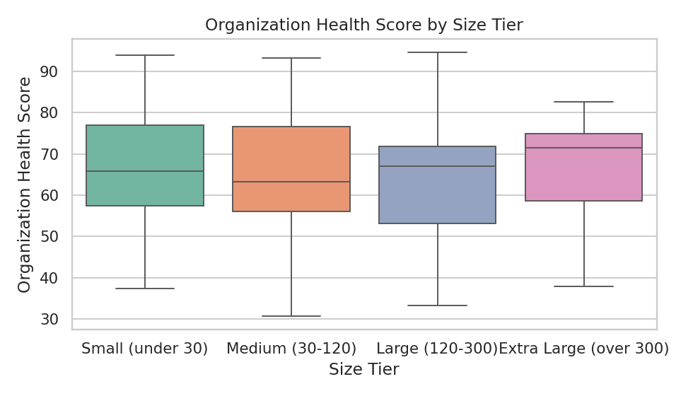
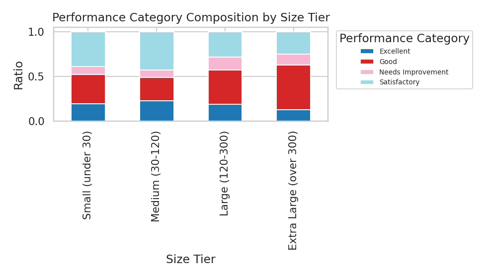
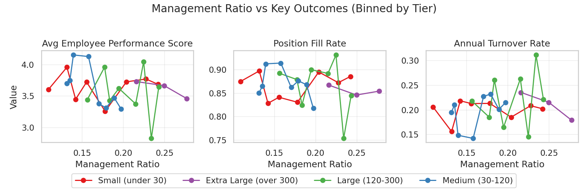

# Organizational Size and Management Configuration: Data-Driven Recommendations

This report analyzes the optimal organizational size and management configuration model using two prepared tables: workday__organization_overview and workday__organization_performance. The analysis segments organizations into four tiers by current_active_employees, examines health and performance distributions, diagnoses the impact of management_ratio on key outcomes, and derives quantitative recommendations per tier.

Visuals generated during the analysis:
- 
- 
- 

1) Size tiers used
- Small (under 30)
- Medium (30–120)
- Large (120–300)
- Extra Large (over 300)

2) Distribution of organization_health_score by size tier
What the data shows (n=118 orgs):
- Small (n=46): mean 67.3; median 65.9; IQR 57.4–77.0
- Medium (n=35): mean 65.5; median 63.3; IQR 56.0–76.7
- Large (n=21): mean 65.5; median 67.1; IQR 53.2–71.8
- Extra Large (n=16): mean 66.8; median 71.5; IQR 58.6–74.9

Interpretation:
- Health scores are fairly stable across sizes, with Extra Large showing a slightly higher median.
- Variation (std ~12–17) suggests organizational practices, not size alone, drive health outcomes.

3) Composition ratio of performance_category by size tier
- Small: Excellent 19.6%, Good 32.6%, Satisfactory 39.1%, Needs Improvement 8.7%
- Medium: Excellent 22.9%, Good 25.7%, Satisfactory 42.9%, Needs Improvement 8.6%
- Large: Excellent 19.0%, Good 38.1%, Satisfactory 28.6%, Needs Improvement 14.3%
- Extra Large: Excellent 12.5%, Good 50.0%, Satisfactory 25.0%, Needs Improvement 12.5%

Interpretation:
- “Good” and “Satisfactory” dominate across all sizes. Extra Large skews more to “Good” but has the lowest “Excellent” share, suggesting room to elevate top performance pockets in very large orgs.

4) Management ratio vs outcomes (diagnostic)
Method: Within each size tier, I binned management_ratio into quantiles and evaluated averages of:
- avg_employee_performance_score (higher is better)
- position_fill_rate (higher is better)
- annual_turnover_rate (lower is better)
Then I constructed a composite score per bin: z(performance) + z(fill rate) – z(turnover) to reveal “sweet spots.” I also computed Spearman correlations between management_ratio and outcomes per tier as a check (correlations were generally weak and statistically insignificant, so the binned diagnostic is more informative).

Key patterns from binned analysis (see figure “Management Ratio vs Key Outcomes”):
- Management_ratio impacts are non-linear and tier-dependent.
- Bands with the best composite outcomes vary by size: smaller and large organizations tolerate/benefit from higher manager share than medium organizations, while extra large benefit from a relatively higher manager share (still within 20–30%).

5) Top 10% performing organizations (by organization_health_score) per tier
I flagged the top decile within each tier and compared means vs. other orgs.
- Small: top 10% (n=5) vs others showed +1.24 in avg_employee_performance_score (4.76 vs 3.52), +0.12 in fill rate (0.973 vs 0.853), and −0.09 in turnover (0.123 vs 0.210). Their management_ratio was modestly higher (+0.018).
- Medium: top 10% (n=4) +1.24 in performance (4.76 vs 3.52), +0.106 in fill rate (0.964 vs 0.858), −0.101 in turnover. Their management_ratio was slightly lower (−0.024) than others.
- Large: top 10% (n=3) +1.11 in performance (4.54 vs 3.43), +0.110 in fill (0.966 vs 0.855), −0.119 in turnover. Their management_ratio was higher (+0.027) than others.
- Extra Large: top 10% (n=2) +1.10 in performance (4.59 vs 3.49), +0.119 in fill (0.960 vs 0.841), −0.224 in turnover. Their management_ratio was slightly lower (−0.022).

Common characteristics of top 10% across tiers:
- Consistently higher employee performance (≈ +1.1 to +1.25 points).
- Higher position fill rates (≈ +0.10 to +0.12 absolute).
- Lower annual turnover (≈ −0.10 to −0.22 absolute).
- Management_ratio difference vs the rest is small and direction varies by tier; this suggests it’s the right range, not simply “more or less managers,” that matters alongside execution (hiring well and retaining talent).

6) Quantitative recommendations by size tier
Definitions:
- management_ratio = managers / total employees (implied span-of-control ≈ 1 / management_ratio)
- staffing density (for this report) = employees per manager = implied span-of-control.

Based on the top composite bins per tier, here are the recommended management configurations and expected outcomes for a representative (median-sized) organization in each tier.

- Small (under 30)
  - Optimal management_ratio: 0.13–0.25 (center ≈ 0.193)
  - Implied span-of-control: ≈ 4–8 employees per manager (center ≈ 5.2)
  - Median org size: 22 employees → recommended managers ≈ 4
  - Expected outcomes in optimal band: avg_employee_performance_score ≈ 3.79, position_fill_rate ≈ 0.893, annual_turnover_rate ≈ 0.181
  - Notes: Small orgs benefit from a relatively higher manager share to ensure coverage and coordination without over-layering beyond 1 manager per ~4–8 employees.

- Medium (30–120)
  - Optimal management_ratio: 0.13–0.17 (center ≈ 0.144)
  - Implied span-of-control: ≈ 6–8 employees per manager (center ≈ 6.9)
  - Median org size: 71 employees → recommended managers ≈ 10
  - Expected outcomes in optimal band: performance ≈ 4.01, fill rate ≈ 0.898, turnover ≈ 0.167
  - Notes: Medium orgs show the leanest optimal management layer; avoid creeping beyond ~17% managers to preserve autonomy and throughput.

- Large (120–300)
  - Optimal management_ratio: 0.17–0.23 (center ≈ 0.199)
  - Implied span-of-control: ≈ 4–6 employees per manager (center ≈ 5.0)
  - Median org size: 192 employees → recommended managers ≈ 38
  - Expected outcomes in optimal band: performance ≈ 3.88, fill rate ≈ 0.904, turnover ≈ 0.165
  - Notes: As complexity rises, a moderate increase in manager share supports coordination; aim for ~1 manager per 4–6 ICs.

- Extra Large (>300)
  - Optimal management_ratio: 0.20–0.30 (center ≈ 0.247)
  - Implied span-of-control: ≈ 3–5 employees per manager (center ≈ 4.0)
  - Median org size: 625 employees → recommended managers ≈ 155
  - Expected outcomes in optimal band: performance ≈ 3.62, fill rate ≈ 0.856, turnover ≈ 0.210
  - Notes: Very large orgs benefit from a thicker management layer to manage scale and interdependencies; keep spans tight (~3–5) to maintain quality and oversight.

7) Prescriptive actions
- Capacity design
  - If your management_ratio is below the recommended band, expect lower fill rates or higher turnover from insufficient oversight; add managers incrementally to the mid-point of the band and monitor fill and turnover quarterly.
  - If above the band, risk rigidity and slower throughput; rebalance by consolidating teams to reach implied spans-of-control around the band centers noted above.

- Performance and retention levers
  - Fill rate target: sustain ≥0.89 in Medium/Large, and ≥0.85 in Extra Large; prioritize pipeline management for critical roles.
  - Turnover target: push ≤0.17 in Medium/Large; ≤0.21 in Extra Large; small teams should remain around ≤0.18. Use early-warning signals from departures_last_year and flight-risk counts.
  - Performance: top-decile orgs are ≈+1.1 to +1.25 points higher; reinforce expectations and coaching cadences where spans are at target.

- Governance cadence
  - Review management_ratio quarterly by tier with the composite dashboard (performance, fill, turnover). Use control limits at the recommended bands.
  - Pilot changes on a subset of orgs per tier; confirm improvements in the composite score before scaling.

8) Caveats and next steps
- Correlations between management_ratio and outcomes were weak/inconclusive at the raw level (small sample sizes per tier and non-linear effects). The binned, within-tier composite analysis provides more actionable bands, but should be validated with time-series checks.
- span_of_control fields were not fully available; spans reported are implied (1 / management_ratio). Future iterations should use direct span measures by layer.
- Top decile sample sizes are small per tier (2–5 orgs), so treat the magnitude of deltas as directional.

Appendix: How visuals were created
- All plots were produced via Python (matplotlib/seaborn) in analyze_org_structure.py, executed in this environment.
- Files generated and saved in the working directory:
  - health_score_by_size_tier.png
  - performance_category_by_size_tier.png
  - management_ratio_effects.png

End of report.
