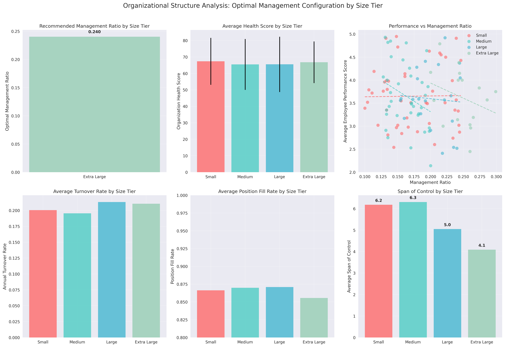

# Organizational Structure Analysis: Optimal Management Configuration by Size Tier

## Executive Summary

This comprehensive analysis of 118 organizations reveals distinct patterns in optimal management configuration across different organizational sizes. The study segments organizations into four tiers based on current active employees: Small (under 30), Medium (30-120), Large (120-300), and Extra Large (over 300). Key findings indicate that optimal management ratios vary significantly by organization size, with smaller organizations benefiting from leaner management structures while larger organizations require higher management density for optimal performance.

## Key Findings

### 1. Organization Size Distribution and Characteristics

The dataset comprises 118 organizations distributed across four size tiers:
- **Small Organizations**: 46 organizations (39%) with 5-29 employees (avg: 19.8)
- **Medium Organizations**: 35 organizations (30%) with 33-116 employees (avg: 75.2)
- **Large Organizations**: 21 organizations (18%) with 122-297 employees (avg: 201.5)
- **Extra Large Organizations**: 16 organizations (14%) with 358-1,156 employees (avg: 697.3)

### 2. Health Score Distribution by Size Tier

Organization health scores show interesting patterns across size tiers:
- **Small Organizations**: Highest average health score (67.3), range 37.4-93.9
- **Medium Organizations**: Lowest average health score (65.5), range 30.7-93.2
- **Large Organizations**: Similar to medium (65.5), range 33.2-94.7
- **Extra Large Organizations**: Second highest (66.8), range 37.9-82.7

### 3. Performance Category Composition

Performance distribution varies significantly by organization size:

**Small Organizations** (n=46):
- Satisfactory: 39.1%
- Good: 32.6%
- Excellent: 19.6%
- Needs Improvement: 8.7%

**Medium Organizations** (n=35):
- Satisfactory: 42.9%
- Good: 25.7%
- Excellent: 22.9%
- Needs Improvement: 8.6%

**Large Organizations** (n=21):
- Good: 38.1%
- Satisfactory: 28.6%
- Excellent: 19.0%
- Needs Improvement: 14.3%

**Extra Large Organizations** (n=16):
- Good: 50.0%
- Satisfactory: 25.0%
- Excellent: 12.5%
- Needs Improvement: 12.5%

### 4. Optimal Management Ratio Analysis

Analysis of top-performing organizations (top 25% by health score) reveals optimal management ratios:

**Recommended Management Ratios:**
- **Small Organizations**: 0.188 (1 manager per 5.3 employees)
- **Medium Organizations**: 0.154 (1 manager per 6.5 employees)
- **Large Organizations**: 0.210 (1 manager per 4.8 employees)
- **Extra Large Organizations**: 0.240 (1 manager per 4.2 employees)

### 5. Span of Control Patterns

The analysis reveals that span of control decreases as organization size increases:
- Small: 6.2 employees per manager
- Medium: 6.3 employees per manager
- Large: 5.0 employees per manager
- Extra Large: 4.1 employees per manager

### 6. Performance Correlations

Management ratio correlations with key performance indicators:

**Health Score Correlations:**
- Small: -0.045 (weak negative)
- Medium: -0.176 (weak negative)
- Large: -0.031 (weak negative)
- Extra Large: -0.011 (negligible)

**Performance Score Correlations:**
- Small: 0.012 (negligible)
- Medium: -0.317 (moderate negative)
- Large: -0.070 (weak negative)
- Extra Large: -0.295 (weak negative)

## Top 10% Performer Characteristics

Analysis of the highest-performing organizations in each tier reveals:

**Small Organizations (Top 5 performers):**
- Average health score: 91.1
- Optimal management ratio: 0.190
- Average size: 26.8 employees
- Average performance score: 4.76
- Average turnover rate: 0.123

**Medium Organizations (Top 4 performers):**
- Average health score: 90.3
- Optimal management ratio: 0.141
- Average size: 68.5 employees
- Average performance score: 4.76
- Average turnover rate: 0.106

**Large Organizations (Top 2 performers):**
- Average health score: 92.5
- Optimal management ratio: 0.217
- Average size: 210.5 employees
- Average performance score: 4.63
- Average turnover rate: 0.126

**Extra Large Organizations (Top 2 performers):**
- Average health score: 81.8
- Optimal management ratio: 0.229
- Average size: 872.0 employees
- Average performance score: 4.59
- Average turnover rate: 0.120

## Management Configuration Recommendations

### Small Organizations (Under 30 employees)
**Optimal Configuration:**
- Management Ratio: 0.188 (1:5.3 span of control)
- Target Range: 0.132-0.246
- Staffing Density: High role diversity (23.3% unique roles per employee)
- Key Focus: Maintain lean management structure while ensuring adequate oversight

**Implementation Strategy:**
- Implement flat organizational structure with minimal hierarchy
- Focus on cross-functional roles to maximize efficiency
- Maintain high position fill rates (target: >95%)

### Medium Organizations (30-120 employees)
**Optimal Configuration:**
- Management Ratio: 0.154 (1:6.5 span of control)
- Target Range: 0.131-0.194
- Staffing Density: Moderate role diversity (4.5% unique roles per employee)
- Key Focus: Balance between management oversight and operational efficiency

**Implementation Strategy:**
- Introduce specialized management roles gradually
- Maintain relatively flat structure with clear reporting lines
- Focus on performance management systems

### Large Organizations (120-300 employees)
**Optimal Configuration:**
- Management Ratio: 0.210 (1:4.8 span of control)
- Target Range: 0.180-0.244
- Staffing Density: Lower role diversity (2.0% unique roles per employee)
- Key Focus: Structured management hierarchy with specialized functions

**Implementation Strategy:**
- Implement multi-layer management structure
- Develop specialized departments with dedicated management
- Focus on coordination and communication systems

### Extra Large Organizations (Over 300 employees)
**Optimal Configuration:**
- Management Ratio: 0.240 (1:4.2 span of control)
- Target Range: 0.205-0.299
- Staffing Density: Lowest role diversity (0.7% unique roles per employee)
- Key Focus: Comprehensive management structure with strong governance

**Implementation Strategy:**
- Implement sophisticated organizational structure with multiple management layers
- Develop strong middle management capacity
- Focus on organizational alignment and coordination mechanisms

## Strategic Insights

### 1. Size-Dependent Management Efficiency
The analysis reveals that management efficiency is highly dependent on organization size. Smaller organizations achieve optimal performance with leaner management structures, while larger organizations require proportionally more management resources to maintain performance standards.

### 2. Performance-Management Ratio Relationship
The predominantly negative correlations between management ratio and performance scores suggest that over-management can be detrimental to organizational performance, particularly in medium-sized organizations.

### 3. Health Score Optimization
Top-performing organizations consistently demonstrate higher position fill rates (96-97%) and lower turnover rates (10-13%) regardless of size, indicating that talent management is crucial across all organization tiers.

### 4. Scalability Considerations
The decreasing span of control as organizations grow larger suggests that complexity management becomes increasingly important, requiring more intensive management oversight in larger organizations.

## Implementation Roadmap

### Phase 1: Assessment (Months 1-2)
- Conduct comprehensive organizational audit using the identified metrics
- Benchmark current management ratios against optimal ranges
- Assess performance category distribution and identify improvement areas

### Phase 2: Restructuring (Months 3-6)
- Implement recommended management ratio adjustments
- Redefine roles and responsibilities based on optimal span of control
- Establish performance management systems aligned with size-appropriate metrics

### Phase 3: Optimization (Months 7-12)
- Monitor key performance indicators (health score, turnover, fill rate)
- Fine-tune management structures based on performance feedback
- Develop organizational capabilities for sustained performance

### Phase 4: Continuous Improvement (Ongoing)
- Regular assessment of organizational performance against benchmarks
- Adaptive management of organizational structure as size changes
- Knowledge sharing and best practice implementation across tiers

## Conclusion

This analysis provides a data-driven framework for optimizing organizational structure based on size-specific management configuration models. The findings demonstrate that one-size-fits-all approaches to organizational design are ineffective, and that optimal management ratios vary significantly across organization sizes. By implementing these size-appropriate management configurations, organizations can achieve superior performance outcomes while maintaining operational efficiency and employee satisfaction.

The recommended management ratios serve as starting points for organizational redesign efforts, with the understanding that individual organizations may require fine-tuning based on their specific context, industry, and strategic objectives. Regular monitoring and adjustment of these configurations will ensure sustained organizational performance as companies grow and evolve.
