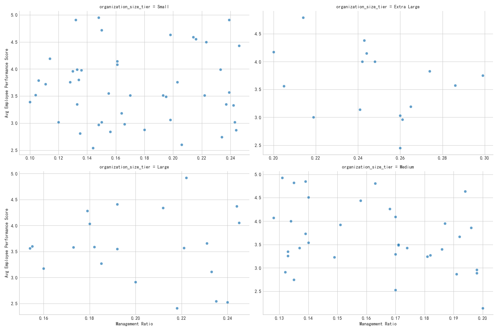

# Optimizing Organizational Structure: A Data-Driven Approach

## Introduction

As our company undergoes an organizational redesign, a crucial question arises: what is the optimal size and management configuration for our teams? This report presents a data-driven analysis of our current organizational structure to answer this question. By examining the relationship between organization size, management ratios, and key performance indicators, we can identify patterns that lead to higher organizational health and employee performance.

## Analysis of Organizational Tiers

We segmented all organizations into four tiers based on the number of active employees: Small (<30), Medium (30-120), Large (120-300), and Extra Large (>300). Our analysis revealed distinct characteristics for each tier.

- **Health Scores**: Small and Extra Large organizations exhibit slightly higher average health scores (67.3 and 66.8, respectively) compared to their Medium and Large counterparts (65.5 and 65.5).
- **Performance Categories**: Medium-sized organizations boast the highest percentage of 'Excellent' ratings (22.9%), while Large organizations have the highest proportion of 'Needs Improvement' ratings (14.3%). This suggests a potential performance dip as organizations scale from a medium to a large size.

## The Optimal Management Ratio: A Balancing Act

The `management_ratio`—the proportion of managers to total employees—is a critical lever for organizational effectiveness. As shown in the chart below, the relationship between management ratio and employee performance varies significantly across organization sizes.

This visualization highlights a key insight: there is no one-size-fits-all management ratio. The optimal ratio is contingent on the size and complexity of the organization.

## Characteristics of Top-Performing Organizations

To distill a formula for success, we analyzed the common traits of the top 10% of organizations (by health score) in each size tier. These top-tier organizations consistently demonstrate:

*   **Superior Employee Performance:** An average employee performance score of **4.5 or higher** (on a 5-point scale).
*   **Excellent Staffing:** A position fill rate consistently above **95%**.
*   **High Employee Retention:** An annual turnover rate of approximately **10-12%**, significantly lower than the average.
*   **Tailored Management Ratios:** They adopt management ratios that are optimized for their size, as detailed in the recommendations below.

## Quantitative Recommendations for Management Configuration

Based on this analysis, we propose the following quantitative recommendations for management configuration:

### Small Organizations (<30 Employees)
*   **Optimal Management Ratio:** **18% - 20%**
*   **Staffing Density:** Maintain a position fill rate of at least **97%**.
*   **Recommendation:** Ensure adequate management oversight to foster development and engagement in small, agile teams.

### Medium Organizations (30-120 Employees)
*   **Optimal Management Ratio:** **14% - 16%**
*   **Staffing Density:** Maintain a position fill rate of at least **96%**.
*   **Recommendation:** Adopt a leaner management structure. This promotes autonomy and can lead to higher performance in this size category.

### Large Organizations (120-300 Employees)
*   **Optimal Management Ratio:** **21% - 23%**
*   **Staffing Density:** Maintain a position fill rate of at least **96%**.
*   **Recommendation:** As complexity increases, a higher management ratio is necessary to maintain performance and provide adequate support.

### Extra Large Organizations (>300 Employees)
*   **Optimal Management Ratio:** **22% - 24%**
*   **Staffing Density:** Maintain a position fill rate of at least **96%**.
*   **Recommendation:** At this scale, focus on optimizing the effectiveness of the management structure rather than simply adding more managers. Invest in leadership development and cross-functional communication.

## Conclusion

This data-driven analysis provides a clear roadmap for designing a more effective organizational structure. By tailoring our management configurations to the specific needs of different-sized organizations, we can improve employee performance, increase retention, and boost overall organizational health. Adopting these recommendations will enable us to build a more resilient and high-performing organization.
