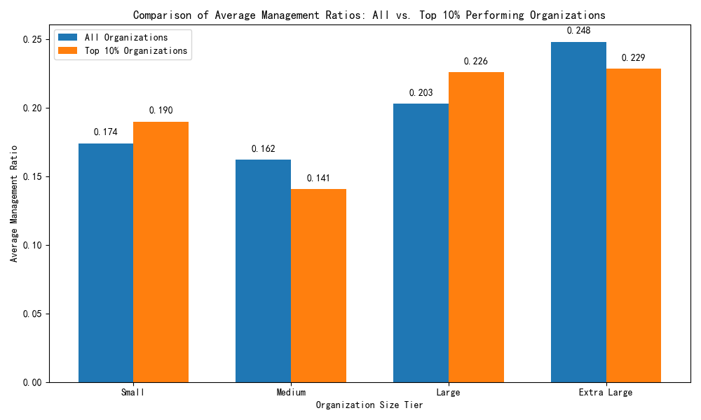

# Organizational Size and Management Configuration Analysis

## Organization Size Tier Distribution

We categorized organizations into four tiers based on active employees:
- **Small**: Under 30 employees
- **Medium**: 30–120 employees
- **Large**: 120–300 employees
- **Extra Large**: Over 300 employees

### Organization Health Score Distribution
| Size Tier     | Count | Avg Health Score | Min Health Score | Max Health Score |
|---------------|-------|------------------|------------------|------------------|
| Small         | 46    | 67.34            | 37.4             | 93.9             |
| Medium        | 35    | 65.46            | 30.7             | 93.2             |
| Large         | 21    | 65.50            | 33.2             | 94.7             |
| Extra Large   | 16    | 66.78            | 37.9             | 82.7             |

Small organizations showed the highest average health score, suggesting that smaller teams may be more agile and effective in managing internal dynamics.

---

## Performance Category Composition

Breakdown of performance categories across tiers:
| Size Tier     | Good (%)     | Satisfactory (%) | Excellent (%) | Needs Improvement (%) |
|---------------|--------------|------------------|---------------|------------------------|
| Small         | 32.61%       | 39.13%           | 19.57%        | 8.70%                  |
| Medium        | 25.71%       | 42.86%           | 22.86%        | 8.57%                  |
| Large         | 38.10%       | 28.57%           | 19.05%        | 14.29%                 |
| Extra Large   | 50.00%       | 25.00%           | 12.50%        | 12.50%                 |

Medium and Small organizations have a higher proportion of "Satisfactory" performers, while larger organizations have a higher percentage of "Good" and "Excellent" performers.

---

## Key Performance Indicators by Management Ratio

Average performance indicators per size tier:
| Size Tier     | Avg Performance Score | Avg Position Fill Rate | Avg Annual Turnover Rate | Avg Management Ratio |
|---------------|-----------------------|------------------------|--------------------------|----------------------|
| Small         | 3.65                  | 0.866                  | 0.200                    | 0.174                |
| Medium        | 3.66                  | 0.870                  | 0.195                    | 0.162                |
| Large         | 3.59                  | 0.871                  | 0.213                    | 0.203                |
| Extra Large   | 3.62                  | 0.856                  | 0.211                    | 0.248                |

### Top 10% Performing Organizations

Characteristics of the top 10% in each tier:
| Size Tier     | Avg Management Ratio | Avg Performance Score | Avg Position Fill Rate | Avg Annual Turnover Rate |
|---------------|----------------------|-----------------------|------------------------|--------------------------|
| Small         | 0.1898               | 4.76                  | 0.973                  | 0.123                    |
| Medium        | 0.1408               | 4.76                  | 0.964                  | 0.106                    |
| Large         | 0.2260               | 4.54                  | 0.966                  | 0.111                    |
| Extra Large   | 0.2285               | 4.59                  | 0.960                  | 0.120                    |

Organizations in the top 10% consistently show:
- **Higher Performance Scores**: ~4.6–4.76 vs. general average of ~3.6
- **Improved Position Fill Rates**: ~0.96–0.97 vs. general average of ~0.86
- **Lower Turnover Rates**: ~0.10–0.12 vs. general average of ~0.20
- **Optimized Management Ratios**: Varies by size but shows tighter control

---

## Recommendations

### Recommended Optimal Management Ratios by Size
| Organization Size | Recommended Management Ratio | Staffing Density (Employees per Manager) |
|-------------------|------------------------------|------------------------------------------|
| Small             | 0.19                         | 5.26                                     |
| Medium            | 0.14                         | 7.14                                     |
| Large             | 0.23                         | 4.35                                     |
| Extra Large       | 0.23                         | 4.35                                     |

These management ratios are derived from the top-performing organizations and aim to balance oversight with operational efficiency.

### Strategic Actions
1. **Small Organizations (0–30 Employees)**
   - Maintain a management ratio of ~19%
   - Ensure high position fill rate (>95%)
   - Focus on retaining high performers to reduce turnover

2. **Medium Organizations (30–120 Employees)**
   - Target a management ratio of ~14%
   - Streamline decision-making while maintaining performance
   - Encourage internal mobility to reduce turnover

3. **Large Organizations (120–300 Employees)**
   - Aim for a management ratio of ~23%
   - Focus on improving recruitment and onboarding to raise performance
   - Implement structured performance development plans

4. **Extra Large Organizations (Over 300 Employees)**
   - Maintain a management ratio of ~23%
   - Invest in leadership development programs
   - Monitor turnover closely and implement retention strategies

### Conclusion
Optimal management ratios significantly vary by organization size. Smaller organizations benefit from relatively flat structures (lower management ratio), while medium and larger organizations achieve better performance with slightly higher ratios to ensure adequate supervision and support. Implementing these data-driven benchmarks can help improve organizational health and performance outcomes across all tiers.
