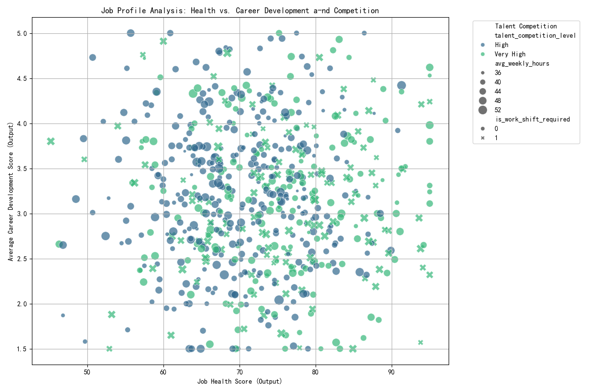

# Job Value Re-evaluation Report

## Introduction

This report analyzes job profiles to identify mismatches between market competition and actual output, with the goal of re-evaluating job value and optimizing talent allocation. The analysis focuses on Tier 1 and Tier 2 jobs with 'High' or 'Very High' talent competition.

## Key Findings

The analysis reveals several job profiles where a high level of talent competition is not justified by their current job health score and career development opportunities. These roles represent a potential misallocation of resources and talent.

### Mismatched Job Profiles Visualization

The following scatter plot illustrates the relationship between job health score, average career development score, and talent competition. The size of the bubbles represents the average weekly hours, and the shape indicates if a work shift is required.

From the visualization, we can observe a cluster of jobs with high competition but lower-than-average health and career development scores. These are the primary candidates for a value re-evaluation. Many of these roles, particularly in the tech and data science fields, exhibit high weekly hours and significant retention difficulty, suggesting an imbalanced 'input-to-output' ratio.

## Recommendations for Optimization

Based on the analysis of 'input-to-output' ratios, we have identified a list of job profiles that require immediate attention. These roles are characterized by high competition and demanding work characteristics, but they deliver suboptimal returns in terms of job health and employee growth.

### Priority List for Resource Reallocation

We recommend prioritizing the following job profiles for optimization. The "Priority Score" is a composite metric that considers low job health and career development scores, as well as high work hours, to rank the urgency of intervention.

| job_title | priority_score |
|---|---|
| Staff Software Engineer | 1.76 |
| Product Manager | 1.76 |
| Staff DevOps Engineer | 1.70 |
| Senior Security Engineer | 1.69 |
| Junior Security Engineer | 1.69 |

### Suggestions for Personnel Redeployment

1.  **Staff Software Engineer & Staff DevOps Engineer**: These roles show high weekly hours and low career development scores. We suggest reviewing the project loads and providing clearer paths for advancement or opportunities for rotation into roles with better growth prospects.
2.  **Product Manager**: This role has extremely high weekly hours and a very low career development score. It is critical to address burnout risk. Consider redistributing responsibilities or hiring additional support.
3.  **Security Roles (Senior & Junior)**: These roles are consistently linked with high retention difficulty and shift work. To improve the 'input-to-output' balance, we recommend exploring options for flexible work arrangements, increasing compensation or benefits to match the demanding nature of the work, and investing in automation to reduce manual workload.

By re-evaluating and optimizing these roles, we can better align our talent resources with true business value, improve employee satisfaction, and reduce turnover in critical, high-competition areas.
