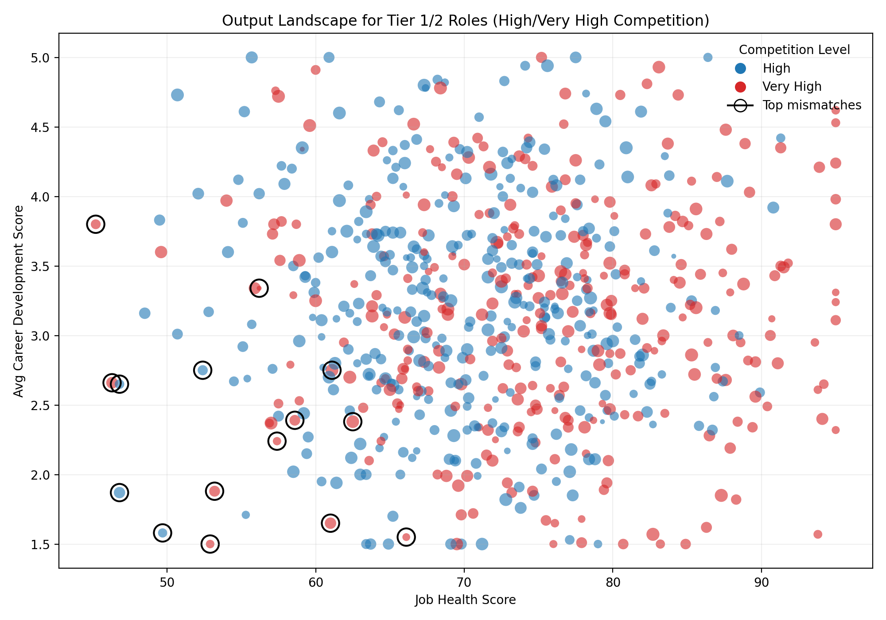
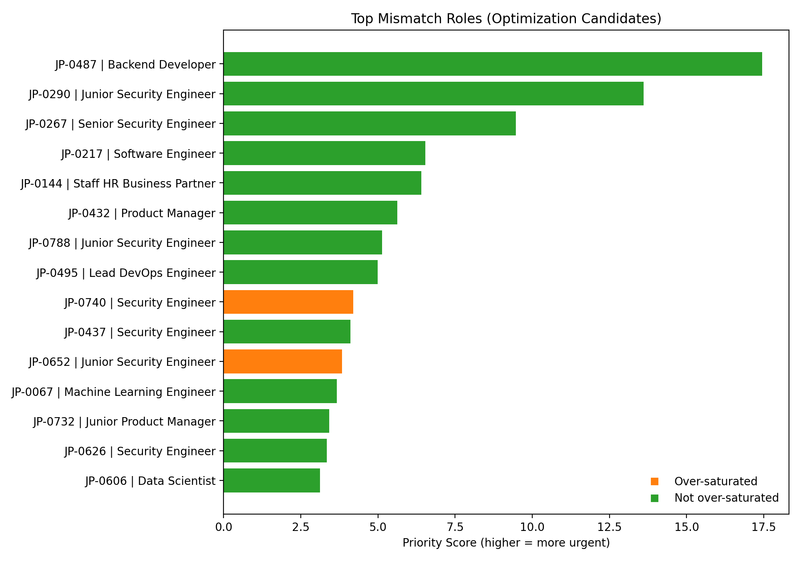

# Job Value Re-evaluation Report: Tier 1/2 Profiles under High Talent Competition

## Executive Summary
We analyzed Tier 1 and Tier 2 job profiles to quantify:
- Talent allocation saturation = current_employees_count / active_positions_count
- Talent quality index = high_performer_percentage × career_growth_potential_percentage

Focusing on roles with \"High\" or \"Very High\" talent competition, we evaluated output performance using job_health_score and avg_career_development_score, and contrasted it against input constraints (avg_weekly_hours, is_work_shift_required, retention_difficulty_level). We identified profiles with imbalanced input-to-output ratios and prioritized optimization and redeployment actions.

Key findings:
- High/Very High competition Tier 1/2 roles: 660 profiles (High: 349, Very High: 311).
- Average talent allocation saturation is below 1 (High: 0.707; Very High: 0.721) — indicating under-staffing overall.
- Mean output levels: job_health_score ≈ 72.4; avg_career_development_score ≈ 3.18.
- A set of Security Engineering and adjacent roles show elevated input burden (longer weekly hours, higher shift requirement, higher retention difficulty) without commensurate output.

## Visuals
- Output landscape for Tier 1/2 roles under High/Very High competition, highlighting mismatch profiles.



- Priority ranking of top mismatch roles based on input-to-output imbalance and saturation/competition weighting.



## Methodology (At-a-Glance)
- Selection: workday__job_overview table; job_value_tier in ('Tier 1','Tier 2').
- Computed per-profile metrics (SQL): talent_allocation_saturation and talent_quality_index, then filtered to talent_competition_level in ('High','Very High').
- Input index: standardized avg_weekly_hours (50%), retention_difficulty_level ordinal (30%), is_work_shift_required (20%).
- Output index: standardized job_health_score (60%) and avg_career_development_score (40%).
- Mismatch_score = (input_scaled + 0.01) / (output_scaled + 0.01). Priority_score additionally weights Very High competition (+20%) and over-saturation (+10%).

Code used to generate the plots and metrics was executed via Python (see analysis_tier12.py in the working directory). The analysis produced:
- hv_mismatch_full_results.csv — full computed metrics and priority ranks for High/Very High competition roles.
- top_mismatch_profiles.csv — the 15 highest-priority optimization candidates.
- redeploy_target_profiles.csv — top high-output, under-saturated roles recommended for redeployment.

## Where competition and output mismatch
Top mismatch roles (examples from top 15 by priority_score):
- JP-0487 Backend Developer (High): mismatch_score 17.44, saturation 0.86, job_health 46.8, career_dev 1.87, retention_difficulty High, shift_required No.
- JP-0290 Junior Security Engineer (Very High): mismatch_score 11.34, saturation 0.40, job_health 52.9, career_dev 1.50, retention Very High, shift_required Yes.
- JP-0267 Senior Security Engineer (Very High): mismatch_score 7.89, saturation 0.78, job_health 53.2, career_dev 1.88, retention Very High, shift_required Yes.
- JP-0217 Software Engineer (Very High): mismatch_score 5.44, saturation 0.93, job_health 46.3, career_dev 2.66, retention High, shift_required No.
- JP-0432 Product Manager (High): mismatch_score 5.62, saturation 0.56, job_health 46.8, career_dev 2.65, retention High, shift_required No.
- Several Security Engineer variants (Very High) with high shift requirements and elevated weekly hours appear repeatedly.

These roles have: relatively lower output scores (health and career development), yet higher input demands and/or competition pressures.

## Differential Patterns (Top mismatches vs others)
- Avg weekly hours: 47.34 vs 43.65 (+3.7 hours/week for top mismatches).
- Shift required rate: 53.3% vs 18.9% (nearly 3× higher among top mismatches).
- Retention difficulty (ordinal): 3.60 vs 3.08 (harder to retain in mismatch group).

Interpretation:
- The mismatch cohort is concentrated in roles with onerous working conditions (more hours, shifts) and higher retention difficulty — yet their output metrics lag. This suggests structural role design or capability gaps reducing realized value.

## Talent Allocation Saturation and Quality Index
- Saturation is on average below 1 in both competition cohorts, indicating many teams are under-staffed relative to active positions.
- Talent Quality Index (high_performer_percentage × career_growth_potential_percentage) varies substantially across roles. In mismatch roles, values are often modest (e.g., JP-0487 ≈ 0.122; several security roles range ≈ 0.012–0.156), suggesting limited high performers or growth potential in current setups.

## Recommended Optimization List (Top Priority)
Prioritize operational optimization and/or headcount rebalancing for these 10 roles, based on priority_score (full top 15 in top_mismatch_profiles.csv):
1) JP-0487 Backend Developer (High)
2) JP-0290 Junior Security Engineer (Very High)
3) JP-0267 Senior Security Engineer (Very High)
4) JP-0217 Software Engineer (Very High)
5) JP-0144 Staff HR Business Partner (High)
6) JP-0432 Product Manager (High)
7) JP-0788 Junior Security Engineer (Very High)
8) JP-0495 Lead DevOps Engineer (Very High)
9) JP-0740 Security Engineer (Very High)
10) JP-0437 Security Engineer (Very High)

Why these first: pronounced input burdens (long hours/shift requirements), elevated retention difficulty, and below-cohort output. Optimizing these yields outsized impact.

## Redeployment Suggestions (High Output, Under-saturated)
Consider redeploying talent from mismatch roles to the following high-output, under-saturated roles (examples, full list in redeploy_target_profiles.csv):
- JP-0252 Lead Software Engineer (Very High): saturation 0.42, job_health 95.0, career_dev 4.62, output_scaled 1.00.
- JP-0640 Machine Learning Engineer (Very High): saturation 0.47, job_health 95.0, career_dev 4.53.
- JP-0801 DevOps Engineer (Very High): saturation 0.82, job_health 95.0, career_dev 4.24.
- JP-0344 Senior HR Business Partner (High): saturation 0.50, job_health 86.4, career_dev 5.00.
- JP-0723 Lead Data Scientist (Very High): saturation 0.35, job_health 95.0, career_dev 3.24.

These roles demonstrate strong outputs yet remain under-staffed; reallocation can yield immediate productivity and growth benefits.

## Prescriptive Actions
- Job redesign for mismatch roles: reduce shift burden with rotation, improve scheduling, invest in tooling/automation (particularly in Security/DevOps) to cut weekly hour load.
- Capability uplift: targeted training and mentorship to raise avg_career_development_score; implement clear progression tracks to increase growth potential.
- Performance mix: re-assess role scopes for JP-0487 Backend Developer and similar low-output roles; adjust responsibilities to align with strengths or reassign to higher-output teams.
- Retention levers: for Very High retention difficulty roles, address root causes (on-call load, incident volume, compensation grade parity) to stabilize teams.
- Saturation corrections: given average under-saturation, prioritize filling active positions in proven high-output roles (above) before backfilling in low-output roles. Use internal mobility first.

## Priority Ranking for Resource Reallocation
- Use priority_score to order actions; the bar chart visual shows top 15 optimization candidates. Begin with the top 5 and reassess quarterly.
- Sequence:
  1) Immediate optimization (Weeks 0–6): JP-0487, JP-0290, JP-0267, JP-0217, JP-0144.
  2) Redeployment waves (Weeks 4–10): Move suitable talent to JP-0252, JP-0640, JP-0801, JP-0344, JP-0723.
  3) Structural fixes (Weeks 8–16): Implement shift/automation changes; recalibrate OKRs to emphasize health and development scores.

## Traceability
- Full computed dataset: hv_mismatch_full_results.csv (includes talent_allocation_saturation, talent_quality_index, input/output indices, mismatch_score, priority_score, priority_rank).
- Top lists: top_mismatch_profiles.csv and redeploy_target_profiles.csv.

## Appendix: Code Snippet Used for Plotting
The following Python was used to produce the visuals and metrics (executed in analysis_tier12.py):

```
# 1) Scatter: job_health vs career score, size by saturation, color by competition, highlight top mismatches
plt.figure(figsize=(10,7))
colors = hv['talent_competition_level'].map({'High':'#1f77b4','Very High':'#d62728'})
size = (hv['saturation'].clip(0,2) + 0.2) * 80
plt.scatter(hv['job_health_score'], hv['avg_career_development_score'], c=colors, s=size, alpha=0.6, edgecolors='none')
plt.scatter(top_mismatch['job_health_score'], top_mismatch['avg_career_development_score'],
            facecolors='none', edgecolors='black', s=200, linewidths=1.5, label='Top mismatches')
plt.xlabel('Job Health Score')
plt.ylabel('Avg Career Development Score')
plt.title('Output Landscape for Tier 1/2 Roles (High/Very High Competition)')
plt.tight_layout()
plt.savefig('tier12_output_scatter.png', dpi=200)
plt.close()

# 2) Bar chart: Top mismatches by priority_score, colored by over-saturation
tm = top_mismatch.copy().sort_values('priority_score', ascending=True)
colors_bar = tm['over_saturated'].map({True:'#ff7f0e', False:'#2ca02c'})
plt.figure(figsize=(10,7))
labels = (tm['job_profile_code'].astype(str) + ' | ' + tm['job_title'].astype(str)).str.slice(0,60)
plt.barh(labels, tm['priority_score'], color=colors_bar)
plt.xlabel('Priority Score (higher = more urgent)')
plt.title('Top Mismatch Roles (Optimization Candidates)')
plt.tight_layout()
plt.savefig('input_output_mismatch_bar.png', dpi=200)
plt.close()
```

By following the above prioritization and redeployment plan, the organization can improve realized job value, align talent with high-return roles, and reduce structural inefficiencies in high-competition job families.
