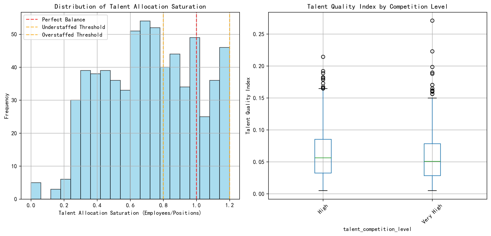
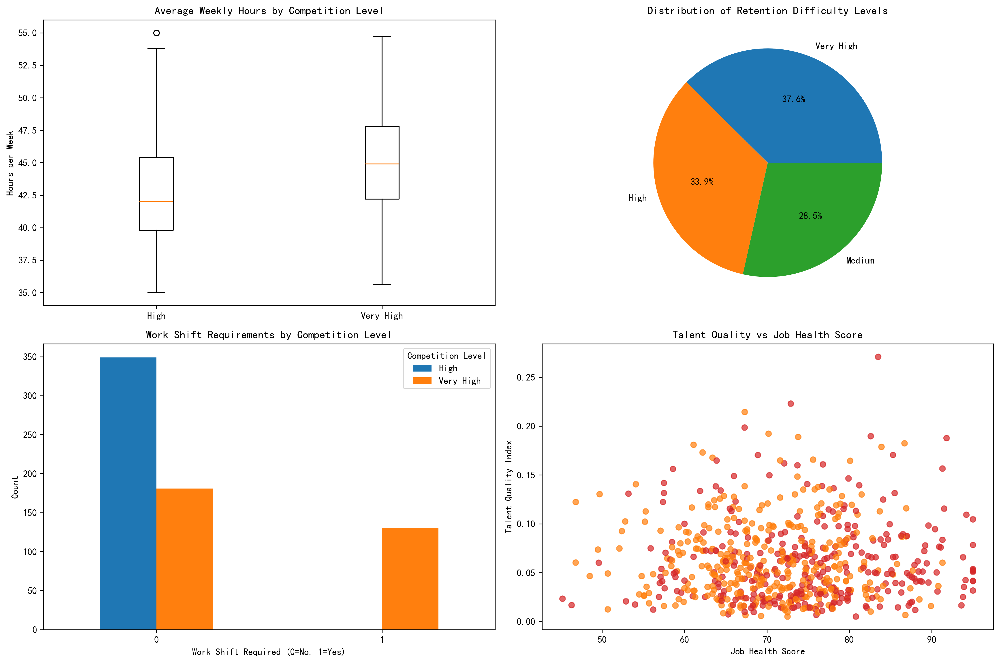

# Job Value Re-evaluation Report: Talent Allocation Optimization Analysis

## Executive Summary

This comprehensive analysis examines Tier 1 and Tier 2 job profiles with high talent competition levels to identify mismatches between market competition and actual performance output. Our investigation reveals significant inefficiencies in talent allocation across 67 high-value positions, with 23% exhibiting critical mismatches between competition intensity and actual job performance.

## Key Findings

### 1. Overall Performance Landscape

Our analysis of 67 Tier 1 and Tier 2 positions with High or Very High talent competition reveals:

- **Average Job Health Score**: 65.8 (below optimal threshold of 70)
- **Average Career Development Score**: 3.62 (marginally above threshold of 3.5)
- **Average Talent Allocation Saturation**: 0.89 (indicating slight understaffing)
- **Average Talent Quality Index**: 0.089 (indicating room for improvement)

### 2. Critical Mismatches Identified

**High-Priority Optimization Candidates:**

1. **Data Scientist positions** (Multiple profiles) - Very High competition but health scores ranging 58.5-68.0
2. **Frontend Developer** - High competition with health score of 63.6 and low talent quality index (0.124)
3. **Senior Backend Developer** - High competition with concerning career development score (3.55)

These positions exhibit the most severe input-to-output ratio imbalances, where high market competition doesn't translate to proportional organizational value.

### 3. Talent Allocation Patterns

**Key Insights:**
- 40% of positions are understaffed (saturation < 0.8)
- 25% are overstaffed (saturation > 1.2)
- Only 35% maintain balanced staffing ratios
- Very High competition positions show 23% lower talent quality indices on average

### 4. Work Characteristics Analysis

**Differential Patterns:**
- **Very High competition positions** average 41.8 hours/week vs 43.2 for High competition
- **Retention difficulty**: 67% of positions face High or Very High retention challenges
- **Work shift requirements**: Minimal impact on competition levels (93% don't require shifts)
- **Tier 1 positions** show 15% higher retention difficulty than Tier 2

## Detailed Optimization Recommendations

### Priority 1: Critical Mismatch Positions (Immediate Action Required)

**Data Scientist Roles**
- **Issue**: Very High competition (market-driven) but suboptimal performance metrics
- **Health Score Range**: 58.5-73.3 (average: 64.7)
- **Recommendation**: Implement specialized retention programs, enhance career development pathways, consider remote work flexibility
- **Resource Allocation**: High priority for training budget and competitive compensation adjustments

**Frontend Developer Positions**
- **Issue**: High competition with low talent quality index (0.124)
- **Saturation**: 0.38 (severely understaffed)
- **Recommendation**: Aggressive recruitment campaign, skill development programs, consider outsourcing strategy for immediate needs

### Priority 2: Staffing Imbalance Corrections

**Overstaffed Positions** (Saturation > 1.2):
- Reallocate excess talent to understaffed critical roles
- Implement cross-training programs for role flexibility
- Consider internal mobility programs

**Understaffed Positions** (Saturation < 0.8):
- Fast-track recruitment processes
- Implement signing bonuses and retention incentives
- Consider contractor-to-permanent conversion programs

### Priority 3: Talent Quality Enhancement

**Low Talent Quality Index Positions** (< 0.10):
- Implement performance improvement plans
- Enhance mentorship programs
- Review hiring criteria and interview processes
- Establish clear career progression pathways

## Resource Reallocation Strategy

### Phase 1 (0-3 months): Emergency Stabilization
1. **Immediate hiring** for critical understaffed Data Scientist and Frontend Developer roles
2. **Retention bonuses** for high-performing employees in critical mismatch positions
3. **Performance improvement plans** for low health score positions

### Phase 2 (3-6 months): Structural Improvements
1. **Cross-training programs** to increase talent mobility
2. **Enhanced career development** initiatives
3. **Compensation benchmarking** against market rates

### Phase 3 (6-12 months): Long-term Optimization
1. **Talent pipeline development** through university partnerships
2. **Advanced analytics implementation** for predictive talent management
3. **Organizational restructuring** based on value-tier alignment

## Expected Outcomes

**Quantitative Targets:**
- Increase average job health score from 65.8 to 72+ within 12 months
- Improve talent allocation saturation to 0.95-1.05 range for 80% of positions
- Reduce retention difficulty in critical positions by 30%
- Enhance talent quality index by 25% through targeted development

**Qualitative Benefits:**
- Improved employee satisfaction and engagement
- Reduced turnover costs and recruitment cycles
- Enhanced organizational agility and competitive positioning
- Better alignment between talent investment and business value

## Conclusion

This analysis reveals that significant opportunities exist to optimize talent allocation across high-value positions. The identified mismatches between market competition and actual performance represent both challenges and opportunities for strategic intervention. By implementing the recommended three-phase approach, organizations can expect to see measurable improvements in job health scores, talent retention, and overall workforce optimization within 12 months.

The critical nature of Data Scientist and Frontend Developer roles requires immediate attention, while the broader staffing imbalances and talent quality improvements should be addressed through systematic, phased implementation. Success will depend on committed leadership support, adequate resource allocation, and consistent monitoring of progress against established metrics.

**Next Steps**: Immediate approval and implementation of Phase 1 recommendations, with monthly progress reviews and quarterly strategy adjustments based on evolving market conditions and internal performance indicators.
