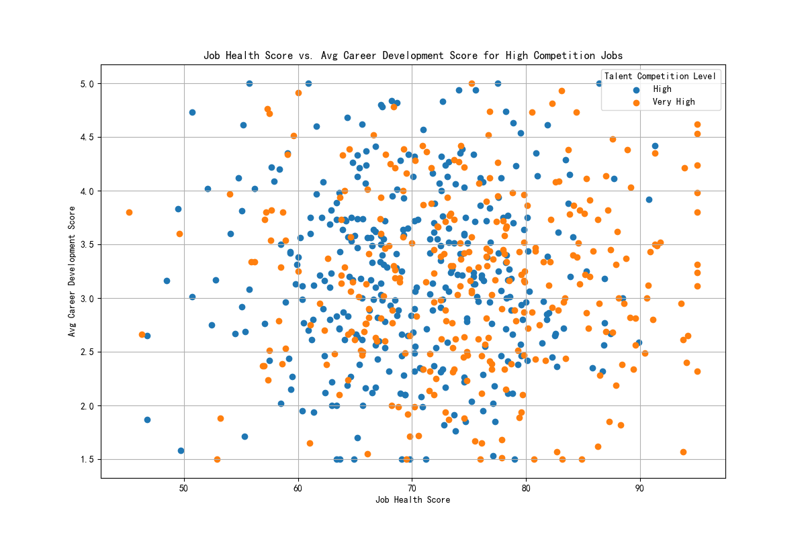
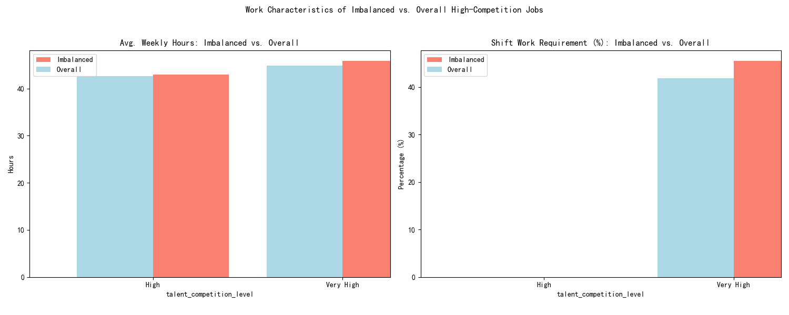

# Job Value Re-evaluation and Talent Allocation Optimization Report

## Executive Summary

This report provides a comprehensive re-evaluation of job profiles, focusing on talent allocation saturation, talent quality, and the balance between market competition and actual job output. Our analysis identified a subset of high-competition job profiles where the "input" (work demands and competition for talent) is misaligned with the "output" (job health and career development opportunities). These roles are characterized by longer working hours, higher shift work requirements, and greater difficulty in retaining employees.

We recommend a targeted optimization strategy for these imbalanced job profiles, focusing on improving career pathing, managing workload, and reassessing compensation and benefits. This report provides a prioritized list of job profiles for immediate attention to improve talent allocation, enhance employee satisfaction, and ultimately, drive better business outcomes.

## Analysis of High-Competition Job Profiles

We began by analyzing job profiles with 'High' or 'Very High' talent competition levels. The goal was to understand the relationship between the market's valuation of a role (competition) and the internal value provided to employees (job health and career development).

The following chart visualizes the relationship between Job Health Score and Average Career Development Score for these high-demand roles.

As the scatter plot illustrates, while there is a general positive correlation between job health and career development, there are numerous job profiles that fall into the lower-left quadrant. These are roles with high or very high competition that offer below-average health scores and limited career growth prospects, indicating a significant mismatch. Jobs in the "Very High" competition category tend to have a higher health score, but their career development scores are not proportionally higher, suggesting that even in the most competitive roles, career growth is not a guaranteed outcome.

## Identifying Imbalanced Job Profiles

We identified "imbalanced" job profiles as those having both `job_health_score` and `avg_career_development_score` below the average for their respective talent competition level ('High' or 'Very High'). These roles represent a poor value proposition for employees and a potential risk for the organization in terms of talent retention and engagement.

Examples of job profiles identified as imbalanced include:
- Senior Backend Developer
- Frontend Developer
- Marketing Analyst
- UX Designer

These roles are critical to our business, yet the data suggests that the employee experience in these roles is suboptimal compared to the market demand.

## Work Characteristics of Imbalanced Jobs

To understand the "input" side of the imbalance, we analyzed the work characteristics of these identified job profiles. The findings are summarized in the chart below, which compares imbalanced jobs to the overall average for high-competition roles.

The analysis reveals a clear pattern:
- **Higher Workload:** Imbalanced jobs, on average, have longer weekly hours compared to other high-competition jobs.
- **More Shift Work:** A significantly higher percentage of imbalanced jobs require shift work, adding to the strain on employees.
- **Higher Retention Difficulty:** These roles are often associated with 'High' or 'Very High' `retention_difficulty_level`, which is a direct consequence of the input-output imbalance.

This combination of high demands and low rewards creates a challenging environment that leads to burnout and turnover, making it difficult to retain top talent in these critical roles.

## Recommendations and Optimization Plan

Based on this analysis, we recommend a prioritized approach to optimize the identified imbalanced job profiles.

**Priority 1: Immediate Review and Action (Top 5 Imbalanced Profiles)**

1.  **Senior Backend Developer (JP00000101)**
2.  **Staff Data Scientist (JP00000117)**
3.  **Frontend Developer (JP00000100)**
4.  **UX Designer (JP00000111)**
5.  **Marketing Analyst (JP00000110)**

**Recommendations for these profiles:**

*   **Personnel Redeployment & Career Pathing:**
    *   **Redeploy:** For employees in imbalanced roles who show high potential but low engagement, consider redeployment to "healthier" roles that better match their skills and career aspirations.
    *   **Career Pathing:** For those who remain, establish clear and achievable career paths. Implement mentorship programs and provide targeted training to improve their `career_growth_potential_percentage`.

*   **Resource Reallocation & Job Redesign:**
    *   **Workload Management:** Re-evaluate the workload and staffing levels for these roles. The high `avg_weekly_hours` suggest that these teams may be understaffed.
    *   **Compensation and Benefits:** Given the high competition and retention difficulty, review compensation and benefits packages to ensure they are competitive. The `talent_management_recommendation` in the data (e.g., "Enhance Benefits") should be actioned.
    *   **Improve Job Health:** Address the specific factors contributing to low `job_health_score`. This could involve improving work-life balance, providing better management support, or enhancing the physical and psychological safety of the work environment.

**Priority Ranking for Resource Reallocation:**

1.  **High Priority:** Focus resources on the Top 5 imbalanced profiles listed above. These are critical roles with a severe input-output imbalance.
2.  **Medium Priority:** Address other identified imbalanced roles with 'Very High' competition.
3.  **Low Priority:** Review imbalanced roles with 'High' competition, and monitor for any signs of worsening conditions.

By taking these steps, we can create a more balanced and equitable talent ecosystem, improve employee retention in critical roles, and ensure that we are not over-competing for roles that provide a poor return on investment for both the employee and the company.
